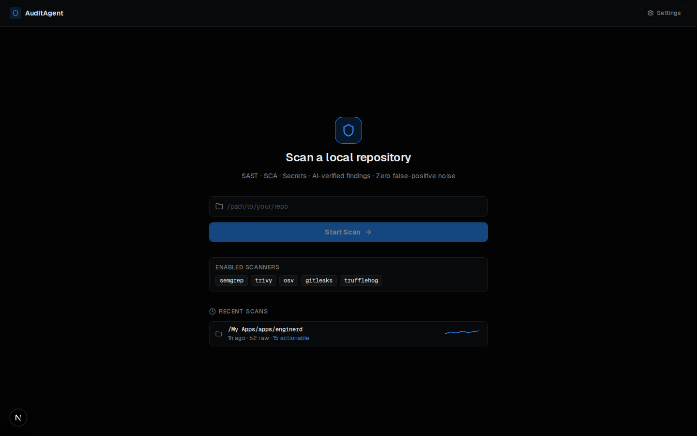
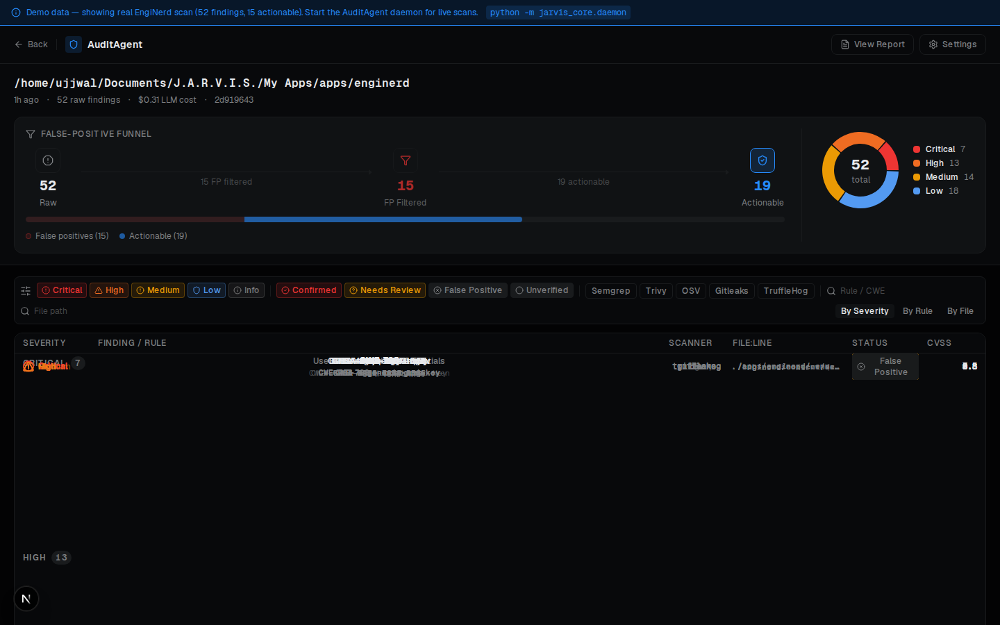
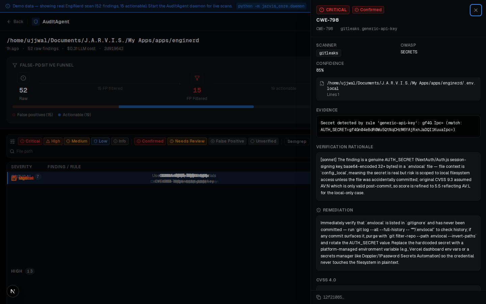

# AuditAgent Dashboard

A best-in-class, local-first security audit dashboard. Visualizes findings from AuditAgent: a defensive SAST + SCA + secrets scanner.

**Bar:** Semgrep AppSec Platform · Sentry · Linear · Vercel design quality.

---

## Screenshots

| Home | Results | Finding Detail |
|---|---|---|
|  |  |  |

---

## Quickstart

```bash
npm install
npm run dev
# Open http://localhost:3000
```

Opens in **Demo mode** by default — no backend required. Shows a real EngiNerd scan: 52 findings, 15 actionable, 37 FP filtered.

### Live mode (with the AuditAgent daemon)

```bash
# In your Jarvis repo:
python -m jarvis_core.daemon

# Then open the dashboard — it auto-detects the daemon and switches to live mode.
```

---

## Features

- **FP Funnel** (signature) — `RAW → FP Filtered → ACTIONABLE` animated 3-stage bar with count-up
- **Severity donut** — Recharts, click to filter findings table
- **TanStack Virtual** — 60fps at 5000+ findings rows, h-9 compact rows
- **URL-synced filters** — severity · scanner · status · rule search · file search, all in `?severity=critical&status=confirmed` query params (nuqs)
- **Finding detail drawer** — right slide-in, focus-trapped, Esc-closeable, CVSS 4.0 gauge with metric breakdown
- **Demo mode** — bundled real EngiNerd findings.json, works offline, zero backend
- **Live mode** — polls daemon at `http://127.0.0.1:8765/v1/audit`, starts scans, streams findings
- **Report viewer** — full markdown report with Copy-markdown
- **Settings sheet** — scanner toggles, LLM budget slider, theme
- **Recent scans** — localStorage-persisted with 7-scan sparklines
- **Dark-first OKLCH design** — tokens match the research spec exactly

## Safety

AuditAgent is **defensive-only**. Only scan repositories you own or have explicit authorization to audit. Never scan third-party code without consent.

## Tech Stack

| Layer | Tech |
|---|---|
| Framework | Next.js 15 (App Router, RSC) |
| Language | TypeScript 5 strict |
| Styling | Tailwind CSS 4, OKLCH tokens |
| Components | Radix UI + custom |
| Animation | Framer Motion 11 |
| Data | TanStack Query v5 |
| Table | TanStack Table + Virtual |
| Charts | Recharts |
| URL state | nuqs |
| Global state | Zustand |
| Icons | Lucide React |
| Fonts | Geist + Geist Mono |

## Environment

Copy `.env.example` (no values needed for demo mode):

```bash
cp .env.example .env.local
```

---

*AuditAgent is part of Jarvis — a personal AI agent system. MIT license.*
