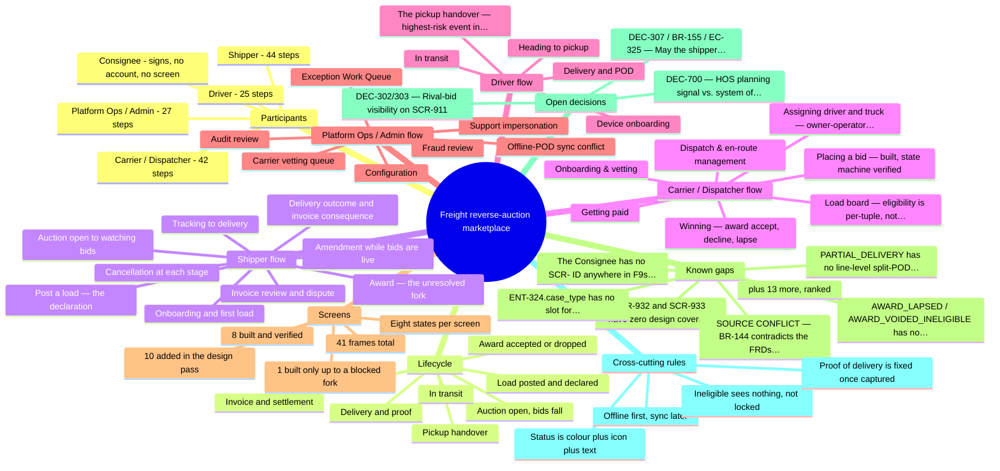
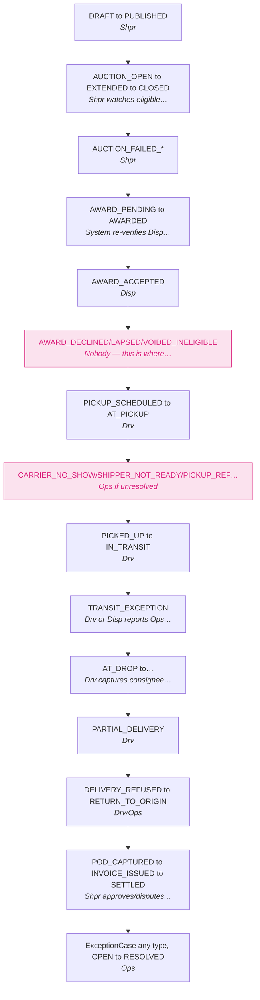

# Freight Reverse-Auction Marketplace — Mind Map

Three renderable views of the same design: the product as a mind map, the load lifecycle as a state machine, and each persona flow as a step-by-step chart. The full step definitions live in `MINDMAP-SOURCE.md`; the interactive version is `DESIGN-MAP.html`.

## 1. The product at a glance

## 2. Load lifecycle — who holds the baton

The magenta states are where the baton drops — an outcome nobody currently owns.

## 3. Shipper — 44 steps

```mermaid
flowchart LR
  subgraph GD21["Onboarding and first load"]
    direction TB
    D21S1["<b>S1</b> Org Setup · Details<br/>Submits"]
    D21S2["<b>S2</b> Org Setup · Verification pending<br/>Waits can already log in"]
    D21S3["<b>S3</b> Org Setup · Payment standing<br/>Submits reference"]
    D21S4["<b>S4</b> Org Setup · Invite team<br/>Sends invite, or skips"]
    D21S5["<b>S5</b> SCR-900 · Loads dashboard · Empty<br/>Clicks Post a load"]
    D21S6["<b>S6</b> SCR-900 · Loads dashboard · Default<br/>Browses, opens a load"]
    D21S1 --> D21S2
    D21S2 --> D21S3
    D21S3 --> D21S4
    D21S4 --> D21S5
    D21S5 --> D21S6
  end
  subgraph GD22["Post a load — the declaration"]
    direction TB
    D22S7["<b>S7</b> SCR-901 · Step 1 Lane & schedule<br/>Fills, clicks Next"]
    D22S8["<b>S8</b> SCR-901 · Step 2 Equipment & cargo<br/>Picks trailer reefer shows temp…"]
    D22S9["<b>S9</b> SCR-901 · Step 3 Auction settings<br/>Sets parameters"]
    D22S10["<b>S10</b> SCR-901 · Step 4 Review & publish<br/>Acknowledges, clicks Publish"]
    D22S11["<b>S11</b> SCR-901 · Partial<br/>Leaves, returns"]
    D22S12["<b>S12</b> SCR-900 · Draft row<br/>Clicks through"]
    D22S7 --> D22S8
    D22S8 --> D22S9
    D22S9 --> D22S10
    D22S10 --> D22S11
    D22S11 --> D22S12
  end
  D21S6 --> D22S7
  subgraph GD23["Auction open to watching bids"]
    direction TB
    D23S13["<b>S13</b> SCR-902 · Live<br/>Expands exclusion reasons"]
    D23S14["<b>S14</b> SCR-902 · Bid feed row is-new<br/>Watches"]
    D23S15["<b>S15</b> SCR-902 · Extended<br/>Watches"]
    D23S16["<b>S16</b> SCR-902 · Thin market<br/>Watches"]
    D23S17["<b>S17</b> SCR-902 · Closing — verifying<br/>Watches"]
    D23S18["<b>S18</b> SCR-902 · Failed<br/>Amends & republishes, or escalates"]
    D23S13 --> D23S14
    D23S14 --> D23S15
    D23S15 --> D23S16
    D23S16 --> D23S17
    D23S17 --> D23S18
  end
  D22S12 --> D23S13
  subgraph GD24["Award — the unresolved fork"]
    direction TB
    D24S19["<b>S19</b> SCR-903 · Verifying<br/>Waits"]
    D24S20a["<b>S20a</b> SCR-903 · Awarded<br/>Views selection-record excerpt"]
    D24S20b["<b>S20b</b> SCR-903 · Award pending shipper review<br/>Accepts, or declines with…"]
    D24S21["<b>S21</b> SCR-903 · Award accepted<br/>Views"]
    D24S22["<b>S22</b> SCR-903 · Award declined / lapsed<br/>Waits, or notified of cascade"]
    D24S19 --> D24S20a
    D24S20a --> D24S20b
    D24S20b --> D24S21
    D24S21 --> D24S22
  end
  D23S18 --> D24S19
  subgraph GD25["Amendment while bids are live"]
    direction TB
    D25S23["<b>S23</b> SCR-901 · Amend attempt<br/>Attempts to edit"]
    D25S24["<b>S24</b> SCR-901 · Withdraw & republish<br/>Confirms, or cancels"]
    D25S25["<b>S25</b> SCR-901 · Amend<br/>Edits freely"]
    D25S23 --> D25S24
    D25S24 --> D25S25
  end
  D24S22 --> D25S23
  subgraph GD26["Cancellation at each stage"]
    direction TB
    D26S26["<b>S26</b> SCR-900/902 · Cancel<br/>Confirms"]
    D26S27["<b>S27</b> SCR-904 · Cancel modal · post-award…<br/>Confirms"]
    D26S28["<b>S28</b> SCR-904 · Cancel modal · post-dispatch…<br/>Confirms"]
    D26S29["<b>S29</b> SCR-904 · Cancel modal · mid-transit<br/>Confirms"]
    D26S30["<b>S30</b> SCR-904 · Cancel unavailable ·…<br/>Redirected"]
    D26S31["<b>S31</b> SCR-904 · SHIPPER_NOT_READY<br/>Acknowledges"]
    D26S26 --> D26S27
    D26S27 --> D26S28
    D26S28 --> D26S29
    D26S29 --> D26S30
    D26S30 --> D26S31
  end
  D25S25 --> D26S26
  subgraph GD27["Tracking to delivery"]
    direction TB
    D27S32["<b>S32</b> SCR-904 · Default<br/>Watches, messages ops"]
    D27S33["<b>S33</b> SCR-904 · Stale<br/>Messages carrier/ops"]
    D27S34["<b>S34</b> SCR-904 · Transit exception<br/>Views, messages ops"]
    D27S32 --> D27S33
    D27S33 --> D27S34
  end
  D26S31 --> D27S32
  subgraph GD28["Delivery outcome and invoice consequence"]
    direction TB
    D28S35["<b>S35</b> SCR-904 · Delivered clear<br/>Views"]
    D28S36["<b>S36</b> SCR-904 · Delivered with exception<br/>Views, may escalate"]
    D28S37["<b>S37</b> SCR-904 · Partial delivery<br/>Views split status"]
    D28S38["<b>S38</b> SCR-904 · Delivery refused<br/>Initiates claim if warranted"]
    D28S39["<b>S39</b> SCR-904 · No receiver<br/>Arranges redelivery"]
    D28S35 --> D28S36
    D28S36 --> D28S37
    D28S37 --> D28S38
    D28S38 --> D28S39
  end
  D27S34 --> D28S35
  subgraph GD29["Invoice review and dispute"]
    direction TB
    D29S40["<b>S40</b> SCR-906 · Default<br/>Approves"]
    D29S41["<b>S41</b> SCR-906 · Partial<br/>Approves clean lines disputes the…"]
    D29S42["<b>S42</b> SCR-906 · Dispute a line<br/>Submits"]
    D29S43["<b>S43</b> SCR-906 · Resolved — credit note<br/>Views resolution"]
    D29S40 --> D29S41
    D29S41 --> D29S42
    D29S42 --> D29S43
  end
  D28S39 --> D29S40
```

## 4. Carrier / Dispatcher — 42 steps

```mermaid
flowchart LR
  subgraph GD32["Onboarding & vetting"]
    direction TB
    D32S1["<b>S1</b> Carrier · Sign-up · Default. *F9 has no…<br/>Enters MC/USDOT"]
    D32S2["<b>S2</b> IAL2 proofing<br/>Uploads ID"]
    D32S3["<b>S3</b> Document upload<br/>Uploads each saves partial"]
    D32S4["<b>S4</b> Vetting Status · Pending. *No…<br/>Browses read-only cannot open…"]
    D32S5["<b>S5</b> Rejected<br/>Re-uploads failing doc only"]
    D32S6["<b>S6</b> Approved<br/>Continues"]
    D32S7["<b>S7</b> SCR-915 Roster · Empty<br/>Adds records"]
    D32S8["<b>S8</b> SCR-915 · Default<br/>step"]
    D32S1 --> D32S2
    D32S2 --> D32S3
    D32S3 --> D32S4
    D32S4 --> D32S5
    D32S5 --> D32S6
    D32S6 --> D32S7
    D32S7 --> D32S8
  end
  subgraph GD33["Load board — eligibility is per-tuple, not…"]
    direction TB
    D33S10["<b>S10</b> Default<br/>Filters, saves view"]
    D33S11["<b>S11</b> Loading<br/>step"]
    D33S12["<b>S12</b> Empty<br/>Adjusts availability or waits"]
    D33S13["<b>S13</b> Permission denied<br/>Uploads renewal"]
    D33S14["<b>S14</b> Stale data<br/>Retries"]
    D33S10 --> D33S11
    D33S11 --> D33S12
    D33S12 --> D33S13
    D33S13 --> D33S14
  end
  D32S8 --> D33S10
  subgraph GD34["Placing a bid — built, state machine verified"]
    direction TB
    D34S15["<b>S15</b> idle<br/>Enters price, submits"]
    D34S16["<b>S16</b> submitting<br/>step"]
    D34S17["<b>S17</b> rejected<br/>Fixes element or picks another…"]
    D34S18["<b>S18</b> submitted<br/>Watches or leaves"]
    D34S19["<b>S19</b> outbid<br/>Re-bids or lets stand"]
    D34S20["<b>S20</b> withdrawn<br/>step"]
    D34S15 --> D34S16
    D34S16 --> D34S17
    D34S17 --> D34S18
    D34S18 --> D34S19
    D34S19 --> D34S20
  end
  D33S14 --> D34S15
  subgraph GD36["Winning — award accept, decline, lapse"]
    direction TB
    D36S21["<b>S21</b> Award Notification & Accept · Default.…<br/>Accept / Decline"]
    D36S22["<b>S22</b> Accepted<br/>Proceeds"]
    D36S23["<b>S23</b> Declined<br/>step"]
    D36S24["<b>S24</b> Lapsed<br/>step"]
    D36S25["<b>S25</b> Settlement · Default<br/>step"]
    D36S21 --> D36S22
    D36S22 --> D36S23
    D36S23 --> D36S24
    D36S24 --> D36S25
  end
  D34S20 --> D36S21
  subgraph GD37["Assigning driver and truck — owner-operator vs…"]
    direction TB
    D37S26["<b>S26</b> Default — owner-op pre-filled self+sole…<br/>Confirms"]
    D37S26d["<b>S26d</b> Default — dispatcher…<br/>Selects each independently"]
    D37S27["<b>S27</b> Contested<br/>Picks another asset"]
    D37S28["<b>S28</b> HOS check<br/>step"]
    D37S29["<b>S29</b> Valid<br/>Confirms"]
    D37S30["<b>S30</b> Error — HOS infeasible<br/>Reassigns, or overrides if…"]
    D37S31["<b>S31</b> Error — document lapsed<br/>Renews or picks another asset"]
    D37S26 --> D37S26d
    D37S26d --> D37S27
    D37S27 --> D37S28
    D37S28 --> D37S29
    D37S29 --> D37S30
    D37S30 --> D37S31
  end
  D36S25 --> D37S26
  subgraph GD38["Dispatch & en-route management"]
    direction TB
    D38S32["<b>S32</b> Default<br/>Drills into a trip"]
    D38S33["<b>S33</b> trip detail, pre-pickup<br/>Substitutes driver/truck before…"]
    D38S34["<b>S34</b> trip detail, post-pickup<br/>Substitutes"]
    D38S35["<b>S35</b> Report breakdown<br/>Submits"]
    D38S36["<b>S36</b> Pickup arrival check<br/>Arriving driver+tractor+trailer…"]
    D38S37["<b>S37</b> in transit<br/>Messages driver"]
    D38S32 --> D38S33
    D38S33 --> D38S34
    D38S34 --> D38S35
    D38S35 --> D38S36
    D38S36 --> D38S37
  end
  D37S31 --> D38S32
  subgraph GD39["Getting paid"]
    direction TB
    D39S38["<b>S38</b> Default<br/>Reviews"]
    D39S39["<b>S39</b> Partial data<br/>Contacts ops on held line"]
    D39S40["<b>S40</b> factored<br/>Reviews, cannot override without…"]
    D39S41["<b>S41</b> quick-pay offer<br/>Elects or declines"]
    D39S42["<b>S42</b> Settled<br/>step"]
    D39S38 --> D39S39
    D39S39 --> D39S40
    D39S40 --> D39S41
    D39S41 --> D39S42
  end
  D38S37 --> D39S38
```

## 5. Driver — 25 steps

```mermaid
flowchart LR
  subgraph GD42["Device onboarding"]
    direction TB
    D42S1["<b>S1</b> Invite Accept · Default<br/>Taps accept"]
    D42S2["<b>S2</b> OTP verify<br/>Enters 6-digit code"]
    D42S3["<b>S3</b> PIN/biometric setup<br/>Sets PIN or enrolls biometric"]
    D42S4["<b>S4</b> Device bind<br/>Confirms"]
    D42S5["<b>S5</b> Language<br/>Picks language"]
    D42S6["<b>S6</b> Today · Empty or Default<br/>Waits, or acts on S7+"]
    D42S1 --> D42S2
    D42S2 --> D42S3
    D42S3 --> D42S4
    D42S4 --> D42S5
    D42S5 --> D42S6
  end
  subgraph GD44["Heading to pickup"]
    direction TB
    D44S7["<b>S7</b> Today · Default<br/>Taps"]
    D44S8["<b>S8</b> Navigation Handoff<br/>Confirms"]
    D44S9["<b>S9</b> Arrival Capture · Default<br/>Confirms arrival enters/scans…"]
    D44S10["<b>S10</b> Branch outcome<br/>step"]
    D44S7 --> D44S8
    D44S8 --> D44S9
    D44S9 --> D44S10
  end
  D42S6 --> D44S7
  subgraph GD45["The pickup handover — highest-risk event in the…"]
    direction TB
    D45S11["<b>S11</b> Document Capture · Structured count<br/>Confirms or edits against declared"]
    D45S12["<b>S12</b> Photo<br/>Takes ≥1 photo"]
    D45S13["<b>S13</b> Dual acknowledgement<br/>Driver + shipper rep each sign,…"]
    D45S14["<b>S14</b> Submitted<br/>step"]
    D45S11 --> D45S12
    D45S12 --> D45S13
    D45S13 --> D45S14
  end
  D44S10 --> D45S11
  subgraph GD47["In transit"]
    direction TB
    D47S15["<b>S15</b> In transit · Default<br/>Mostly nothing — position is…"]
    D47S16["<b>S16</b> Report a Problem · Category<br/>Picks category, attaches photo or…"]
    D47S17["<b>S17</b> Interrupt<br/>Acknowledges / calls dispatch"]
    D47S18["<b>S18</b> Driver truly dark<br/>Nothing — by design"]
    D47S15 --> D47S16
    D47S16 --> D47S17
    D47S17 --> D47S18
  end
  D45S14 --> D47S15
  subgraph GD48["Delivery and POD"]
    direction TB
    D48P1["<b>P1</b> POD · Arrival<br/>Confirms arrival"]
    D48P2["<b>P2</b> POD · Forced choice<br/>Must pick one — Continue stays…"]
    D48P3b["<b>P3b</b> POD · Exception detail<br/>Records the exception"]
    D48P4["<b>P4</b> POD · Photo<br/>Captures photo"]
    D48P5["<b>P5</b> POD · Signature<br/>Consignee signs"]
    D48P6["<b>P6</b> POD · Read-only confirm<br/>Reviews, submits"]
    D48P7["<b>P7</b> POD · Pending sync<br/>Nothing"]
    D48P1 --> D48P2
    D48P2 --> D48P3b
    D48P3b --> D48P4
    D48P4 --> D48P5
    D48P5 --> D48P6
    D48P6 --> D48P7
  end
  D47S18 --> D48P1
```

## 6. Platform Ops / Admin — 27 steps

```mermaid
flowchart LR
  subgraph GD52["Exception Work Queue"]
    direction TB
    D52S1["<b>S1</b> Default<br/>Scans, opens Urgent cross-domain…"]
    D52S2["<b>S2</b> same<br/>Clicks Claim"]
    D52S3["<b>S3</b> Contested<br/>Reads only — platform-wide read…"]
    D52S4["<b>S4</b> Default<br/>Escalates or works case"]
    D52S5["<b>S5</b> Resolved<br/>Confirms"]
    D52S1 --> D52S2
    D52S2 --> D52S3
    D52S3 --> D52S4
    D52S4 --> D52S5
  end
  subgraph GD54["Offline-POD sync conflict"]
    direction TB
    D54S1["<b>S1</b> Sync conflict<br/>Opens item"]
    D54S2["<b>S2</b> same<br/>Compares, picks authoritative…"]
    D54S3["<b>S3</b> Sync conflict·Resolved<br/>Confirms with named reason"]
    D54S1 --> D54S2
    D54S2 --> D54S3
  end
  D52S5 --> D54S1
  subgraph GD55["Support impersonation"]
    direction TB
    D55S1["<b>S1</b> Initiate<br/>Fills fields, fresh MFA"]
    D55S2["<b>S2</b> Active session + persistent banner on…<br/>Browses read-only"]
    D55S3["<b>S3</b> Write-as confirm<br/>Confirms mutating action"]
    D55S4["<b>S4</b> Expired<br/>Requests new session if needed"]
    D55S1 --> D55S2
    D55S2 --> D55S3
    D55S3 --> D55S4
  end
  D54S3 --> D55S1
  subgraph GD56["Configuration"]
    direction TB
    D56S1["<b>S1</b> List<br/>Selects a parameter"]
    D56S2["<b>S2</b> Edit<br/>Submits"]
    D56S3["<b>S3</b> Applied<br/>step"]
    D56S1 --> D56S2
    D56S2 --> D56S3
  end
  D55S4 --> D56S1
  subgraph GD57["Carrier vetting queue"]
    direction TB
    D57S1["<b>S1</b> Default<br/>Opens candidate"]
    D57S2["<b>S2</b> Evidence<br/>Decides…"]
    D57S3a["<b>S3a</b> Approve<br/>Approves"]
    D57S3b["<b>S3b</b> Override<br/>Submits"]
    D57S4["<b>S4</b> Second approve<br/>Distinct PLATFORM_SENIOR_REVIEWER…"]
    D57S1 --> D57S2
    D57S2 --> D57S3a
    D57S3a --> D57S3b
    D57S3b --> D57S4
  end
  D56S3 --> D57S1
  subgraph GD58["Fraud review"]
    direction TB
    D58S1["<b>S1</b> Default<br/>Opens case"]
    D58S2["<b>S2</b> Evidence<br/>Investigates"]
    D58S3["<b>S3</b> Classify<br/>Selects"]
    D58S4["<b>S4</b> Containment<br/>Applies containment"]
    D58S1 --> D58S2
    D58S2 --> D58S3
    D58S3 --> D58S4
  end
  D57S4 --> D58S1
  subgraph GD510["Audit review"]
    direction TB
    D510S1["<b>S1</b> Search<br/>Searches"]
    D510S2["<b>S2</b> Record<br/>Views, exports"]
    D510S3["<b>S3</b> Exported<br/>step"]
    D510S1 --> D510S2
    D510S2 --> D510S3
  end
  D58S4 --> D510S1
```

---

Generated from `design/D2-D6`, `DESIGN-STRUCTURE.md` and `DESIGN-GAPS.md`. Paste any block into mermaid.live to edit, or open this file where mermaid renders (GitHub, Obsidian, VS Code).
