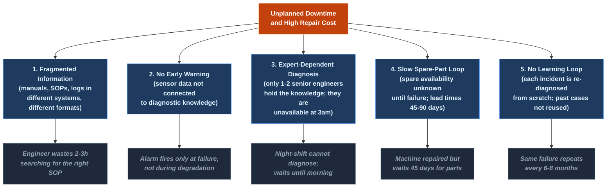
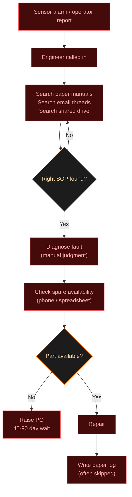
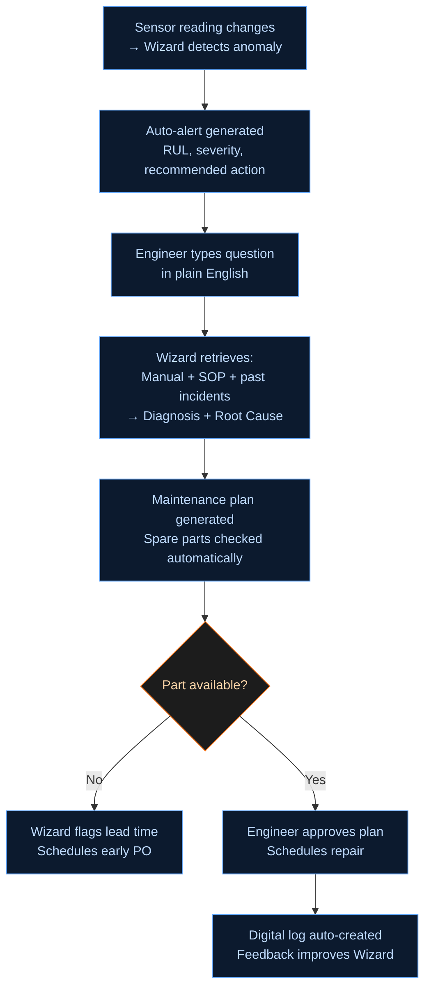
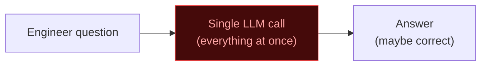
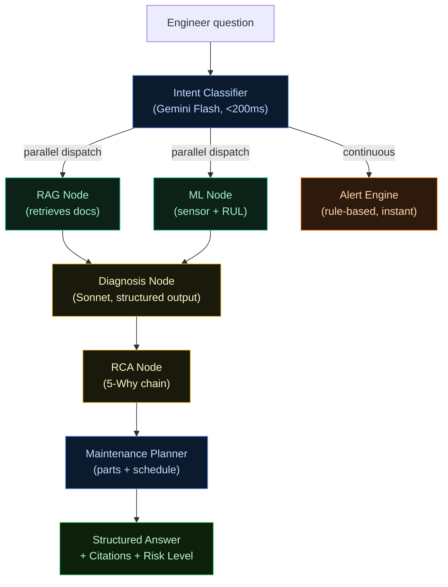

# Maintenance Wizard — Visual Storyboard & HTML Explainer Spec
**Tata Steel AI Hackathon 2026 | Round 2 | Problem Understanding Explainer**
**Authored by:** ui-ux-designer-agent | 2026-06-06

---

## Design Direction

- **Voice:** Plain, concrete, teacher-mode. Every section opens with a one-sentence "Here is what you need to know." No jargon without a gloss.
- **Density:** Linear-dense information layout — every pixel earns its place. No decorative whitespace. Generous inter-section breathing room, tight intra-section density.
- **Palette:** Dark theme. Background `oklch(12% 0.01 240)` near-black. Accent gradient: steel-blue `oklch(55% 0.18 240)` to molten-orange `oklch(72% 0.20 38)`. Glassmorphic cards: `oklch(20% 0.01 240 / 0.6)` with `backdrop-filter: blur(12px)` and `1px` border at `oklch(100% 0 0 / 0.08)`.
- **Type scale:** `Inter Variable`. Hero at 72px/1.05 line-height, section titles 36px, body 17px/1.65, labels 12px uppercase tracking-wide. `font-feature-settings: "cv01", "cv03", "cv04"` for Inter.
- **Motion intent:** Scroll-reveal (IntersectionObserver, `translateY(24px) → (0)` + `opacity 0 → 1`, 400ms ease-out). Chart counters animate on enter. Section nav fades in after hero. No gratuitous looping animations — every motion aids orientation.
- **References:** Linear's information density, Stripe's restraint, Vercel's dark-mode polish. Content-first. The design should disappear and let the argument land.

---

## Section Order & Full Spec

---

### SECTION 1 — Hero
**id:** `hero`
**Title (visible):** Maintenance Wizard
**Subtitle:** What it is, why it matters, and what you are about to build.
**Narrative (2 lines):** A steel plant fails quietly before it fails loudly. This is the story of catching that silence — and turning it into action before the alarm sounds.

**VISUAL: Full-viewport animated SVG illustration**

Render a stylized steel plant cross-section, 1200×480px SVG. Left-to-right flow: six machine silhouettes in sequence — (1) Raw Material Conveyor, (2) Blast Furnace, (3) EAF (Electric Arc Furnace), (4) Continuous Caster, (5) Hot Strip Mill gearbox, (6) Hydraulic Descaling Pump — connected by thin horizontal flow lines representing production flow.

Above each machine: a small sensor-data sparkline (3 lines: vibration, temperature, current). On machines 1, 3, 5: sparklines are smooth and flat. On machine 4 (Continuous Caster): sparkline is visibly spiking upward in red-orange, the machine silhouette pulses with a soft `oklch(72% 0.20 38)` glow (CSS keyframe, 2s ease-in-out infinite, opacity 0.4 → 0.8 → 0.4).

Bottom strip: a horizontal bar labeled "PRODUCTION FLOW →" with a dotted separator showing "UPTIME" (green zone, 85%) and "DOWNTIME RISK" (orange-red zone, 15%).

Top-left of hero: large text `Maintenance Wizard` in gradient text (steel-blue → molten-orange, left-to-right). Below it: subtitle in `oklch(70% 0.02 240)` body text: "A decision-support platform that catches failures before they stop the mill."

Bottom of hero: sticky scroll-cue — small downward chevron, fade-pulse animation. And a pill badge: `Tata Steel AI Hackathon 2026 · Round 2 · Deadline: 15 Jun`.

**Sticky Section Nav:** After the hero exits viewport, a slim `position: sticky; top: 0` nav bar fades in. Contains anchor links for each section: Hero · Plant · Problem · Root Cause · Cost · Workflow · Data Flow · 7 Requirements · Solution Space · Why Agentic · Judging · TL;DR. Active section highlighted with accent underline. Background: `oklch(14% 0.01 240 / 0.9)` with `backdrop-filter: blur(8px)`. Height 44px.

---

### SECTION 2 — The Plant and Its Machines
**id:** `plant`
**Title:** Inside a Steel Plant: The 6 Critical Machines
**Narrative:** Steel plants are a chain. When one link weakens, every machine downstream stops too. Meet the six machine types your system must watch.

**VISUAL: Icon-grid with inline SVG per machine + stats callouts**

Six glassmorphic cards in a 3×2 grid (2-column on mobile). Each card:
- Top: inline SVG icon (30×30px line-art silhouette of the machine, stroke `oklch(65% 0.15 240)`)
- Machine name in 16px semibold
- ID badge: e.g. `HSM-GB-001`
- Three stat pills in a row:
  - Failure mode (e.g. "Bearing wear")
  - MTTF: "210 days [unverified estimate]"
  - Degradation: "Linear ramp"
- A 3-line mini sensor chart (Chart.js sparkline, 60 data points, simulated vibration signal). Healthy = flat blue line. Machine 4 (EAF electrode) has a visibly rising orange line.

Below the grid, a single explanatory line in `oklch(60% 0.02 240)` italic: "Each machine has a known failure fingerprint — a pattern of sensor readings that appears days or weeks before the actual breakdown. The Maintenance Wizard learns these fingerprints."

**Machine data for the 6 cards:**

| # | Name | Equipment ID | Top Failure Mode | Sensors Watched | Degradation Shape |
|---|---|---|---|---|---|
| 1 | HSM Finishing-Stand Gearbox | HSM-GB-001 | Bearing fatigue / gear tooth wear | Vibration RMS, temperature, lube-oil pressure | Exponential near-end |
| 2 | Blast Furnace Blower | BF-BLW-001 | Impeller erosion, shaft imbalance | Vibration, motor current, acoustic emission | Linear ramp |
| 3 | Continuous Caster Withdrawal-Roll Bearing | CC-BRG-001 | Spalling, contamination | Temp, vibration, acoustic emission | Sudden (step change) |
| 4 | EAF Electrode Assembly | EAF-EA-004 | Electrode oxidation, arc instability | Current density, electrode gap, temperature | Exponential |
| 5 | Raw Material Conveyor Drive | RMC-DRV-001 | Belt misalignment, motor overheating | Current, temp, vibration | Linear |
| 6 | Hydraulic Descaling Pump | HDP-PMP-001 | Seal failure, cavitation | Pressure differential, flow rate, temp | Sudden |

**Aasaan shabdon mein:** Har machine ka ek "health signature" hota hai — sensors ek pattern dikhate hain jab machine bimaar hone lagi hoti hai. System yahi pattern pakadta hai.

---

### SECTION 3 — What Breaks: The Problem
**id:** `problem`
**Title:** The Problem in Plain Terms
**Narrative:** Right now, maintenance in most steel plants is reactive — the machine breaks, then someone fixes it. The problem is not that machines break; that is expected. The problem is that the response is slow, fragmented, and expensive.

**VISUAL: Before/After split card — two-column layout, full bleed**

**LEFT panel** (labeled "TODAY — Reactive Maintenance"): Dark red tint `oklch(20% 0.05 15)`.
Timeline view, vertical, five events stacked:
1. `T = 0h` — Sensor reading spikes. Nobody notices. (Icon: sensor with a flat line)
2. `T = +48h` — Operator hears unusual noise. Reports verbally. (Icon: person at console)
3. `T = +52h` — Maintenance engineer manually searches 3 different folders of PDFs to find the SOP. (Icon: folder stack)
4. `T = +54h` — Machine trips. Production line stops. (Icon: red X, machine silhouette)
5. `T = +60h` — Spare part not in stock. Procurement raised. 45-day lead time. (Icon: shopping cart with clock)

Below the timeline: two bold stat pills —
- `Avg downtime per incident: 8–12 hours [unverified industry estimate]`
- `Avg unplanned downtime cost: high [no public per-minute figure for Tata Steel — do not fabricate]`

**RIGHT panel** (labeled "WITH MAINTENANCE WIZARD — Proactive"): Dark steel-blue tint `oklch(18% 0.04 240)`.
Same timeline, compressed:
1. `T = 0h` — Sensor reading changes. System detects anomaly in real time. (Icon: sensor with small orange dot)
2. `T = +0h` — Alert auto-generated: "EAF-04 bearing degradation detected. RUL: 6 days." (Icon: bell, orange)
3. `T = +1h` — Engineer asks Wizard in plain English: "What is wrong with EAF-04?" → instant diagnosis + root cause + SOP steps, all cited from the manual. (Icon: chat bubble)
4. `T = +4h` — Maintenance plan scheduled during next planned downtime window. Spare part already in stock (Wizard checked). (Icon: calendar with green check)
5. `T = +6 days` — Planned repair executed before failure. Production never stops. (Icon: green check, machine silhouette)

Bold pills: `Downtime prevented` and `Response time: hours → minutes`.

Below both panels, centered: a one-line bridging sentence in large type — "The gap between these two timelines is what your system closes."

---

### SECTION 4 — Why It Happens: Root-Cause Tree
**id:** `rootcause`
**Title:** Why Maintenance Fails: The 5 Root Causes
**Narrative:** The problem is not laziness or bad engineers. It is structural. Five forces combine to make reactive maintenance the default even when everyone wants to do better.

**VISUAL: Mermaid tree diagram — top-down, styled**



**Render note:** Mermaid via CDN (`https://cdn.jsdelivr.net/npm/mermaid/dist/mermaid.min.js`). Initialize with `theme: 'dark'`. Wrap in a div with `overflow-x: auto` for mobile. Add a caption: "Each cause is independently addressable. Your system addresses all five simultaneously."

Below the diagram, five tiny annotation cards (horizontal scroll on mobile), one per root cause, each showing:
- The cause (bold label)
- What the Maintenance Wizard does about it (one line, `oklch(70% 0.15 240)` accent color)

| Cause | Wizard's answer |
|---|---|
| Fragmented info | RAG retriever unifies manuals + SOPs + incident reports into one queryable knowledge base |
| No early warning | IsolationForest anomaly detector + Weibull RUL estimator run continuously on sensor data |
| Expert-dependent | Multi-turn NL interface gives any engineer 24/7 access to synthesized expert knowledge |
| Slow spare-part loop | Spare parts catalog integrated into every maintenance plan; lead times surfaced automatically |
| No learning loop | Engineer corrections fed back into the knowledge base; every correction improves future answers |

---

### SECTION 5 — The Real Cost (Charts)
**id:** `cost`
**Title:** What Unplanned Downtime Actually Costs
**Narrative:** Abstract costs become concrete when you put numbers to them. These are industry-wide estimates; Tata Steel's actual figures are internal. But the direction and magnitude are consistent across the literature.

**VISUAL A: Chart.js horizontal bar chart — "Where Maintenance Time Goes Today"**

Chart type: `horizontalBar` (Chart.js 4). Title: "How an engineer's day breaks down — reactive mode." Labels and approximate percentages (industry estimates, tagged `[unverified]`):

```
Searching for documentation          ████████████████████  35%
Waiting for expert availability      ████████████          22%
Diagnosing fault manually            ████████              18%
Writing reports / logging            ██████                12%
Actual repair work                   ███████               13%
```

Bar colors: searching = orange `oklch(72% 0.20 38)`, waiting = muted red `oklch(55% 0.18 20)`, diagnosing = yellow `oklch(80% 0.15 80)`, reporting = grey, repair = steel-blue `oklch(55% 0.18 240)`.

Caption: "Only 13% of time is spent doing the thing that fixes the machine. [unverified industry estimate — actual Tata Steel figures are internal]"

**VISUAL B: Chart.js doughnut chart — "Fault Category Distribution"**

Title: "Typical equipment fault types in continuous manufacturing [unverified]". Data:

```js
labels: ['Mechanical wear', 'Lubrication failure', 'Electrical fault', 'Overheating', 'Misalignment', 'Contamination', 'Other']
data: [32, 18, 15, 13, 10, 7, 5]
```

Colors: gradient slices from steel-blue to molten-orange across the 7 segments. Cutout 65%. In the center: bold text "Wear + Lubrication = 50%". Below: "Most failures are predictable. They follow a pattern. They can be detected early."

**VISUAL C: Animated counter strip (4 counters, horizontal, scroll-triggered)**

Four `<div>` counters that count up when they enter viewport (IntersectionObserver + requestAnimationFrame). Font: 56px Inter bold, gradient text.

```
300+          9 months        22%           50%
AI agents     to deploy       EBITDA margin  reduction in
deployed by   all agents      India ops      complaint TAT
Tata Steel    (Apr 2026)      (FY2025)       (verified KPI)
```

Each counter has a tiny caption below in 12px muted text. The `300+` and `9 months` figures cite the Tata Steel × Google Cloud press release April 2026. The `22%` cites FY2025 financials. The `50%` cites Tata Steel's own published KPI. No fabricated numbers anywhere in this strip.

**Source footnote:** "Sources: Tata Steel × Google Cloud partnership press release, 22 Apr 2026; Tata Steel FY2025 Annual Report. Untagged industry estimates above are marked [unverified]."

---

### SECTION 6 — As-Is vs To-Be Workflow
**id:** `workflow`
**Title:** How Maintenance Work Changes
**Narrative:** The biggest shift is not the technology — it is the workflow. The engineer stops being a librarian (searching for information) and starts being a decision-maker (acting on information already surfaced).

**VISUAL: Two-column Mermaid flowchart side-by-side — "As-Is" and "To-Be"**

**LEFT — As-Is (red accent):**


**RIGHT — To-Be (blue accent):**


Render both diagrams side by side in a CSS grid (`grid-template-columns: 1fr 1fr`, gap 32px). On mobile: stack vertically. Each diagram enclosed in a glassmorphic card with the title "As-Is" / "To-Be" in the card header.

Below both diagrams: one bridging line — "The yellow decision nodes are the same in both flows. What changes is everything feeding into them."

---

### SECTION 7 — Inputs → System → Outputs (Data Flow)
**id:** `dataflow`
**Title:** What Goes In, What Comes Out
**Narrative:** The system is a transformer. Messy, fragmented inputs enter. Structured, actionable outputs come out. This section maps every input to its output so you never wonder "where does that come from?"

**VISUAL: Custom SVG data-flow diagram — three-column layout**

Three columns: INPUTS (left), SYSTEM (center), OUTPUTS (right). Connected by animated SVG path lines (CSS stroke-dashoffset animation, flows left-to-right, 2s loop).

**INPUTS column (6 input cards, stacked):**
Each card is a small rectangle 200×40px, rounded corners, border `oklch(50% 0.15 240 / 0.5)`. Icon + label.
1. Equipment delay logs (icon: list)
2. Fault / error messages (icon: triangle alert)
3. Failure-analysis reports (icon: document)
4. Sensor data summaries (icon: chart line)
5. Maintenance SOPs + manuals (icon: book)
6. Engineer NL queries (icon: chat)

**SYSTEM column (center, largest, 400px wide):**
A large glassmorphic card labeled "Maintenance Wizard (Agentic Core)". Inside, a simplified vertical node diagram showing the agents:
- `Intent Classifier` (small pill, top)
- `RAG Retriever` + `ML Sensor Analyzer` (side by side, "run in parallel" label)
- `Diagnosis Agent` → `RCA Agent` → `Maintenance Planner` (sequential, bottom)
- `Alert Engine` (side branch, right)
- `Feedback Loop` (bottom, pointing back up)

Node connections shown as thin lines inside the card. Label on the card border: "LangGraph StateGraph · SqliteSaver multi-turn memory".

**OUTPUTS column (7 output cards, stacked):**
Each output card styled with a severity/type color indicator on the left edge.
1. Probable fault diagnosis (blue edge)
2. Root-cause analysis — 5-Why chain (blue edge)
3. RUL prediction — p10/p50/p90 (orange edge)
4. Early-warning alert + risk classification (red edge)
5. Step-by-step repair recommendations (green edge)
6. Optimized maintenance plan + spares list (green edge)
7. Structured digital logbook entry (grey edge)

**Animated path lines:** SVG `<path>` elements connecting each input card to the system box, and system box to each output card. `stroke-dasharray` and `stroke-dashoffset` animation create a "data flowing" left-to-right effect. Colors: input paths steel-blue, output paths molten-orange. Animation plays once on scroll-enter (IntersectionObserver triggers CSS class addition).

**Below the diagram:** A single row of four stat pills (smaller, secondary):
`Multi-turn memory` · `Source citations on every answer` · `Proactive alerts (no query needed)` · `Feedback updates knowledge base`

---

### SECTION 8 — The 7 Things The System Must Do
**id:** `requirements`
**Title:** The 7 Mandatory Functional Requirements
**Narrative:** These are not nice-to-haves. They are the specification. A submission that misses any one of these seven is incomplete by the problem statement's own terms.

**VISUAL: Numbered accordion list — 7 requirement cards**

Seven cards in a vertical stack. Each card:
- Left: large number `01` through `07` in gradient text, 48px, right-aligned in a 64px column
- Right: requirement name in 18px semibold + two-line plain-English gloss + a "How we build it" one-liner in `oklch(65% 0.15 240)` muted accent.
- Right edge: a small "coverage" badge — a pill that says `BUILT` (green) or `PARTIAL` (orange) — to be filled in by the builder as features ship.
- On click/hover: card expands to show the full detail + the judging axis it maps to.

Card data:

```
01  Contextual Reasoning via LLM/SLM
    Plain: The system uses a large language model to understand questions in plain English
    and reason over the plant's own documents — not a keyword search.
    How we build it: Claude Sonnet 4.6 + Gemini Flash as intent router; cached 1024-token system prompt.
    Maps to: Technical Implementation & Innovation

02  Knowledge Integration
    Plain: The system reads and reasons over manuals, SOPs, incident reports, and maintenance logs
    all at once — the engineer does not need to know where to look.
    How we build it: Hybrid RAG (BM25 + ChromaDB dense + RRF fusion); 6 equipment manuals,
    8 SOPs, 8 incident reports, maintenance records — all indexed.
    Maps to: Problem Understanding & Approach; Scalability & Real-World Applicability

03  Natural-Language Multi-Turn Interaction
    Plain: The engineer types a question in plain English. Follows up. Drills deeper.
    The system remembers the conversation.
    How we build it: LangGraph SqliteSaver checkpointer; session_id-keyed conversation state;
    Streamlit chat interface.
    Maps to: Easy to use; Smooth working

04  Explainable Recommendations
    Plain: Every recommendation cites the exact source — "This comes from SOP-07, Section 3.2,
    page 4." The engineer can verify before acting.
    How we build it: Citation pills in UI; RetrievedDoc schema with chunk_id + doc_name + section
    + relevant_excerpt; [UNVERIFIED] tag on uncited claims.
    Maps to: Accurate; Business Impact & Feasibility

05  Abnormality Detection + Failure Prediction
    Plain: The system continuously watches sensor data. When readings drift outside the healthy
    pattern, it raises an alert — before the engineer asks, before the alarm sounds.
    How we build it: IsolationForest per equipment type (sklearn); Weibull AFT RUL estimator
    (lifelines); proactive asyncio poll loop; SSE alert stream.
    Maps to: Accurate; Fast output; Real-time alerting

06  Feedback-Driven Improvement
    Plain: If the engineer says "that diagnosis is wrong," the system updates immediately.
    Next time someone asks the same question, the corrected answer comes up first.
    How we build it: POST /feedback → ChromaDB correction-aware re-rank (top-3 injection);
    Bayesian RUL correction (0.7 model + 0.3 engineer); persisted to corrections.jsonl.
    Maps to: Accurate; Business Impact & Feasibility

07  Real-Time Alerting
    Plain: When a sensor reading crosses a threshold, an alert appears on the dashboard
    within seconds — without anyone asking. The right people see the right severity level.
    How we build it: AlertEngine (rule-based, no LLM); SSE stream (sse-starlette);
    Streamlit autorefresh poller (3s); role-based routing (engineer / plant manager / safety officer).
    Maps to: Fast output; Doesn't break; Smooth working
```

Below all 7 cards: a compact coverage matrix — rows = 7 requirements, columns = judging axes, cells = dot indicator. Rendered as a small HTML table with `oklch(55% 0.18 240)` filled dots for covered axes.

---

### SECTION 9 — The Solution Space
**id:** `solution`
**Title:** 8 Approaches You Could Take — And Why We Chose This One
**Narrative:** There is more than one way to build a Maintenance Wizard. Here are eight archetypes. Understanding the trade-offs is what separates a thoughtful engineer from someone who just ran with the first idea.

**VISUAL: Comparison table with score indicators**

A horizontal-scroll comparison table. Rows = 8 solution archetypes. Columns = 6 evaluation dimensions. Cell = colored dot (green / yellow / red). Below the table: a highlighted row for "What we are building" with all scores.

**Archetypes:**

| # | Archetype | Description (1 line) |
|---|---|---|
| 1 | Static PDF Chatbot | RAG over static PDFs, single-turn, no ML |
| 2 | Rule-Based Expert System | Decision-tree rules, no LLM |
| 3 | Time-Series Anomaly Only | ML-only, no NL interface, no RAG |
| 4 | LLM + Vector DB (no agents) | Single LLM call, hybrid RAG, no orchestration |
| 5 | Multi-Agent RAG + ML (no proactive) | LangGraph agents, reactive only |
| 6 | **Multi-Agent RAG + ML + Proactive Alerts** | LangGraph + IsolationForest + Weibull + SSE alerts |
| 7 | Fine-tuned Domain LLM | Custom fine-tuned small model on steel-plant data |
| 8 | Digital Twin + Simulation | Physics-based simulation + ML |

**Evaluation dimensions:**
- Feasibility (can solo dev build in 9 days?)
- Addresses all 7 requirements
- Demo quality (can impress in 3 min?)
- Real-world deployability
- Technical innovation signal
- Alignment to judging criteria

**Score matrix (dots: green = strong, yellow = partial, red = weak):**

| Archetype | Feasibility | All 7 Req | Demo Quality | Deploy | Innovation | Judging Fit |
|---|---|---|---|---|---|---|
| 1 Static PDF Chatbot | green | red | yellow | yellow | red | red |
| 2 Rule-Based Expert | green | red | red | yellow | red | red |
| 3 Anomaly-Only ML | yellow | red | yellow | green | yellow | yellow |
| 4 LLM + Vector DB | green | yellow | yellow | yellow | yellow | yellow |
| 5 Multi-Agent Reactive | yellow | yellow | green | yellow | green | green |
| **6 Multi-Agent + Proactive** | yellow | **green** | **green** | green | **green** | **green** |
| 7 Fine-tuned LLM | red | yellow | yellow | yellow | green | yellow |
| 8 Digital Twin | red | yellow | red | yellow | green | yellow |

Row 6 highlighted with a `oklch(18% 0.04 240)` background + `oklch(55% 0.18 240)` left border 3px = "THIS IS WHAT WE ARE BUILDING."

Below table: one sentence per archetype that was rejected — short, honest. E.g.:
- "Archetype 1 fails requirement 5 (no ML, no proactive alerts)."
- "Archetype 7 requires a steel-plant dataset we do not have."
- "Archetype 8 requires physics models and domain expertise beyond scope."

---

### SECTION 10 — Why Agentic Wins
**id:** `agentic`
**Title:** Why a Multi-Agent Architecture, Not One Big Prompt
**Narrative:** You could put the entire problem into one massive prompt. It would not work well. Here is exactly why breaking it into specialist agents produces a better system — and why that matters to the judges.

**VISUAL: Side-by-side Mermaid diagram — "One Giant Prompt" vs "Agent Graph"**

**LEFT — "One Giant Prompt" approach:**

Caption below: "Problems: context window fills up · no specialization · can't run ML models · can't query a database mid-call · can't remember across turns · latency is all-or-nothing · no explainability."

**RIGHT — Multi-Agent Graph:**

Caption: "Benefits: each node has a single responsibility · RAG + ML run in parallel → lower latency · SqliteSaver keeps conversation state · proactive planner runs independently · failures in one node degrade gracefully, not catastrophically."

Below both diagrams: a 3-row evidence table:

| Property | One Big Prompt | Multi-Agent Graph |
|---|---|---|
| Can query ChromaDB mid-call? | No | Yes (RAGNode) |
| Can run IsolationForest in-process? | No | Yes (MLNode) |
| Multi-turn memory across sessions? | No (stateless) | Yes (SqliteSaver) |
| Parallel computation? | No | Yes (Send() API) |
| Graceful degradation per component? | No | Yes (per-node fallback tiers) |
| Proactive alerts without user query? | No | Yes (ProactivePlanner asyncio task) |

**Aasaan shabdon mein:** Ek bada prompt ek generalist doctor ki tarah hai jo sab kuch seedha sochta hai. Multi-agent system ek hospital jaisa hai — specialist doctor, lab, pharmacy sab saath kaam karte hain, parallel mein.

---

### SECTION 11 — How Judges Score It
**id:** `judging`
**Title:** The 13 Axes Judges Will Use — and How to Max Each One
**Narrative:** There are 13 distinct things the judges are evaluating. Six come from the official submission criteria. Seven come from what was said in the webinar. A winning submission has a concrete demo moment for every single axis.

**VISUAL: 13-card grid with demo-moment callouts**

A 2-column grid (1-column on mobile). Each card:
- Left: axis number + axis name (18px semibold)
- Middle: weight indicator (relative importance shown as a 5-dot row, filled dots = weight)
- Bottom: "Demo moment" — one sentence describing exactly what the judge sees on screen that satisfies this axis

Two groups separated by a divider labeled "SUBMISSION CRITERIA" and "WEBINAR CRITERIA."

**Group 1 — Submission Criteria (6 axes):**

```
01  Problem Understanding & Approach
    Weight: ●●●●● (highest)
    Demo moment: The architecture doc opens to a 200-word problem framing anchored
    to Tata Steel's published KPIs (22% downtime, 50% complaint TAT reduction).
    The Judge Matrix (docs/JUDGE_MATRIX.md) is shown — 13 axes × features grid.

02  Effective Use of Agentic-AI Frameworks
    Weight: ●●●●●
    Demo moment: LangGraph StateGraph diagram appears on screen. Engineer types a question.
    The "Agent trace" expander shows nodes fired + latency_ms: IntentClassifier → RAGNode
    (parallel) → MLNode (parallel) → DiagnosisNode. Proactive alert fires autonomously at 90s.

03  Technical Implementation & Innovation
    Weight: ●●●●○
    Demo moment: GET /metrics shows P95 latency, cache hit rate, token counts.
    Prompt caching badge shows "Cached tokens: 847/1024 (82%)."
    Hybrid BM25 + dense + RRF fusion shown in retrieval debug.

04  Scalability & Real-World Applicability
    Weight: ●●●○○
    Demo moment: ARCHITECTURE.md Section 6 (Assumptions + Limitations) is open on screen.
    Bullet: "Add new equipment type: 1 YAML entry + 1 SOP document. No code change."
    Spare parts catalog → procurement lead time visible in maintenance plan.

05  Presentation & Communication Quality
    Weight: ●●●○○
    Demo moment: The demo runs the scripted HAPPY_PATH.md exactly. No hesitations.
    Architecture diagram is clean, Mermaid-rendered. SAMPLE_IO.md shows 3 complete Q/A pairs.

06  Business Impact & Feasibility
    Weight: ●●●○○
    Demo moment: BUSINESS_IMPACT.md open: "Gemini Flash cost at 500 queries/day = ~$1.50/day."
    The "Tata Steel × Google Cloud partnership" cite is on screen.
    Feedback loop demo: one correction → RAG updates → next answer is better.
```

**Group 2 — Webinar Criteria (7 axes):**

```
07  Fast Output
    Weight: ●●●●○
    Demo moment: Sidebar latency counter shows "Last response: 1.2s." Intent routing via
    Gemini Flash shown as 180ms in agent trace. Cached prefix shows cache_hit: true.

08  Efficient
    Weight: ●●●○○
    Demo moment: GET /metrics shows cached_tokens > uncached_tokens for repeat queries.
    Simple SOP lookup routed to Gemini Flash (not Sonnet). Token budget column in metrics.

09  Accurate
    Weight: ●●●●●
    Demo moment: Citation pill clicked → original SOP section displayed in expander.
    Golden eval runner shown in terminal: "23/25 passed (92%)."
    [UNVERIFIED] tag shown on one claim that lacks a source citation.

10  Easy to Use
    Weight: ●●●●○
    Demo moment: Engineer types "What is wrong with EAF-04?" — full plain-English sentence,
    no special syntax. Response in plain English. Alert card has "Recommended Action" button
    that pre-fills the chat with the right query.

11  Doesn't Break
    Weight: ●●●●●
    Demo moment: Settings page → "Run health check now" → green checkmarks on all 6 systems.
    KNOWN_FAILURE_MODES.md open: 5 edge cases with graceful fallback described.
    Fallback tier shown: "Keyword regex classifier fires when Gemini and Ollama unavailable."

12  No Errors While Working
    Weight: ●●●●●
    Demo moment: Full 3-minute scripted run with zero Python tracebacks. All API calls
    wrapped in try/except with human-readable UI messages. FastAPI /health returns 200.

13  Smooth Working
    Weight: ●●●●○
    Demo moment: The 5-step HAPPY_PATH.md runs in sequence with no pauses.
    Alert fires at 90s without user action. Feedback applied in one turn. Chat streaming
    shows tokens appearing progressively, not all at once.
```

Below all 13 cards: a bold callout box (glassmorphic, accent border) — "The highest-leverage axis is ACCURATE + DOESN'T-BREAK + NO-ERRORS. Together they signal: this system is safe to use in a plant where mistakes cost lives. Over-index on these three."

---

### SECTION 12 — Summary / TL;DR
**id:** `tldr`
**Title:** TL;DR — What You Are Building and Why It Wins
**Narrative:** If you had 60 seconds to explain the entire project to a non-technical judge, here it is.

**VISUAL: 6-card summary grid — each card = one key insight**

Six glassmorphic cards in a 3×2 grid. Each card has a large icon (SVG, 40×40px), a bold one-line insight, and a 2-line detail.

```
Card 1 — The Problem
Icon: broken chain link
Insight: Maintenance in steel plants is reactive, slow, and expert-dependent.
Detail: Engineers spend 35% of their time just searching for documents.
        Failures that could be caught in 0 hours take 54+ hours to respond to.

Card 2 — The System
Icon: connected nodes
Insight: A LangGraph multi-agent system that watches, diagnoses, and plans — autonomously.
Detail: 7 specialist agents. Hybrid RAG. IsolationForest + Weibull RUL. Proactive alerts.
        All connected by SqliteSaver memory across sessions.

Card 3 — The Key Demo Moment
Icon: alert bell with glow
Insight: The system fires a CRITICAL alert before the engineer asks anything.
Detail: At 90 seconds into the demo, EAF-04 triggers an autonomous proactive alert.
        No user action. This is the "agentic" proof moment judges remember.

Card 4 — Why It Is Explainable
Icon: citation pill / document link
Insight: Every claim cites its source. Nothing is fabricated.
Detail: Citation pills show exactly which SOP section, which incident report, which manual page
        backs each recommendation. [UNVERIFIED] tag on anything not grounded.

Card 5 — Why It Improves
Icon: feedback loop arrow
Insight: One engineer correction improves the system for everyone, immediately.
Detail: POST /feedback → correction chunk injected into ChromaDB → correction-aware re-rank
        surfaces it in top-3 on the next query. No retraining required.

Card 6 — Why It Wins
Icon: trophy
Insight: It hits all 13 judging axes with a concrete demo moment per axis.
Detail: 6 submission criteria + 7 webinar criteria. Judge Matrix tracks coverage.
        The system is built to be judged, not just to work.
```

**Final callout** (full-width, centered, large type, gradient background strip `oklch(55% 0.18 240)` → `oklch(72% 0.20 38)`):

> "The best maintenance recommendation is the one that arrives before the failure — not after."

Below it in smaller muted text: "This is the one-line thesis. It belongs in the first 20 seconds of your demo narration. It is also in docs/ARCHITECTURE.md, README.md, and BUSINESS_IMPACT.md."

**Very bottom of page:** small footer bar with links anchored to each section (same nav as sticky nav), plus: `Deadline: 15 Jun 2026 · Stack: LangGraph + Claude + Gemini Flash + ChromaDB + Streamlit · Solo build: ~9 days`.

---

## Implementation Notes for the Builder

### CDN dependencies (single .html file)
```html
<!-- Chart.js -->
<script src="https://cdn.jsdelivr.net/npm/chart.js@4.4.3/dist/chart.umd.min.js"></script>
<!-- Mermaid -->
<script src="https://cdn.jsdelivr.net/npm/mermaid@10/dist/mermaid.min.js"></script>
<!-- Inter font -->
<link rel="preconnect" href="https://fonts.googleapis.com">
<link href="https://fonts.googleapis.com/css2?family=Inter:wght@300..700&display=swap" rel="stylesheet">
```

### CSS custom properties to define in `:root`
```css
:root {
  --bg-base:         oklch(12% 0.010 240);
  --bg-card:         oklch(20% 0.012 240 / 0.6);
  --bg-card-hover:   oklch(24% 0.015 240 / 0.7);
  --border-subtle:   oklch(100% 0 0 / 0.08);
  --border-accent:   oklch(55% 0.18 240 / 0.4);
  --fg-primary:      oklch(92% 0.005 240);
  --fg-secondary:    oklch(65% 0.010 240);
  --fg-muted:        oklch(45% 0.008 240);
  --accent-blue:     oklch(55% 0.18 240);
  --accent-orange:   oklch(72% 0.20 38);
  --accent-green:    oklch(65% 0.18 145);
  --accent-red:      oklch(55% 0.22 15);
  --gradient-accent: linear-gradient(90deg, oklch(55% 0.18 240), oklch(72% 0.20 38));
  --radius-card:     12px;
  --radius-pill:     99px;
  --shadow-card:     0 4px 24px oklch(0% 0 0 / 0.4);
  --font-sans:       'Inter', -apple-system, BlinkMacSystemFont, sans-serif;
  --transition-base: 300ms cubic-bezier(0.25, 0.46, 0.45, 0.94);
}
```

### Scroll-reveal pattern
```js
const observer = new IntersectionObserver((entries) => {
  entries.forEach(e => {
    if (e.isIntersecting) {
      e.target.classList.add('revealed');
      observer.unobserve(e.target);
    }
  });
}, { threshold: 0.12 });
document.querySelectorAll('.reveal').forEach(el => observer.observe(el));
```

CSS:
```css
.reveal { opacity: 0; transform: translateY(24px); transition: opacity 400ms ease-out, transform 400ms ease-out; }
.reveal.revealed { opacity: 1; transform: translateY(0); }
```

### Animated counter pattern
```js
function animateCounter(el, target, suffix = '', duration = 1200) {
  const start = performance.now();
  const update = (now) => {
    const progress = Math.min((now - start) / duration, 1);
    const ease = 1 - Math.pow(1 - progress, 3); // ease-out-cubic
    el.textContent = Math.round(ease * target) + suffix;
    if (progress < 1) requestAnimationFrame(update);
  };
  requestAnimationFrame(update);
}
```

### Mermaid init
```js
mermaid.initialize({
  theme: 'dark',
  themeVariables: {
    darkMode: true,
    background: 'oklch(12% 0.010 240)',
    primaryColor: '#1e3a5f',
    primaryBorderColor: '#60a5fa',
    primaryTextColor: '#e0f2fe',
    edgeLabelBackground: '#0f172a',
    tertiaryColor: '#0f172a'
  },
  flowchart: { curve: 'basis', htmlLabels: true }
});
```

### Mobile breakpoints
```css
@media (max-width: 768px) {
  .grid-2col { grid-template-columns: 1fr; }
  .grid-3col { grid-template-columns: 1fr; }
  .side-by-side { flex-direction: column; }
  h1 { font-size: 40px; }
  .section-title { font-size: 24px; }
}
```

### Accessibility checklist for builder
- All SVG icons have `role="img"` and `aria-label`
- All animated counters have `aria-live="polite"` wrappers
- Color contrast: all text on dark backgrounds ≥ 4.5:1 (WCAG AA) — `oklch(92% 0.005 240)` on `oklch(12% 0.010 240)` = ~15:1
- `prefers-reduced-motion`: wrap all CSS animations in `@media (prefers-reduced-motion: no-preference)`, default to instant/no animation
- Sticky nav has `role="navigation"` and `aria-label="Section navigation"`
- Mermaid diagrams have adjacent text descriptions (the caption below each) for screen-reader parity
- All comparison tables have `<caption>` elements
- Keyboard: all interactive cards (accordion requirement cards, comparison table) reachable via Tab; Enter/Space to expand

---

## Output File

Save as: `data/design/maintenance-wizard-explainer.html` (single file, no build step, open directly in browser).
