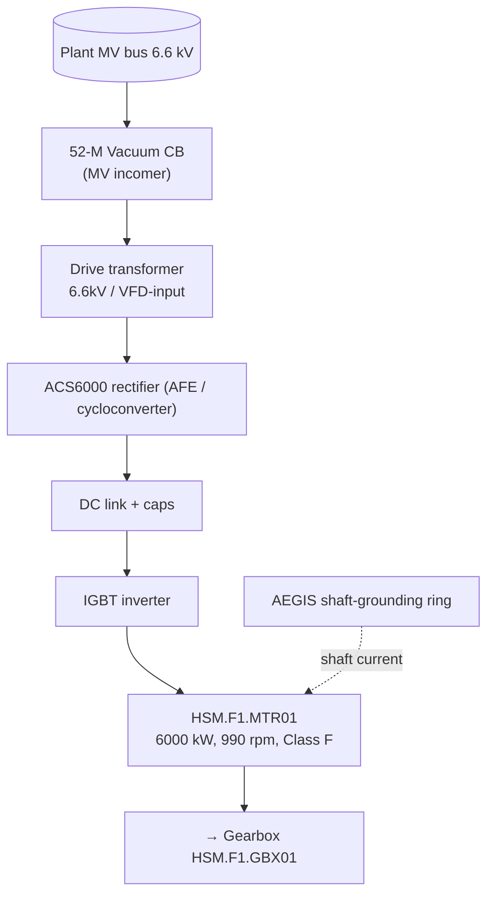

# ELEC-01 — F1 Main Drive: MV Induction Motor + VFD (Text Schematic)
**Asset ID:** HSM.F1.MTR01 | **Doc:** ELEC-01 | Rev 1.0 | Site: TATA_JSR (Synthetic)
**Standard References:** IEC 60034-1, NEMA MG1-2021, IEEE 1415-2006, IEC 60255 (protection), IEEE 43-2013

> **DISCLAIMER — SYNTHETIC DOCUMENT.** A real electrical schematic is a drawing; this reproduces the single-line description, protection settings, VFD parameters, and PLC wiring so the RAG corpus carries equivalent text. Values are representative estimates. No proprietary Tata Steel data.

---

## 1. Single-Line (power path)

- **Motor:** ABB AMI 630 MV, 6-pole squirrel-cage, 6000 kW, 990 rpm, insulation Class F (155 °C), bearings SKF 6326 (DE) / 6226 (NDE).
- **Drive:** ABB ACS6000, DC-link, IGBT inverter, dV/dt filter + common-mode choke.

## 2. Protection Settings (motor feeder relay)

| ANSI dev | Function | Setting (representative) | Basis |
|----------|----------|--------------------------|-------|
| 50 | Instantaneous overcurrent | ~8× FLC, 50 ms | IEC 60255 |
| 51 | Time overcurrent (IDMT) | 1.15× FLC, IEC very-inverse | NEMA MG1 service factor |
| 50N/51N | Earth-fault (residual) | 10–20% In, 0.1–0.3 s | resistance-earthed MV |
| 49 | Thermal overload (RTD-biased) | Class F → trip @155 °C winding | IEC 60034-1; ties to `WIND.TEMP` |
| 46 | Negative-sequence / phase unbalance | 2% warn / 5% trip | ties to `CURR.IMBAL` |
| 27/59 | Under/over-voltage | 0.8/1.2 pu | bus protection |
| 64 / IR | Stator earth-insulation (offline PI) | PI < 1.5 = do-not-energise | IEEE 43-2013; ties to `INS.PI` |

## 3. VFD Parameters (ACS6000, representative)

| Parameter | Value | Note |
|-----------|-------|------|
| Output frequency range | 0–50 Hz | 0–990 rpm |
| Accel / decel ramp | per mill master | high-torque starts stress rotor bars (SCN-039) |
| Switching scheme | IGBT, dV/dt-filtered | common-mode → AEGIS ring required |
| Motor thermal model | RTD-fed (Class F) | redundant to relay 49 |
| Current-imbalance monitor | enabled | drives `CURR.IMBAL` tag |
| Min lube interlock | OIL.PRES from GBX01 | drive trips < 2.0 bar (I-HR-02) |

## 4. Sensor → PLC Wiring (signal list)

| Spine tag | Signal type | Termination | PLC address (representative) |
|-----------|-------------|-------------|------------------------------|
| JSR.HR.STD1.MTR01.WIND.TEMP | RTD Pt100 (3-wire) → 4–20 mA tx | RTD card → AI | AI_F1MTR_WINDTEMP |
| JSR.HR.STD1.MTR01.VIB.DE.RMS | IEPE accel → 4–20 mA | vib card → AI | AI_F1MTR_VIBDE |
| JSR.HR.STD1.MTR01.VIB.2XF1 | IEPE accel (band) | vib card → AI | AI_F1MTR_VIB2XF1 |
| JSR.HR.STD1.MTR01.CURR.IMBAL | from VFD Modbus/IO | comms | NW_F1MTR_CURRIMBAL |
| JSR.HR.STD1.MTR01.MCSA.RBAR.SB | MCSA analyser feature | comms | NW_F1MTR_MCSA |
| JSR.HR.STD1.MTR01.INS.PI | offline Megger (manual entry) | CMMS event | — (offline) |

## 5. Earthing / Bonding
Resistance-earthed MV neutral; motor frame bonded to plant earth grid; AEGIS ring diverts VFD shaft current to prevent bearing EDM fluting (a contributor to motor-bearing spall, MAN-003 §5.5).

## 6. Related
SCN-039 (broken rotor bar), FTA-04 (motor winding insulation), SOP-03 (motor rewind/swap), LOTO-EX-01 (motor isolation). LOTO energy sources: MV electrical, VFD DC-link stored charge, gravity (mechanical load back-drive).
