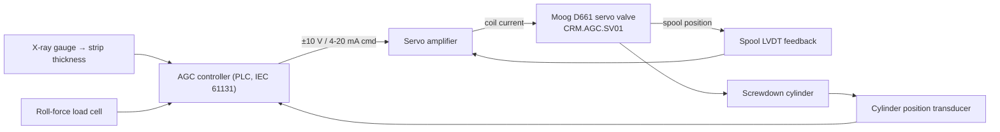

# ELEC-02 — Cold-Mill AGC Hydraulic Servo Control Loop (Text Schematic)
**Asset ID:** CRM.AGC.SV01 | **Doc:** ELEC-02 | Rev 1.0 | Site: TATA_JSR (Synthetic)
**Standard References:** ISA-5.1-2009, ISO 4406:2021, IEC 61131 (PLC)

> **DISCLAIMER — SYNTHETIC DOCUMENT.** Textual schematic of the AGC servo control + signal wiring. Representative values. No proprietary Tata Steel data.

---

## 1. Control-Loop Single-Line (signal path)

Inner loop: spool-position (LVDT) closed by the servo amplifier. Outer loop: gauge/position closed by the AGC PLC. The Moog D661 spool clearance is 1–3 um, hence the strict ISO 4406 ≤15/13/10 oil-cleanliness requirement.

## 2. Signal / Wiring List (sensor → PLC)

| Spine tag | Signal | Termination | PLC address (representative) |
|-----------|--------|-------------|------------------------------|
| JSR.CR.S2.AGC.SV.POSERR | LVDT-derived spool error | servo amp → AI (high-speed) | AI_AGC_POSERR |
| JSR.CR.S2.AGC.SV.NULLLEAK | null-leak test (flow tx) | test bench / AI | AI_AGC_NULLLEAK |
| JSR.CR.S2.AGC.SV.ISO4406 | inline particle counter | comms (Modbus) | NW_AGC_ISO4406 |
| JSR.CR.S2.AGC.GAUGE.DEV | from gauge processor | comms | NW_AGC_GAUGEDEV |
| Servo coil command | controller output | ±10 V / 4–20 mA | AO_AGC_SVCMD |

## 3. Servo / Drive Parameters (representative)

| Parameter | Value | Note |
|-----------|-------|------|
| Valve type | Moog D661, 2-stage, LVDT feedback | high-response |
| Rated flow | per cylinder sizing | — |
| Loop update rate | 100 Hz (POSERR sampling) | matches spine sampling |
| Cleanliness requirement | ISO 4406 ≤15/13/10 | servo-grade |
| Filtration | 3 um absolute (FLT-SERVO-3) | upstream of valve |
| Position-error alarm | 1.5% warn / 3.0% alarm | ties to `POSERR` |
| Null-leak limit | 1.0 warn / 2.0 alarm L/min | spool-wear indicator |

## 4. Protection / Fault Logic

| Logic | Action | Tie |
|-------|--------|-----|
| `POSERR` > 3.0% AND `GAUGE.DEV` > 20 um | AGC-loss: flag strip rejection, fall back to feed-forward, swap valve | SCN-048 |
| `ISO4406` ≥ 17/15/12 | Oil-dirty alarm: flush, replace FLT-SERVO-3 | SCN-048 |
| `NULLLEAK` ≥ 2.0 L/min | Spool-wear alarm: schedule valve replacement | MAN-013 |

## 5. Related
SCN-048 (servo silting / spool wear). Hydraulic supply detailed in PID-05. LOTO energy sources: hydraulic stored pressure (accumulator), electrical control supply.
