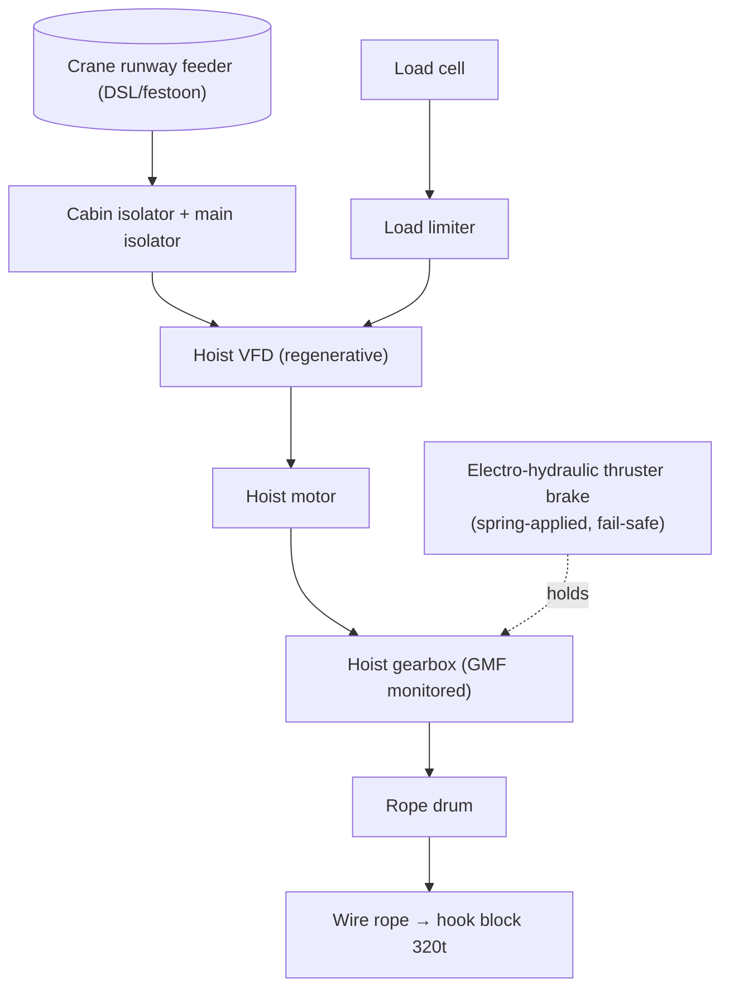

# ELEC-03 — Ladle Crane Hoist Drive & Safety Circuit (Text Schematic)
**Asset ID:** MS.LDC.CRN01 | **Doc:** ELEC-03 | Rev 1.0 | Site: TATA_JSR (Synthetic)
**Standard References:** FEM 1.001, BS EN 13135, ISO 4309:2017, IEC 60204-32 (crane electrical), OSHA 1910.179

> **DISCLAIMER — SYNTHETIC DOCUMENT.** Textual schematic of the hoist drive + load/safety circuit. Molten-metal life-safety asset — OEM (Konecranes) documentation governs. Representative values. No proprietary Tata Steel data.

---

## 1. Single-Line (hoist drive)

- **Fail-safe brake:** spring-applied / power-released electro-hydraulic thruster brake. Loss of power → brake applies (gravity-load hold). Spring pre-load sets holding torque.
- **Regenerative VFD:** controlled lowering of molten ladle; dynamic/regen braking shares duty with the mechanical brake.

## 2. Protection / Safety Settings

| Function | Setting (representative) | Basis |
|----------|--------------------------|-------|
| Overload — load limiter alarm | 95% SWL | molten-metal regime (stricter than EOT) |
| Overload — power cut | 110% SWL | ties to `LOAD.SWL` |
| Motor overcurrent (50/51) | per drive rating | IEC 60204-32 |
| Earth-fault (50N) | 10–20% In | crane feeder |
| Upper/lower limit switches | hard-wired into safety string | hoist over-travel |
| Brake monitoring | brake-applied feedback + drum temp | `BRAKE.TEMP` 110/120 °C |
| E-stop string | hard-wired, dual-channel | Cat-rated safety relay |

## 3. Sensor → PLC Wiring (signal list)

| Spine tag | Signal | Termination | PLC address (representative) |
|-----------|--------|-------------|------------------------------|
| JSR.MS.CRN01.LOAD.SWL | load cell → limiter | AI / safety | AI_CRN_LOADSWL |
| JSR.MS.CRN01.ROPE.MFL | MFL / MRT instrument | comms / event | NW_CRN_ROPEMFL |
| JSR.MS.CRN01.GBX.VIB.GMF | accel → vib card | AI | AI_CRN_GBXGMF |
| JSR.MS.CRN01.BRAKE.TEMP | IR sensor | AI | AI_CRN_BRAKETEMP |

## 4. Fault / Interlock Logic

| Logic | Action | Tie |
|-------|--------|-----|
| `LOAD.SWL` ≥ 110% | cut hoist power | I-MS-01 |
| `ROPE.MFL` ≥ 300 mV (≈ ISO 4309 discard) | remove crane from service, rope replacement | SCN-047 |
| `BRAKE.TEMP` ≥ 120 °C | brake-overheat alarm (slip / drag) | SOP-10 |
| `GBX.VIB.GMF` ≥ 2.5 g | hoist-gearbox alarm | SOP-10 Part C |

## 5. Related
SCN-047 (wire-rope fatigue / broken wire), FTA-05 (crane wire-rope), SOP-10, LOTO-EX-03. LOTO energy sources: electrical feeder, hydraulic brake-thruster supply, **gravity (suspended load — never leave ladle hanging)**, stored mechanical (rope/drum tension).
