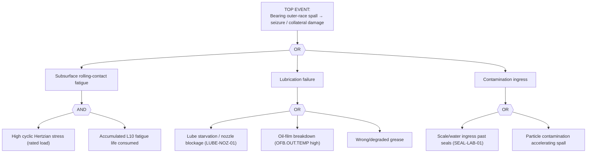

# FTA-01 — Rolling-Bearing Outer-Race Fatigue Spall (BPFO)
**Doc:** FTA-01 | Rev 1.0 | Site: TATA_JSR (Synthetic)
**Primary asset:** HSM.F3.WR.BRG01 (generalises to pump/fan bearings)
**Failure mode (spine):** `outer_race_fatigue_spall_BPFO` | **Scenario:** SCN-037
**Fault codes (spine):** `VIB-BPFO-DANGER`, `TEMP-TRIP-100C` | **Safety class:** P2
**Standard References:** ISO 15243:2017, ISO 20816-3:2022

> **DISCLAIMER — SYNTHETIC DOCUMENT.** Fault tree grounded in spine SCN-037 signature and ISO 15243. No proprietary Tata Steel data.

---

## 1. Fault Tree

## 2. Indented Tree (text)

- **TOP:** Outer-race spall → progression to seizure / collateral mill damage
  - **OR**
    - IE1 Subsurface rolling-contact fatigue **(AND)**
      - B1 High cyclic Hertzian contact stress at rated load
      - B2 L10 fatigue life consumed (age since `installation_date`/overhaul)
    - IE2 Lubrication failure **(OR)**
      - B3 Lube starvation / nozzle blockage
      - B4 Oil-film breakdown — `OFB.OUT.TEMP` > 75 °C
      - B5 Wrong or degraded grease
    - IE3 Contamination ingress **(OR)**
      - B6 Scale/water past labyrinth seal
      - B7 Hard-particle contamination accelerating spall initiation

## 3. Sensor Signature → Tree Mapping (SCN-037)

| Stage | Spine signature | Tree node |
|-------|-----------------|-----------|
| Healthy (wk 0–6) | AE −2..2 dBuV; VIB 1.6 mm/s; TEMP 58 °C | baseline |
| Warning (wk 6–8) | `AE.RMS` crosses 6 dBuV; no vib change yet | early IE1 |
| Alarm (wk 8–10) | `VIB.DE.ENV.BPFO` 1.0→3.0 g; TEMP drift | IE1 confirmed |
| Failure (hours) | all-3 alarming; `TEMP.DE` → 100 °C trip | TOP |

**Fault codes:** `VIB-BPFO-DANGER` (envelope BPFO), `TEMP-TRIP-100C` (outer-ring trip).

## 4. Resolution
Per SOP-01 (bearing replacement). Root-cause the lube/contamination branch (IE2/IE3) at change-out — replacing the bearing without fixing lube starvation repeats the failure.
