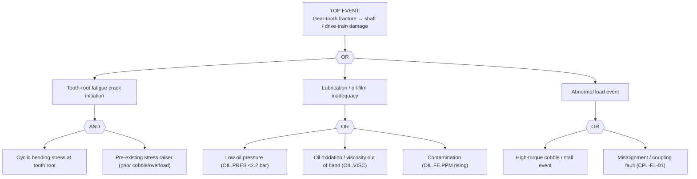

# FTA-02 — Mill Gearbox Gear-Tooth Fatigue Crack
**Doc:** FTA-02 | Rev 1.0 | Site: TATA_JSR (Synthetic)
**Primary asset:** HSM.F1.GBX01 (Flender H4SH, 6000 kW)
**Failure mode (spine):** `gear_tooth_fatigue_crack` | **Scenario:** SCN-038
**Fault codes (spine):** `GMF-DANGER`, `CHIP-DETECT-ALARM` | **Safety class:** P2
**Standard References:** ISO 6336 (gear rating), AGMA 9005, ISO 4406:2021

> **DISCLAIMER — SYNTHETIC DOCUMENT.** Grounded in spine SCN-038 signature. No proprietary Tata Steel data.

---

## 1. Fault Tree

## 2. Indented Tree (text)

- **TOP:** Tooth fracture → shaft risk / drive-train loss
  - **OR**
    - IE1 Tooth-root fatigue crack **(AND)** — cyclic bending + pre-existing stress raiser
    - IE2 Lubrication inadequacy **(OR)** — low `OIL.PRES`; `OIL.VISC` off-band; rising `OIL.FE.PPM`
    - IE3 Abnormal load **(OR)** — cobble/stall torque spike; misalignment/coupling

## 3. Sensor Signature → Tree Mapping (SCN-038)

| Stage | Spine signature | Tree node |
|-------|-----------------|-----------|
| Healthy (wk 0–8) | GMF 2.8 mm/s; Fe 3 ppm; oil clean | baseline |
| Warning (wk 8–10) | cepstrum rahmonics + GMF sidebands rise | IE1 crack growth |
| Alarm | chip detector trips + spall particles in oil | IE1 + IE2 |
| Failure | tooth fracture → shaft risk | TOP |

**Fault codes:** `GMF-DANGER` (GMF-band `VIB.GMF.RMS`), `CHIP-DETECT-ALARM` (`OIL.FE.PPM` / magnetic chip detector).

## 4. Resolution
Per SOP-02 (gearbox oil + gear service / overhaul). Confirm root cause: if SCN-038 traces to a prior cobble (IE3), inspect the mating gear and shaft for secondary cracks before return to service.
