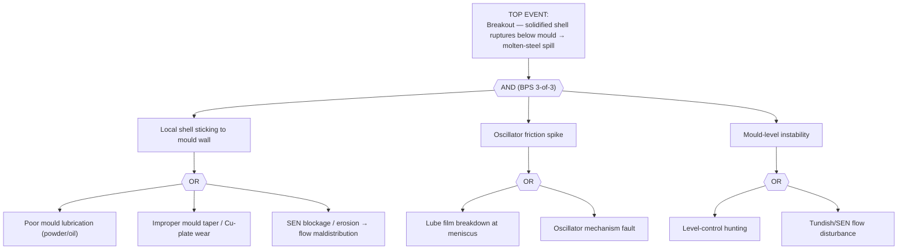

# FTA-03 — Continuous-Caster Breakout / Shell Sticking
**Doc:** FTA-03 | Rev 1.0 | Site: TATA_JSR (Synthetic)
**Primary asset:** CCM.MOLD.01 (slab Cu-Cr-Zr mould)
**Failure mode (spine):** `breakout_sticking` | **Scenario:** SCN-043
**Fault codes (spine):** `BPS-BREAKOUT-P1`, `TC-VPATTERN`, `OSC-FRICTION-SPIKE` | **Safety class:** P1
**Standard References:** mould BPS practice; SMS Concast oscillator/mould references

> **DISCLAIMER — SYNTHETIC DOCUMENT.** Grounded in spine SCN-043 (3-of-3 BPS rule). No proprietary Tata Steel data.

---

## 1. Fault Tree

> **Critical AND-gate:** A true breakout requires concurrent evidence on all three branches (TC V-pattern, friction spike, level wave). Single-sensor excursions are advisory — this AND-gate is the BPS logic that prevents false trips.

## 2. Indented Tree (text)

- **TOP:** Breakout — shell rupture below mould → spill
  - **AND (BPS 3-of-3)**
    - IE1 Shell sticking **(OR)** — poor lubrication; bad taper / Cu-plate wear; SEN blockage
    - IE2 Friction spike **(OR)** — meniscus lube-film breakdown; oscillator fault
    - IE3 Level instability **(OR)** — level-control hunting; SEN flow disturbance

## 3. Sensor Signature → Tree Mapping (SCN-043)

| Stage | Spine signature | Tree node |
|-------|-----------------|-----------|
| Healthy | TC delta 12 °C; level 1 mm; heat flux 1.6 MW/m² | baseline |
| Warning | `TC.DELTA` 20→25 °C **+** `OSC.FRICTION` spike **+** level wave (need all 3) | AND partially met |
| Alarm | `TC.DELTA` >50 °C V-pattern propagating **+** `OSC.FRICTION` >18 kN | BPS trip |
| Failure | shell rupture 60–90 s after BPS alarm | TOP |

**Fault codes:** `BPS-BREAKOUT-P1`, `TC-VPATTERN` (`MOLD.TC.DELTA`), `OSC-FRICTION-SPIKE` (`MOLD.OSC.FRICTION`).

## 4. Resolution
On BPS alarm: automatic casting-speed reduction / strand stop (PID-02 I-CC-01). Post-event: inspect Cu plate for sticking marks, check mould powder feed and SEN, verify oscillator. Mould copper change per SOP-07 if plate wear (B2) is the root cause.
