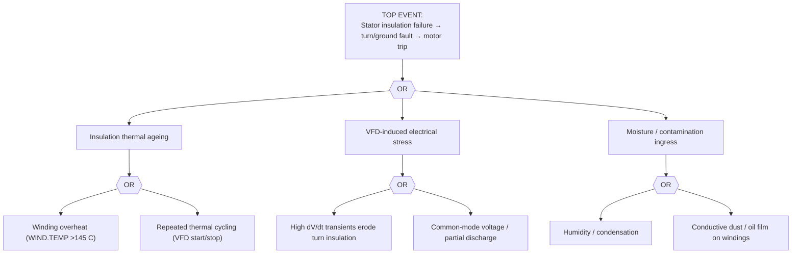

# FTA-04 — MV Motor Stator-Winding Insulation Failure
**Doc:** FTA-04 | Rev 1.0 | Site: TATA_JSR (Synthetic)
**Primary asset:** HSM.F1.MTR01 (ABB AMI 630 MV, Class F, VFD-fed)
**Failure mode (spine):** `stator_winding_turn_short` / `insulation_degradation_ground_fault`
**Related scenario:** SCN-039 family (electrical modes) | **Safety class:** P3
**Standard References:** IEEE 43-2013, IEC 60034-1, IEEE 1415-2006, NEMA MG1-2021

> **DISCLAIMER — SYNTHETIC DOCUMENT.** Grounded in MAN-003 §5.2/§5.3 and spine motor sensors. No proprietary Tata Steel data.

---

## 1. Fault Tree

## 2. Indented Tree (text)

- **TOP:** Stator insulation failure → turn-short / ground fault → trip
  - **OR**
    - IE1 Thermal ageing **(OR)** — overheat (`WIND.TEMP` >145 °C); thermal cycling
    - IE2 VFD electrical stress **(OR)** — dV/dt erosion; common-mode / partial discharge
    - IE3 Moisture/contamination **(OR)** — humidity; conductive dust/oil

## 3. Sensor Signature → Tree Mapping

| Stage | Spine / MAN-003 signature | Tree node |
|-------|---------------------------|-----------|
| Healthy | `WIND.TEMP` 118 °C; `CURR.IMBAL` 0.6%; `INS.PI` 2–5 | baseline |
| Warning | `INS.PI` < 2.0 (offline); slot temp asymmetry; `CURR.IMBAL` rising | IE1/IE2 |
| Alarm | `INS.PI` < 1.5 (do-not-energise); `CURR.IMBAL` >5%; `VIB.2XF1` elevated (magnetic asymmetry) | turn-short developing |
| Failure | phase-to-phase / ground fault → relay 50N/49 trip | TOP |

**Protection ties (ELEC-01):** relay 46 (`CURR.IMBAL`), relay 49 (`WIND.TEMP`), offline IR/PI (`INS.PI`).

## 4. Resolution
PI < 1.5 → do NOT re-energise without engineering review (MAN-003). Rewind (RWND-KIT-MV, 3-wk) or swap to insurance spare (MTR-MV-6000) per SOP-03. Isolation per LOTO-EX-01 (MV + VFD DC-link + gravity back-drive).
