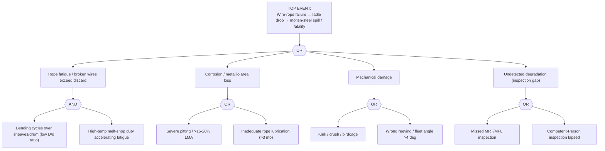

# FTA-05 — Ladle-Crane Wire-Rope Fatigue / Broken-Wire Failure
**Doc:** FTA-05 | Rev 1.0 | Site: TATA_JSR (Synthetic)
**Primary asset:** MS.LDC.CRN01 (Konecranes 320 t ladle crane)
**Failure mode (spine):** `wire_rope_fatigue_broken_wire` | **Scenario:** SCN-047
**Fault codes (spine):** `ROPE-MFL-RETIRE`, `ROPE-DISCARD-ISO4309` | **Safety class:** P1
**Standard References:** ISO 4309:2017, FEM 1.001, BS EN 13135, OSHA 1910.179

> **DISCLAIMER — SYNTHETIC DOCUMENT.** Life-safety asset. Grounded in spine SCN-047 + SOP-10 discard criteria. No proprietary Tata Steel data.

---

## 1. Fault Tree

## 2. Indented Tree (text)

- **TOP:** Wire-rope failure → ladle drop (mass-fatality risk)
  - **OR**
    - IE1 Fatigue/broken wires **(AND)** — bending cycles (low D/d) + hostile melt-shop duty
    - IE2 Corrosion / LMA loss **(OR)** — pitting / >15–20% LMA; poor rope lube
    - IE3 Mechanical damage **(OR)** — kink/crush/birdcage; wrong reeving / fleet >4°
    - IE4 Undetected degradation **(OR)** — missed MRT; lapsed CP inspection

## 3. Sensor / Inspection Signature → Tree Mapping (SCN-047)

| Stage | Signature (spine / ISO 4309) | Tree node |
|-------|------------------------------|-----------|
| Healthy (months) | `ROPE.MFL` 0–100 mV; <6 broken wires | baseline |
| Warning | `ROPE.MFL` 150 mV (~8–12% LMA); dia −3%; ≥6 random broken wires/lay | IE1/IE2 early |
| Alarm (discard) | `ROPE.MFL` 300 mV (>15–20% LMA); ≥12 random (or ≥4 in one strand); dia −7% | ISO 4309 discard |
| Failure | rope parts → ladle drop | TOP |

**Fault codes:** `ROPE-MFL-RETIRE` (MFL threshold), `ROPE-DISCARD-ISO4309` (broken-wire/LMA/diameter criteria).

> **Defence-in-depth (cuts IE4):** quarterly MRT, monthly visual, pre-shift operator check, mandatory Competent-Person certification before molten-metal return-to-service.

## 4. Resolution
Immediate removal from service on any discard criterion; rope replacement per SOP-10 Part A; brake check Part B. Isolation per LOTO-EX-03 (electrical + brake-hydraulic + gravity — never leave ladle suspended).
