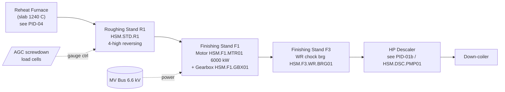

# P&ID-01 — Hot Strip Mill (Hot Rolling Process Area)
**Area:** HOT_ROLLING (TATA_JSR, synthetic reference) | **Doc:** PID-01 | Rev 1.0
**Standard References:** ISA-5.1-2009 (instrumentation symbols & tag identification), ISA-95 (asset/tag hierarchy)

> **DISCLAIMER — SYNTHETIC DOCUMENT.** This is a *textual* P&ID — a real P&ID is a drawing. The instrument tag content is reproduced from `SPEC/ground_truth_spine.json` so the RAG corpus carries the same tags, loops, and interlocks a drafted P&ID sheet would. All numeric values are representative industry estimates. No proprietary Tata Steel data is used.

---

## 1. Process Flow

Drive train per stand: **MV bus → VFD (ACS6000) → induction motor (HSM.F1.MTR01) → reduction gearbox (HSM.F1.GBX01) → pinion stand → work rolls** (chock bearings e.g. HSM.F3.WR.BRG01). Roll force is reacted through the housing and measured by AGC load cells on HSM.STD.R1.

---

## 2. Instrument Tag List (ISA-5.1 — reproduced from spine)

| Loop tag (spine) | ISA-5.1 type | Service | Unit | Normal | Warn | Alarm |
|------------------|--------------|---------|------|--------|------|-------|
| JSR.HR.STD1.MTR01.WIND.TEMP | TI/TIT | F1 motor stator winding temp | degC | 80–130 | 145 | 155 |
| JSR.HR.STD1.MTR01.VIB.DE.RMS | VI/VT | F1 motor DE vibration RMS | mm/s | 0.5–2.3 | 4.5 | 7.1 |
| JSR.HR.STD1.MTR01.CURR.IMBAL | II/IT | F1 motor phase current imbalance | % | 0–1 | 2 | 5 |
| JSR.HR.STD1.MTR01.MCSA.RBAR.SB | JI (elec sig) | F1 motor rotor-bar MCSA sideband | dBc | −70 to −50 | −45 | −35 |
| JSR.HR.STD1.MTR01.VIB.2XF1 | VI/VT | F1 motor 2× supply-freq vib | mm/s | 0.0–0.5 | 1.0 | 2.5 |
| JSR.HR.STD1.GBX01.VIB.GMF.RMS | VI/VT | F1 gearbox GMF-band vib | mm/s | 0.5–4.0 | 6.0 | 10.0 |
| JSR.HR.STD1.GBX01.OIL.TEMP | TI/TIT | F1 gearbox oil sump temp | degC | 45–65 | 80 | 90 |
| JSR.HR.STD1.GBX01.OIL.PRES | PI/PIT | F1 gearbox lube-oil pressure | bar | 2.5–4.0 | 2.2 | 2.0 |
| JSR.HR.STD1.GBX01.OIL.FE.PPM | AI/AT | F1 gearbox ferrous particle count | ppm | 0–5 | 15 | 40 |
| JSR.HR.STD1.GBX01.OIL.VISC | AI/AT | F1 gearbox oil viscosity @40C | cSt | 198–242 | 180 | 265 |
| JSR.HR.STD3.WR.BRG01.VIB.DE.H.RMS | VI/VT | F3 WR bearing DE vib RMS | mm/s | 0.5–2.3 | 4.5 | 7.1 |
| JSR.HR.STD3.WR.BRG01.VIB.DE.ENV.BPFO | VI/VT | F3 WR bearing BPFO envelope | g | 0.0–0.5 | 1.0 | 3.0 |
| JSR.HR.STD3.WR.BRG01.TEMP.DE | TI/TIT | F3 WR bearing outer-ring temp | degC | 40–70 | 85 | 100 |
| JSR.HR.STD3.WR.BRG01.OFB.OUT.TEMP | TI/TIT | F3 oil-film bearing outlet temp | degC | 50–65 | 75 | 85 |
| JSR.HR.STD3.WR.BRG01.AE.RMS | YE/AE | F3 WR bearing acoustic emission | dBuV | −2 to 2 | 6 | 12 |
| JSR.HR.R1.FORCE | WI/WT | R1 rolling-force ripple | % | 0–2 | 4 | 8 |
| JSR.HR.R1.WR.VIB.CHOCK | VI/VT | R1 chock chatter vibration | mm/s | 0–1.0 | 4.0 | 10.0 |
| JSR.HR.R1.CROWN.DEV | GI/GT | R1 strip-crown deviation | um | −10 to 10 | 25 | 40 |
| JSR.HR.R1.WR.AE.RMS | YE/AE | R1 roll-journal acoustic emission | dB | −3 to 3 | 8 | 15 |

---

## 3. Control Loops

- **CL-HR-01 — F1 speed/torque loop:** ACS6000 VFD regulates motor speed (0–990 rpm). Feedback: motor encoder + `JSR.HR.STD1.MTR01.CURR.IMBAL` health gate. Cascaded under the mill master speed reference.
- **CL-HR-02 — F1 gearbox lube loop:** Forced-lube pump maintains `JSR.HR.STD1.GBX01.OIL.PRES` 2.5–4.0 bar; low-pressure (<2.0 bar) trips the drive (interlock I-HR-02).
- **CL-HR-03 — R1 AGC gauge loop:** Roll-force load cells + `JSR.HR.R1.CROWN.DEV` feed the hydraulic/electric screwdown to hold gauge; ripple `JSR.HR.R1.FORCE` is a diagnostic, not a control, tag.
- **CL-HR-04 — F3 oil-film bearing loop:** OFB lube supply holds `JSR.HR.STD3.WR.BRG01.OFB.OUT.TEMP` 50–65 °C; outlet >85 °C trips (interlock I-HR-04).

## 4. Interlocks (ISA-18.2 priority shown)

| ID | Logic | Action | Priority |
|----|-------|--------|----------|
| I-HR-01 | `MTR01.WIND.TEMP` ≥ 155 | Controlled stop F1 drive | P2 (high) |
| I-HR-02 | `GBX01.OIL.PRES` ≤ 2.0 bar | Trip F1 drive (no-lube protection) | P1 (critical) |
| I-HR-03 | `MTR01.VIB.DE.RMS` ≥ 7.1 | Controlled stop, inspect bearings | P2 |
| I-HR-04 | `WR.BRG01.OFB.OUT.TEMP` ≥ 85 | Stop F3, OFB inspection | P2 |
| I-HR-05 | `R1.WR.VIB.CHOCK` ≥ 10.0 (5th-octave chatter) | Reduce speed / strip pass | P3 |

## 5. Related Failure Scenarios
SCN-037 (F3 BRG outer-race spall), SCN-038 (F1 gearbox tooth fatigue), SCN-039 (F1 motor broken rotor bar), SCN-044 (R1 work-roll spall). See FTA-01/02/04 and ELEC-01.
