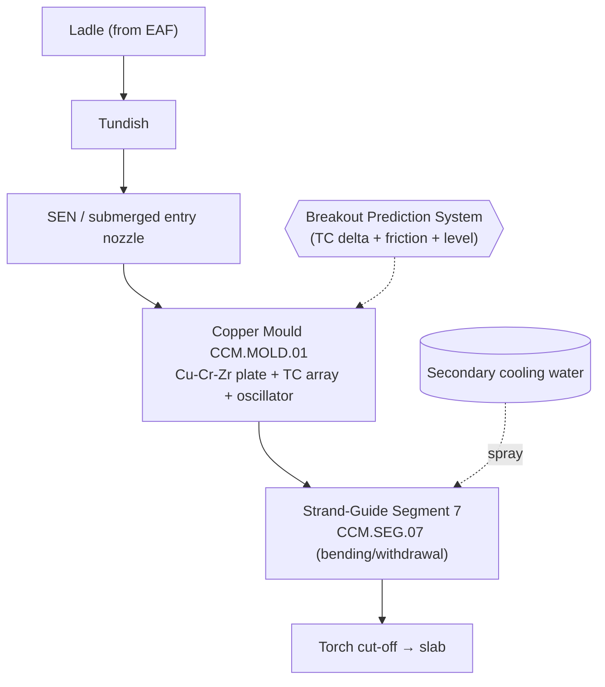

# P&ID-02 — Continuous Caster 1 (Casting Process Area)
**Area:** CASTER_1 (TATA_JSR, synthetic reference) | **Doc:** PID-02 | Rev 1.0
**Standard References:** ISA-5.1-2009, ISA-95

> **DISCLAIMER — SYNTHETIC DOCUMENT.** Textual P&ID; tag content reproduced from the spine. No proprietary Tata Steel data.

---

## 1. Process Flow

The mould forms the initial solid shell; the oscillator prevents sticking; secondary spray in the strand guide completes solidification through Segment 7's clamped rolls.

---

## 2. Instrument Tag List (ISA-5.1 — reproduced from spine)

| Loop tag (spine) | ISA-5.1 type | Service | Unit | Normal | Warn | Alarm |
|------------------|--------------|---------|------|--------|------|-------|
| JSR.CC1.MOLD.TC.DELTA | TI/TDT | Adjacent thermocouple delta (breakout precursor) | degC | 0–20 | 25 | 50 |
| JSR.CC1.MOLD.OSC.FRICTION | WI/WT | Oscillator friction force | kN | 2–8 | 10 | 18 |
| JSR.CC1.MOLD.LEVEL.DEV | LI/LT | Mould level deviation | mm | −2 to 2 | 5 | 12 |
| JSR.CC1.MOLD.HEATFLUX | QI/QT | Mean mould heat flux (computed) | MW/m2 | 1.2–2.0 | 1.0 | 0.8 |
| JSR.CC1.SEG07.FORCE.HYD | WI/WT | Segment clamping force | kN | 200–400 | 480 | 550 |
| JSR.CC1.SEG07.ROLL.RPM | SI/ST | Roll rotation speed (encoder) | rpm | 3–25 | 1.0 | 0.0 |
| JSR.CC1.SEG07.BULGE | GI/GT | Strand bulge deviation | mm | 0.0–1.0 | 2.0 | 4.0 |
| JSR.CC1.SEG07.SPRAY.FLOW | FI/FT | Zone spray flow | L/min | 180–220 | 150 | 120 |
| JSR.CC1.SEG07.VIB.ROLL | VI/VT | Roll-bearing vibration | mm/s | 0.5–2.0 | 3.5 | 6.0 |

> **Direction notes (from spine):** `MOLD.HEATFLUX` — *lower is worse* (cold spot → breakout). `SEG07.ROLL.RPM` — drop toward 0 = roll seizure (no encoder pulses).

---

## 3. Control Loops

- **CL-CC-01 — Mould level loop:** Stopper/slide-gate modulated against `JSR.CC1.MOLD.LEVEL.DEV` (target ±2 mm).
- **CL-CC-02 — Oscillation loop:** Servo-driven oscillator at fixed frequency/stroke; `JSR.CC1.MOLD.OSC.FRICTION` is the lubrication-health monitor.
- **CL-CC-03 — Secondary cooling loop:** Spray-water flow `JSR.CC1.SEG07.SPRAY.FLOW` scheduled to casting speed (zone model).
- **CL-CC-04 — Segment soft-reduction loop:** Hydraulic clamp holds `JSR.CC1.SEG07.FORCE.HYD` to the gap/force setpoint.

## 4. Interlocks (BPS-centric)

| ID | Logic | Action | Priority |
|----|-------|--------|----------|
| I-CC-01 (BPS) | `MOLD.TC.DELTA` > 50 V-pattern **AND** `OSC.FRICTION` > 18 **AND** level wave (3-of-3) | Breakout-Prediction trip: drop casting speed / stop strand | P1 (critical) |
| I-CC-02 | `SEG07.ROLL.RPM` → 0 with `FORCE.HYD` > 480 | Roll-seizure alarm, stop strand | P2 |
| I-CC-03 | `SEG07.SPRAY.FLOW` < 120 | Cooling-loss alarm | P2 |
| I-CC-04 | `MOLD.HEATFLUX` < 0.8 | Cold-spot / sticking warning to BPS | P2 |

> **BPS single-sensor rule:** A breakout trip requires **all three** signatures (TC delta V-pattern, friction spike, level wave). Single-sensor excursions are advisory only (per spine SCN-043).

## 5. Related Failure Scenarios
SCN-042 (CCM.SEG.07 roll seizure), SCN-043 (CCM.MOLD.01 breakout/sticking). See FTA-03 (caster breakout).
