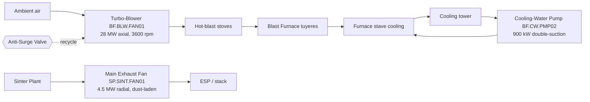

# P&ID-03 — Blast Furnace Blower / Cooling-Water + Sinter Fan (Iron-Making)
**Area:** BLAST_FURNACE + SINTER_PLANT (TATA_JSR, synthetic reference) | **Doc:** PID-03 | Rev 1.0
**Standard References:** ISA-5.1-2009, ISA-95, API 670:2014

> **DISCLAIMER — SYNTHETIC DOCUMENT.** Textual P&ID; tag content reproduced from the spine. No proprietary Tata Steel data.

---

## 1. Process Flow

---

## 2. Instrument Tag List (ISA-5.1 — reproduced from spine)

| Loop tag (spine) | ISA-5.1 type | Service | Unit | Normal | Warn | Alarm |
|------------------|--------------|---------|------|--------|------|-------|
| JSR.BF.BLW.FAN01.VIB.1X | VI/VT | Blower 1× vibration RMS | mm/s | 1.0–2.3 | 4.5 | 7.1 |
| JSR.BF.BLW.FAN01.SHAFT.DISP | ZI/ZT | Shaft displacement pk-pk (proximity) | um | 10–50 | 80 | 127 |
| JSR.BF.BLW.FAN01.TEMP.BRG | TI/TIT | Journal bearing temp | degC | 45–65 | 80 | 95 |
| JSR.BF.BLW.FAN01.PRES.OSC | PI/PT | Discharge pressure oscillation | % | 0–2 | 5 | 8 |
| JSR.BF.BLW.FAN01.THRUST.TEMP | TI/TIT | Thrust bearing temp | degC | 50–75 | 90 | 105 |
| JSR.BF.CW.PMP02.VIB.1X | VI/VT | CW pump 1× radial vib | mm/s | 0.5–1.8 | 2.8 | 5.6 |
| JSR.BF.CW.PMP02.HEAD.DEV | PI/PDT | CW pump diff-head deviation | % | −3 to 3 | −7 | −12 |
| JSR.BF.CW.PMP02.TEMP.BRG | TI/TIT | CW pump bearing temp | degC | 40–70 | 85 | 100 |
| JSR.BF.CW.PMP02.VIB.BB | VI/VT | CW pump broadband (seal) vib | mm/s | 0.5–1.5 | 2.5 | 5.0 |
| JSR.SP.FAN01.VIB.1X | VI/VT | Sinter fan 1× vib RMS | mm/s | 1.0–2.3 | 4.5 | 7.1 |
| JSR.SP.FAN01.TEMP.BRG | TI/TIT | Sinter fan bearing temp | degC | 45–65 | 80 | 95 |
| JSR.SP.FAN01.VIB.AXIAL | VI/VT | Sinter fan axial 2× ratio | ratio | 0.0–0.3 | 0.4 | 0.7 |
| JSR.SP.FAN01.DP.DUCT | PI/PDT | Sinter fan inlet/outlet DP | kPa | 8–14 | 18 | 22 |

> **Direction notes:** `CW.PMP02.HEAD.DEV` — *negative = wear* (impeller erosion). API 670 shaft-displacement limit at 127 um (alarm).

---

## 3. Control Loops

- **CL-BF-01 — Blast volume/pressure loop:** Blower speed (steam-turbine or motor drive) regulates cold-blast pressure; surge margin tracked via `JSR.BF.BLW.FAN01.PRES.OSC`.
- **CL-BF-02 — Anti-surge loop:** ASV opens when operating point approaches surge line (margin < 8%) to recycle/blow-off.
- **CL-BF-03 — Cooling-water loop:** CW pump holds stave-circuit differential head; `JSR.BF.CW.PMP02.HEAD.DEV` flags impeller wear.
- **CL-SP-01 — Sinter draught loop:** Fan damper/speed holds bed draught; `JSR.SP.FAN01.DP.DUCT` monitors duct/ESP loading.

## 4. Interlocks

| ID | Logic | Action | Priority |
|----|-------|--------|----------|
| I-BF-01 | `BLW.PRES.OSC` > 8 **AND** axial vib burst | Surge protection — open ASV, hold/reduce speed | P1 (critical) |
| I-BF-02 | `BLW.SHAFT.DISP` ≥ 127 um | Trip blower (API 670) | P1 |
| I-BF-03 | `CW.PMP02.VIB.1X` ≥ 5.6 **OR** `TEMP.BRG` ≥ 100 | Swap to standby CW pump | P2 |
| I-SP-01 | `SP.FAN01.VIB.1X` ≥ 7.1 (imbalance/shedding) | Reduce speed, plan balance | P2 |

## 5. Related Failure Scenarios
SCN-041 (BF.BLW.FAN01 surge), SCN-050 (BF.CW.PMP02 bearing failure), SCN-051 (SP.SINT.FAN01 mass imbalance). See FTA-01 (bearing spall).
