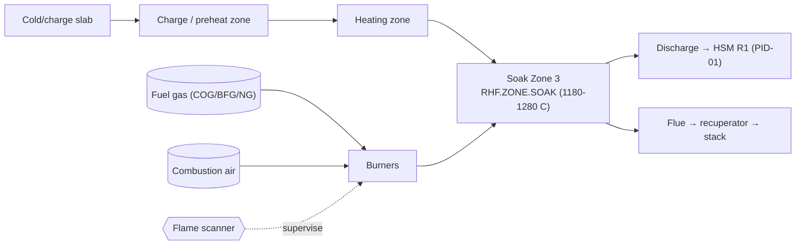

# P&ID-04 — Reheating Furnace Soak Zone (Reheating)
**Area:** REHEAT_FURNACE (TATA_JSR, synthetic reference) | **Doc:** PID-04 | Rev 1.0
**Standard References:** ISA-5.1-2009, ISA-95, EN 746-2:2010 (industrial thermoprocessing safety)

> **DISCLAIMER — SYNTHETIC DOCUMENT.** Textual P&ID; tag content reproduced from the spine. No proprietary Tata Steel data.

---

## 1. Process Flow

Walking-beam mechanism indexes slabs through the zones; the soak zone equalises slab temperature before the slab discharges to the hot strip mill.

---

## 2. Instrument Tag List (ISA-5.1 — reproduced from spine)

| Loop tag (spine) | ISA-5.1 type | Service | Unit | Normal | Warn | Alarm |
|------------------|--------------|---------|------|--------|------|-------|
| JSR.RHF.Z3.ZONE.TEMP | TI/TIT (Type S TC) | Soak zone temperature | degC | 1180–1280 | 1300 | 1330 |
| JSR.RHF.Z3.FLAME.SIG | BI/BE | Flame scanner signal | % | 90–100 | 70 | 40 |
| JSR.RHF.Z3.FLUE.O2 | AI/AT | Flue-gas O2 | % | 1.5–3.5 | 5.0 (hi) / 1.0 (lo) | 6.0 |
| JSR.RHF.Z3.SHELL.IR | TI/TE (IR) | Shell surface temp (refractory health) | degC | 80–120 | 180 | 250 |

> **Direction notes:** `FLAME.SIG` — *lower is worse* (flame loss). `FLUE.O2` has a dual band: low O2 (<1.0%) = incomplete combustion/CO risk; high O2 (>5.0%) = excess-air / burner fault. `SHELL.IR` rising = refractory hot-spot/burnout.

---

## 3. Control Loops

- **CL-RHF-01 — Zone temperature loop:** Fuel/air firing rate modulated against `JSR.RHF.Z3.ZONE.TEMP` setpoint (slab-temperature model).
- **CL-RHF-02 — Combustion trim loop:** Air/fuel ratio trimmed on `JSR.RHF.Z3.FLUE.O2` (target 1.5–3.5%).
- **CL-RHF-03 — Burner flame supervision:** `JSR.RHF.Z3.FLAME.SIG` continuously supervised; loss triggers fuel safety shut-off valve (FSSV).

## 4. Interlocks (EN 746-2 burner safety)

| ID | Logic | Action | Priority |
|----|-------|--------|----------|
| I-RHF-01 | `FLAME.SIG` < 40 | Auto fuel cut-off (FSSV close), purge before re-light | P2 (high) |
| I-RHF-02 | `FLUE.O2` > 6.0 | Excess-air / burner-fault alarm, reduce firing | P2 |
| I-RHF-03 | `ZONE.TEMP` > 1330 | High-temp alarm, cut firing (refractory protection) | P2 |
| I-RHF-04 | `SHELL.IR` > 250 | Refractory burnout alarm, plan controlled shutdown | P2 |

> **Safe-light sequence:** On flame loss the FSSV closes; a timed purge (≥4 furnace-volume changes per EN 746-2) is mandatory before re-ignition. No manual re-light without purge.

## 5. Related Failure Scenarios
SCN-046 (RHF.ZONE.SOAK burner failure / fuel-side). See FTA-05? — note FTA set covers bearing/gearbox/breakout/winding/wire-rope; burner fault is covered narratively here and in MAN-010.
