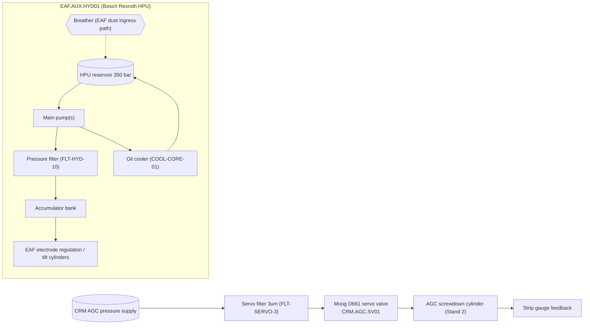

# P&ID-05 — Melt-Shop & Cold-Mill Hydraulic Systems (Steelmaking / Cold Rolling)
**Area:** MELT_SHOP (EAF_1) + COLD_ROLLING (STAND_2) (TATA_JSR, synthetic reference) | **Doc:** PID-05 | Rev 1.0
**Standard References:** ISA-5.1-2009, ISA-95, ISO 4406:2021 (oil cleanliness)

> **DISCLAIMER — SYNTHETIC DOCUMENT.** Textual P&ID; tag content reproduced from the spine. No proprietary Tata Steel data.

---

## 1. Process Flow

---

## 2. Instrument Tag List (ISA-5.1 — reproduced from spine)

| Loop tag (spine) | ISA-5.1 type | Service | Unit | Normal | Warn | Alarm |
|------------------|--------------|---------|------|--------|------|-------|
| JSR.MS.EAF1.HYD.ISO4406 | AI/AT | EAF HPU oil cleanliness code | ISO code | ≤17/15/12 | 18/16/13 | 19/17/14 |
| JSR.MS.EAF1.HYD.OIL.TEMP | TI/TIT | EAF HPU oil temperature | degC | 40–50 | 60 | 70 |
| JSR.MS.EAF1.HYD.FILT.DP | PI/PDT | EAF HPU filter differential pressure | bar | 0.0–1.5 | 3.0 | 4.5 |
| JSR.MS.EAF1.HYD.WATER.PPM | AI/AT | EAF HPU water content | ppm | 0–100 | 200 | 500 |
| JSR.CR.S2.AGC.SV.ISO4406 | AI/AT | Servo oil cleanliness code | ISO code | ≤15/13/10 | 16/14/11 | 17/15/12 |
| JSR.CR.S2.AGC.SV.POSERR | YI/YT | Servo position error | % | 0.0–0.5 | 1.5 | 3.0 |
| JSR.CR.S2.AGC.SV.NULLLEAK | FI/FT | Servo null leakage | L/min | 0.0–0.5 | 1.0 | 2.0 |
| JSR.CR.S2.AGC.GAUGE.DEV | GI/GT | Strip gauge deviation | um | −5 to 5 | 10 | 20 |

> **Note:** Servo cleanliness target (≤15/13/10) is one to two ISO codes cleaner than the EAF HPU (≤17/15/12) — the Moog D661 spool clearance (1–3 um) is silt-sensitive.

---

## 3. Control Loops

- **CL-EAF-01 — HPU pressure loop:** Pump/accumulator hold 350 bar; condition gated by `JSR.MS.EAF1.HYD.FILT.DP` and `JSR.MS.EAF1.HYD.OIL.TEMP`.
- **CL-EAF-02 — Cooler loop:** Oil cooler holds `JSR.MS.EAF1.HYD.OIL.TEMP` 40–50 °C.
- **CL-CRM-01 — AGC gauge servo loop:** Moog D661 closes the gauge loop — `JSR.CR.S2.AGC.GAUGE.DEV` is the controlled variable; `JSR.CR.S2.AGC.SV.POSERR` is the inner spool-position feedback.

## 4. Interlocks

| ID | Logic | Action | Priority |
|----|-------|--------|----------|
| I-EAF-01 | `EAF1.HYD.FILT.DP` ≥ 4.5 bar | Filter-blinding alarm — bypass-risk, change element (FLT-HYD-10) | P4→escalate |
| I-EAF-02 | `EAF1.HYD.WATER.PPM` ≥ 500 | Water-contamination alarm, dewater / drain | P3 |
| I-EAF-03 | `EAF1.HYD.OIL.TEMP` ≥ 70 | Cooler-fault alarm (COOL-CORE-01) | P3 |
| I-CRM-01 | `AGC.SV.POSERR` ≥ 3.0 **AND** `GAUGE.DEV` > 20 | AGC-loss alarm — flag strip for rejection, swap servo | P2 |
| I-CRM-02 | `AGC.SV.ISO4406` ≥ 17/15/12 | Servo-oil-dirty alarm, flush + replace FLT-SERVO-3 | P2 |

> **Bypass caution:** When `FILT.DP` reaches 4.5 bar the filter element is blinding; if the bypass opens, unfiltered EAF-dust-laden oil reaches downstream servos — change the element before bypass (SCN-049).

## 5. Related Failure Scenarios
SCN-048 (CRM.AGC.SV01 servo silting / spool wear), SCN-049 (EAF.AUX.HYD01 filter clog). See FTA-05 (motor winding) is unrelated; servo/HPU faults are narrative here + MAN-011/MAN-013.
