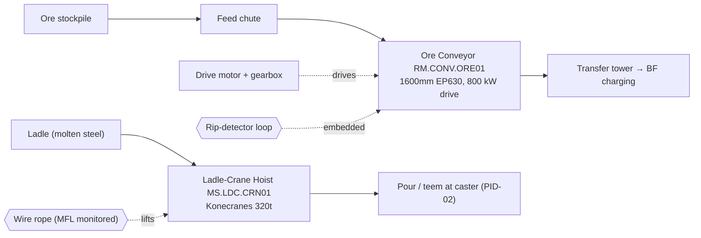

# P&ID-06 — Raw-Material Handling & Molten-Metal Crane (Material Handling)
**Area:** RAW_MATERIAL (ORE_YARD) + MELT_SHOP (LADLE_BAY) (TATA_JSR, synthetic reference) | **Doc:** PID-06 | Rev 1.0
**Standard References:** ISA-5.1-2009, ISA-95, CEMA (belt conveyors), ISO 4309:2017 (wire rope)

> **DISCLAIMER — SYNTHETIC DOCUMENT.** Textual P&ID; tag content reproduced from the spine. No proprietary Tata Steel data.

---

## 1. Process Flow

---

## 2. Instrument Tag List (ISA-5.1 — reproduced from spine)

| Loop tag (spine) | ISA-5.1 type | Service | Unit | Normal | Warn | Alarm |
|------------------|--------------|---------|------|--------|------|-------|
| JSR.RM.CONV1.MTR.CURR | II/IT | Conveyor drive motor current | %FLA | 60–95 | 105 | 125 |
| JSR.RM.CONV1.IDLER.US | YE/AE | Idler ultrasound level | dBuV | −20 to −8 | 8 | 15 |
| JSR.RM.CONV1.IDLER.TEMP | TI/TE (IR) | Idler surface temp (fire risk) | degC | 25–60 | 80 | 100 |
| JSR.RM.CONV1.BELT.EDGE | GI/GT | Belt edge position (tracking) | mm | −15 to 15 | 25 | 50 |
| JSR.RM.CONV1.RIP.LOOP | JI/JT | Rip-detector loop current | mA | 60–80 | 48 | 0 |
| JSR.MS.CRN01.ROPE.MFL | YE/AE (MFL/LMA) | Hoist wire-rope MFL signal | mV | 0–100 | 150 | 300 |
| JSR.MS.CRN01.LOAD.SWL | WI/WT | Hoist load (% SWL) | %SWL | 0–95 | 95 | 110 |
| JSR.MS.CRN01.GBX.VIB.GMF | VI/VT | Hoist gearbox GMF vibration | g | 0–0.5 | 1.0 | 2.5 |
| JSR.MS.CRN01.BRAKE.TEMP | TI/TE (IR) | Brake drum temperature | degC | 25–90 | 110 | 120 |

> **Direction notes:** `RIP.LOOP` — open loop (→ 0 mA) = belt tear. `ROPE.MFL` is the LMA proxy; alarm 300 mV ≈ >15–20% LMA / ISO 4309 discard. `LOAD.SWL` — molten-metal crane regime: alarm at 95% SWL, power-cut at 110%.

---

## 3. Control Loops

- **CL-RM-01 — Conveyor drive loop:** VFD/DOL drive; `JSR.RM.CONV1.MTR.CURR` is load/overload indicator (blocked chute → overcurrent).
- **CL-RM-02 — Belt tracking loop:** Self-aligning idlers / trackers correct `JSR.RM.CONV1.BELT.EDGE`.
- **CL-MS-01 — Hoist load loop:** Load cell + limiter on `JSR.MS.CRN01.LOAD.SWL`; ISO 4309 rope-health via `JSR.MS.CRN01.ROPE.MFL`.

## 4. Interlocks

| ID | Logic | Action | Priority |
|----|-------|--------|----------|
| I-RM-01 | `CONV1.RIP.LOOP` open (0 mA) | Emergency belt stop (rip detected) | P1 (critical) |
| I-RM-02 | `CONV1.IDLER.TEMP` ≥ 100 | Belt-fire-risk alarm, stop & inspect idler | P1 |
| I-RM-03 | `CONV1.MTR.CURR` ≥ 125 %FLA | Overload trip (blocked-chute protection) | P2 |
| I-RM-04 | `CONV1.BELT.EDGE` ≥ 50 mm | Mis-track alarm, stop before edge damage | P2 |
| I-MS-01 | `CRN01.LOAD.SWL` ≥ 110 %SWL | Cut hoist power (overload) | P1 |
| I-MS-02 | `CRN01.ROPE.MFL` ≥ 300 mV | Rope-discard alarm, remove crane from service | P1 |

## 5. Related Failure Scenarios
SCN-045 (RM.CONV.ORE01 idler bearing failure → belt fire), SCN-047 (MS.LDC.CRN01 wire-rope fatigue / broken wire). See FTA-05 (crane wire-rope), SOP-09, SOP-10, LOTO-EX-03.
