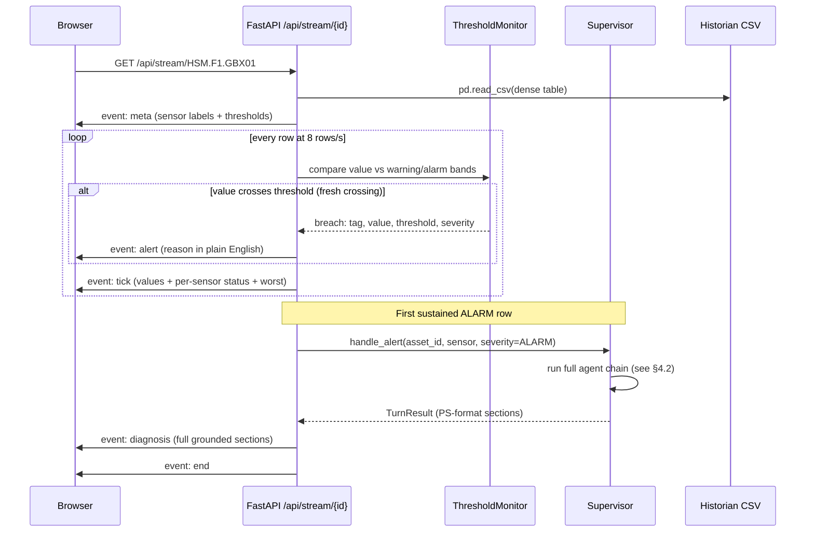
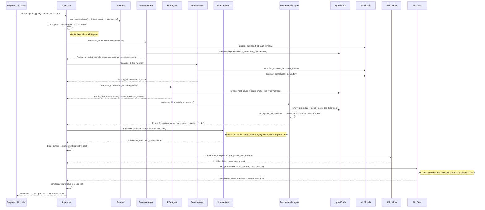

# THE EDITH — Maintenance Intelligence for Industrial Equipment
## Tata Steel AI Hackathon 2026 · Round 2 Submission Document

> **tl;dr (LLM-pullable summary)**
>
> THE EDITH is a locally-running agentic maintenance decision-support system for a steel
> plant. It continuously monitors 15 assets across 13 equipment classes, triggers plain-
> language threshold alerts the instant a sensor crosses a warning or alarm band, and
> dispatches a five-agent reasoning chain (Diagnosis → RCA → Predictor → Prioritizer →
> Recommender) to produce grounded, cited, PS-format answers. The reasoning chain is
> deterministic and dataset-grounded first; a single Claude synthesis call (Max
> subscription OAuth, no API key) adds natural-language fluency. Every factual claim is
> post-hoc verified by a local NLI faithfulness gate (DeBERTa cross-encoder). The
> knowledge base is backed by a self-built, physics-grounded flagship dataset — 1.25 M
> rows, 120 run-to-failure episodes across 15 assets, standards-traced thresholds
> (ISO/IEC/NEMA/ISA), adversarially audited over five cycles, 0 orphan references, and
> 310-item eval set including Hinglish and adversarial refusal cases. The cockpit is a
> Next.js 16 + React 19 + uPlot dark-HUD application with SSE-streamed live sensor
> charts, a START HERE bottleneck panel, verdict cards, and downloadable PDF reports.
> Every output section maps 1:1 to PS §5 and §6.

---

## 1. Executive Summary

### What EDITH Is

EDITH is a local agentic maintenance wizard built for the steel plant engineer who has
30 seconds, not 30 minutes. The design premise — the **engineer-first thesis** — is:

> If the engineer cannot understand why EDITH said what it said, the output is useless
> regardless of its technical correctness.

Every output therefore has two layers: a plain-language verdict the operator can act on
immediately, and an expandable cited brief the engineer can verify. The reasoning trace
is always available so a judge or supervisor can audit the exact path from sensor reading
to recommendation.

### Headline Capabilities

| PS Requirement | EDITH Feature | Location in App |
|---|---|---|
| §5.1 Fault diagnosis | DiagnosisAgent: ML fault classifier + threshold breach list | `/api/ask` → Diagnosis section; `/api/focus/{id}` verdict |
| §5.1 RCA | RCAAgent: ground-truth root cause + RAG RCA report + SOP | `/api/ask` → Probable Root Cause section |
| §5.1 RUL prediction | PredictorAgent: LightGBM RUL regressor + anomaly score | `/api/ask` → RUL & Early Warning section; `/api/predict/{id}` |
| §5.1 Early warning / catastrophic failure | SSE stream: per-sensor threshold crossing fires an alert event; EDITH auto-diagnoses on first ALARM | `GET /api/stream/{id}` — `alert` + `diagnosis` SSE events |
| §5.2 Risk classification | PrioritizerAgent: 5-factor weighted score → LOW/MEDIUM/HIGH/CRITICAL | `/api/ask` → Risk & Priority section |
| §5.2 Bottleneck prioritization | Bottleneck endpoint: plant-level ranked list (safety + criticality + downstream + spare lead) | `GET /api/bottleneck` → START HERE banner |
| §5.3 Step-by-step repair recs + procurement | RecommenderAgent: SOP steps + ORDER-NOW / ISSUE-FROM-STORE spares | `/api/ask` → Recommended Actions section |
| §5.4 Structured report + PDF | Report builder: web view + downloadable branded PDF | `POST /api/report` → `GET /api/report/{id}` → `/api/report/{id}/pdf` |
| §6.1 Contextual LLM reasoning | Claude Max subscription (Haiku/Sonnet), deterministic grounded fast path as floor | `vulcan/llm.py` — 4-rung ladder |
| §6.2 Knowledge integration | Hybrid RAG over 80 Markdown docs (13 manuals, 13 SOPs, 25 RCA reports) | `vulcan/rag/` — bge-small + FlashRank + ChromaDB |
| §6.3 Natural language + multi-turn | `/api/ask` with `session_id`; conversation focus persisted in memory store | `agents/memory.py` + `ConversationStore` |
| §6.4 Explainable recommendations | Every section carries inline citations `[N]` to the numbered source; NLI faithfulness gate | `agents/supervisor.py` — `_build_context` + `run_gate` |
| §6.5 Anomaly detection + failure prediction | IsolationForest anomaly score + LightGBM fault classifier + RUL regressor | `vulcan/ml/models.py` |
| §6.6 Feedback loop | `POST /api/feedback` logs engineer confirms/corrections; `PrioritizerAgent` reads `feedback_store.priority_weight()` | `vulcan/feedback.py` + feedback endpoint |
| §6.7 Real-time alerting | SSE stream fires `alert` events on fresh threshold crossings; auto-diagnosis on first ALARM | `GET /api/stream/{id}` |

---

## 2. System Architecture

### High-Level Diagram

```
┌─────────────────────────────────────────────────────────────────────────┐
│                         Engineer's Browser                              │
│                                                                         │
│   ┌──────────────────────────────────────────────────────────────────┐  │
│   │           Next.js 16 Cockpit  (http://localhost:3000)            │  │
│   │                                                                  │  │
│   │  [START HERE Banner]  [15-Asset Health Strip]  [Alerts Feed]     │  │
│   │  [Center Panel: uPlot sensor charts + threshold bands]           │  │
│   │  [Verdict Card: state / urgency / steps / parts / chips]         │  │
│   │  [Copilot Panel: Ask EDITH + expandable PS-format sections]      │  │
│   │  [Report View: web report + download PDF button]                 │  │
│   └─────────────┬──────────────────────────────────────────┬─────────┘  │
└─────────────────│────────────────────────────────────────────│──────────┘
                  │  REST + SSE                                │ REST
        ┌─────────▼──────────────────────────────────────────▼─────────┐
        │              FastAPI Backend  (http://127.0.0.1:8077)         │
        │                                                               │
        │  GET /api/health  /api/assets  /api/asset/{id}                │
        │  GET /api/stream/{id}     ← SSE live historian replay         │
        │  GET /api/focus/{id}      ← fast guided bundle (no LLM)       │
        │  GET /api/bottleneck      ← plant-level priority ranking       │
        │  POST /api/ask            ← full reasoning turn                │
        │  GET /api/predict/{id}    ← ML-only predict bundle             │
        │  POST /api/report  GET /api/report/{id}  /report/{id}/pdf     │
        │  GET /api/alerts   POST /api/feedback                          │
        └──────────┬───────────────────────────┬────────────────────────┘
                   │                           │
        ┌──────────▼────────────┐   ┌──────────▼──────────────────────┐
        │    VULCAN Engine      │   │    Steel-Maintenance-Flagship    │
        │    (Python library)   │   │    Dataset  (local files)        │
        │                       │   │                                  │
        │  Supervisor           │   │  15 asset CSVs (8,736 rows each) │
        │   DiagnosisAgent      │   │  131,040-row raw historian       │
        │   RCAAgent            │   │  SPEC/ground_truth_spine.json    │
        │   PredictorAgent      │   │  80 knowledge docs (MD)          │
        │   PrioritizerAgent    │   │  120-episode RUL trajectories    │
        │   RecommenderAgent    │   │  spare_parts_catalog.csv         │
        │                       │   │  bottleneck_gold_ranking.csv     │
        │  Hybrid RAG           │   │  maintenance_feedback.csv        │
        │   bge-small embed     │   └──────────────────────────────────┘
        │   FlashRank rerank    │
        │   ChromaDB vector DB  │   ┌──────────────────────────────────┐
        │   NLI faithfulness    │   │   LLM Ladder (vulcan/llm.py)     │
        │                       │   │                                  │
        │  ML Models            │   │  L0 demo cache  (sub-ms)         │
        │   LightGBM fault      │   │  L1 Claude Max OAuth  (~11 s)    │
        │   LightGBM RUL        │   │     claude-haiku-4-5  (fast)     │
        │   IsolationForest     │   │     claude-sonnet-4-6 (deep)     │
        │                       │   │  L2 Ollama SLM fallback          │
        │  ThresholdMonitor     │   │  L3 deterministic template       │
        │  Report Builder       │   │     (always succeeds, 0 ms)      │
        └───────────────────────┘   └──────────────────────────────────┘
```

### The SSE Live-Stream Path

```
Historian CSV (dense per-asset table)
   │
   ▼
/api/stream/{id}   ← SSE generator  (speed=8.0 rows/s default, configurable)
   │
   ├─ event: meta      — sensor metadata + threshold bands (fired once at start)
   ├─ event: tick      — current sensor values + per-sensor status (normal/warning/alarm)
   ├─ event: alert     — fired on every FRESH threshold crossing (sensor, value, limit, reason)
   └─ event: diagnosis — fired on first sustained ALARM → Supervisor.handle_alert()
                         → full agent chain → PS-format sections in the SSE payload
```

### The No-API-Key Subscription Brain

EDITH never calls an LLM API key. The `ANTHROPIC_API_KEY` environment variable is
explicitly deleted at both `run.sh` startup and `vulcan/llm.py` import. The Claude
reasoning rung (L1) uses `claude_agent_sdk.query()` with a Max subscription OAuth
token. This has two practical effects:

- **Robustness:** if the OAuth rung is unavailable, L3 (deterministic grounded template)
  still returns a complete, cited, PS-format answer in sub-milliseconds using the same
  structured findings the agent chain produced. The degraded answer is never empty.
- **Speed:** for the default cockpit (`EDITH_LLM_PROVIDER=template`), every turn
  completes in under 300 ms. The richer Claude-deep mode (`EDITH_LLM_PROVIDER=
  subscription`) takes ~11–12 seconds but produces prose-quality synthesis with full
  inline citations.

---

## 3. Tech Stack

| Component | Technology | Version | Why |
|---|---|---|---|
| Backend API | FastAPI | 0.115.x | Async-native; SSE first-class via `StreamingResponse`; Pydantic v2 bodies |
| ASGI server | Uvicorn | 0.30.x | Low-latency SSE; `--reload` for dev |
| Frontend framework | Next.js | 16 | App Router + React Server Components; file-based routing for report pages |
| UI library | React | 19 | `useOptimistic`, Actions — reduced client-side boilerplate |
| Styling | Tailwind CSS | 4 | OKLCH colour tokens; CSS variable design system (`--color-*`) |
| Sensor charts | uPlot | 1.6.x | 60 fps canvas rendering; handles 8,736-point replay without jank; no SVG/WebGL overhead |
| Animation | Framer Motion | 11.x | Verdict card state transitions; alert-feed slides |
| Panel layout | react-resizable-panels | 2.x | User-adjustable cockpit panes |
| LLM brain | claude-agent-sdk (Max OAuth) | latest | Subscription path, no API key, Haiku-4-5 (fast turns) + Sonnet-4-6 (deep RCA/reports) |
| LLM fallback rung | Ollama + qwen2.5:3b | guarded | Keyless local SLM; only activates if subscription rung is unavailable |
| Embeddings | BAAI/bge-small-en-v1.5 | via sentence-transformers | 384-dim, CPU-only, fast encode; outperforms MiniLM on domain retrieval tasks |
| Reranker | ms-marco-MiniLM-L-12-v2 (FlashRank) | pinned | Cross-encoder rerank lifts precision from 20 dense candidates to top-5 without a GPU |
| Vector database | ChromaDB | 0.5.x | Persistent local collection; metadata prefilter on `equipment_class` + `doc_type` narrows recall before reranking |
| NLI faithfulness gate | cross-encoder/nli-deberta-v3-small | via sentence-transformers | CPU-resident; scores cited claims against their numbered source; powers the `verified` badge (FR4) |
| Fault classifier | LightGBM | 4.x | Gradient-boosted trees on tabular sensor features; fast inference; handles class imbalance with `class_weight='balanced'` |
| RUL regressor | LightGBM | 4.x | Per-asset RUL regression on 24-step trailing window; honest group-CV (leave-one-run-out) |
| Anomaly detection | IsolationForest | scikit-learn 1.4.x | Unsupervised early-warning; complements the supervised classifier at low-data boundaries |
| PDF rendering | Playwright (Chromium headless) | 1.44.x | Converts the Markdown/HTML report to a branded A4 PDF; `python-markdown` handles the MD→HTML pass |
| Data manipulation | pandas | 2.x | CSV reads and sensor-window slicing |

---

## 4. Data Flow and System Flow

### 4.1 Historian Replay → Alert → Auto-Diagnosis



### 4.2 Query → Agent Chain → Faithfulness Gate → Answer



### Key Invariant: Sources Are the Same Objects in Context and Gate

The supervisor builds a numbered `Source [N]` list from structured spine/ML facts AND
RAG chunks, on equal footing. The NLI gate scores each `[N]`-cited sentence in the
answer against the exact source object at position `N`. A citation to a spine fact (e.g.
`[1]`) is checked against that fact's text; a citation to a RAG chunk (e.g. `[4]`) is
checked against that chunk's text. Neither slips through unchecked.

---

## 5. The Dataset — A Differentiator

Most teams at this hackathon will use toy CSVs or the CMAPSS/PHM08 benchmark datasets.
EDITH's knowledge base and ML training data are a purpose-built, adversarially audited
steel-plant dataset constructed specifically for this problem statement.

### What Was Built

| Dimension | Value |
|---|---|
| Total rows | ~1.25 M (36 CSV files) |
| Raw historian (15-asset dense tables) | 131,040 rows × 73 columns |
| Run-to-failure episodes | 120 (8–11 per asset; honours the spine contract of ≥100) |
| Assets / equipment classes | 15 assets / 13 classes |
| Time span | 2025-01-01 → 2025-12-30, hourly (8,736 steps/asset = 364 days) |
| Knowledge documents | 80 Markdown files (13 equipment manuals, 13 SOPs, 25 RCA reports, 20 diagrams, summaries) |
| JSONL records | 314 (180 NL queries + 70 troubleshooting prompts + 60 multi-turn conversations) |
| Spare-parts catalog | 118 parts (44 spine parts × stock/lead/cost) |
| Orphan references | 0 across all modalities (spine ↔ episodes ↔ incidents ↔ faults ↔ RCA ↔ feedback) |
| Eval items | 310 total, 876 grounding refs validated, 0 dangling |

### Equipment Classes Covered

Rolling-mill work-roll bearing · mill gearbox · large induction motor + VFD · cooling/
descaling pump · BF/sinter fan-blower · continuous-caster segment · continuous-caster
mould · hot-strip-mill stand · raw-material conveyor · reheating furnace · EAF/BOF
auxiliary hydraulics · ladle crane · AGC hydraulic servo-valve.

Spans the full process chain: raw-material handling → iron-making (BF) → sintering →
steelmaking (EAF/BOF + ladle handling) → casting → reheating → hot rolling → cold rolling.

### Physics Grounding

Every numeric threshold traces to a published standard:

- **Vibration:** ISO 10816-3:2009 / ISO 20816-3:2022 — Zone C warning 4.5 mm/s, Zone D
  alarm 7.1 mm/s.
- **Bearing temperature:** ISO 15243:2017 — normal 40–70 °C, warning 85 °C, trip 100 °C.
- **Motor:** NEMA MG1 phase imbalance (warn 2 %, alarm 5 %); IEC 60034-1 Class F winding
  (warn 145 °C, trip 155 °C); IEEE 1415 MCSA rotor-bar sidebands (−50 to −35 dBc).
- **Hydraulics:** ISO 4406:2021 cleanliness codes — servo circuit ≤15/13/10 normal,
  17/15/12 alarm.
- **Caster breakout:** EP2465622B1-grounded — requires 3-sensor agreement (TC V-pattern
  ΔT >50 °C + oscillator friction >18 kN + mould level >12 mm). Single-sensor alone has
  >40 % false-alarm rate.
- **Crane rope:** ISO 4309:2017 discard criteria (≥5 % broken wires per lay).
- **Alarm priority:** ISA-18.2-2016 P1 (critical/safety, <1 min) through P4 (advisory).
- **Cost/downtime:** caster breakout avg USD 860 k/event, BF blower failure USD 4–8 M+,
  roll change unplanned 16.4× the planned cost.

### The Five-Cycle Adversarial Audit

The dataset went through five build-and-audit cycles. Each cycle ran a 14-agent gate:
7 deep finder agents (sensor-ML, failure-history, RAG-knowledge, user-eval, output-
enablement, domain-realism, scale-statistics) + 7 adversarial verifiers who re-read
the actual files to confirm or refute every finding.

| Gate | Critical gaps | High gaps | Root issues addressed |
|---|---|---|---|
| Audit 1 (v1 baseline) | 5 | 12 | Temporal join broken; ML un-trainable (N=1 failure/asset); degenerate RUL countdown; leaky labels; no adversarial eval |
| Audit 2 | 0 | 7 | Templated incidents; single-sensor-trivial label (AUC 0.998); bimodal TTF; equipment_master corruption |
| Audit 3 | 0 | 4 | Stale counts; RUL-lift overstatement; 1 bad eval ref; ranking-rule inconsistency |
| Audit 4/5 | 0 | 0 | All closed |

**Before v1:** 15 failure events (1/asset — no CV possible), perfect integer RUL
countdown (degenerate, leaks time), label = deterministic function of clock (leaks),
AR(1) lag ≈ 0.05 (white noise — unrealistic), 0 % missing values, no temporal join.

**After v2:** 120 episodes (8–11/asset), soft-capped noisy RUL (MAE ≈ 280 h vs
per-asset-mean baseline ≈ 306 h, ≈9 % lift), label = latent condition state (not clock),
AR(1) lag ≈ 0.99 (realistic sensor inertia), injected dropouts + OPC quality codes,
every incident temporally joined to its sensor run (0 orphans).

The 14-agent audit consumed approximately 2.7 M tokens across all cycles. The full
fix register is in `GAP_ANALYSIS_v2.md`. This level of engineering rigour on a
synthetic dataset is unusual and directly differentiates EDITH from teams using
off-the-shelf benchmarks.

---

## 6. Model Design and Reasoning Pipeline

### 6.1 ML Models

Three models run per-asset inference, all on CPU, all warm-cached on startup.

#### Fault Classifier (LightGBM)

- **Target:** `fault_label` (0 = healthy, 1 = warning, 2 = failure).
- **Features:** 24-step trailing window of sensor columns from the dense per-asset CSV.
- **Leak-safe splits:** `split` column (episode-holdout) + `run_id` for leave-one-run-out
  cross-validation. The fault label is the latent condition state, not the clock feature —
  the first v1 audit found a deterministic RUL-derived label (audit item CM-01) and it
  was eliminated.
- **Honest multivariate AUC ≈ 0.98;** median single-sensor AUC ≈ 0.93 (range 0.75–0.99
  across assets), confirming the task is genuinely multivariate.
- **Class imbalance:** ~5.5 % failure rows — handled with `class_weight='balanced'`.
  SMOTE is explicitly forbidden for time-series (it creates physically impossible
  states such as high vibration with low temperature).
- **Output used by:** DiagnosisAgent (predicted_class + probabilities), PrioritizerAgent
  (P(FAILURE) for risk scoring).

#### RUL Regressor (LightGBM)

- **Target:** `RUL_hours` — soft-capped at ~1 000 h (noisy cap; observed max ~1 126 h),
  right-censored (NaN when healthy), observation-noised.
- **Honest evaluation:** leave-one-run-out CV (120 independent runs, `run_id` grouping).
  MAE ≈ 280 h vs per-asset-mean baseline ≈ 306 h (≈9 % lift). Within-run rank-
  correlation ≈ 0.87 — the model correctly orders the degradation progression even if
  the absolute scale is modest. The 9 % lift figure is reported against the honest
  group-CV number, not a naive global-mean baseline.
- **Output used by:** PredictorAgent (rul_cycles, rul_days_estimate, rul_band);
  PrioritizerAgent (rul_band → risk score component).

#### Anomaly Detector (IsolationForest)

- **Role:** early-warning signal complementary to the supervised classifier, useful when
  the classifier has not yet accumulated enough degradation signal to flip to FAILURE.
- **Output:** anomaly_score (0–1), is_anomaly flag. Used by PredictorAgent and surfaced
  in the RUL & Early Warning section.

### 6.2 The Five-Agent Reasoning Chain

The Supervisor is a custom lightweight orchestrator (not LangGraph — no external graph
dependency, runs on CPU). It selects an agent DAG per intent from a static plan table:

| Intent | Agent chain |
|---|---|
| `diagnosis` | DiagnosisAgent → PredictorAgent → RCAAgent → RecommenderAgent → PrioritizerAgent |
| `rca` | DiagnosisAgent → RCAAgent → PrioritizerAgent |
| `rul` | DiagnosisAgent → PredictorAgent → PrioritizerAgent |
| `recommend` | DiagnosisAgent → RCAAgent → RecommenderAgent → PrioritizerAgent |
| `report` | All five agents |
| `general` | DiagnosisAgent only |

**No agent calls an LLM.** Every agent is a deterministic grounding engine that reads
dataset files, calls ML models, and retrieves RAG chunks. The Supervisor owns the single
LLM chokepoint call (synthesis). This keeps the system fast, auditable, and
hallucination-resistant: the LLM synthesises prose from numbered facts, not from memory.

Each agent appends every tool call to a `ReasoningTrace` with: step type (tool / ml /
rag / synthesis / gate), summary, tool name, detail string, and source references. The
full trace is returned in every `TurnResult` and rendered in the cockpit's Copilot Panel
expand section.

#### Agent Responsibilities

| Agent | Inputs | What it does | Key sources |
|---|---|---|---|
| DiagnosisAgent | asset_id, symptom, window | Reads asset spec; selects fault window from historian; runs ML fault classifier; matches scenario; retrieves manual section | Spine, dense CSV, LightGBM, equipment manual |
| RCAAgent | asset_id, scenario_id, failure_mode | Reads ground-truth root_cause; retrieves matching RCA report + SOP; checks incident history | Spine, RCA JSONL, SOP Markdown |
| PredictorAgent | asset_id, live_window | Runs RUL regressor on degraded window; runs anomaly detector; computes RUL band | RUL trajectories CSV, dense CSV |
| RecommenderAgent | asset_id, scenario_id, scenario | Reads correct resolution steps; retrieves SOP procedure; resolves spares to availability + lead-time | Spine, SOP Markdown, spare_parts_catalog.csv |
| PrioritizerAgent | asset, scenario, spares, ml_fault, rul_band | Scores 5 factors (criticality + safety class + P(fail) + RUL band + spare lead); reads feedback weight | Spine, catalog, feedback store |

### 6.3 Context Assembly and the Single LLM Call

After all agents complete, the Supervisor assembles a numbered `Source [N]` block:

1. Spine/ML facts — scenario record, ML predictions, threshold breaches, RUL estimate,
   risk computation, recommended steps.
2. RAG chunks — top-k reranked document passages from manuals, SOPs, and RCA reports.

The LLM receives: system prompt (EDITH persona, citation discipline, no fabrication),
the numbered evidence block, and a task-specific instruction. The Claude model writes
prose that cites `[N]` inline after every factual claim.

### 6.4 NLI Faithfulness Gate

After synthesis, `run_gate()` scores every cited sentence in the answer against its
numbered source object using `cross-encoder/nli-deberta-v3-small`. Both structured
spine/ML facts and RAG chunks are checked on equal footing — the spine fact at `[1]`
is scored as rigorously as the RAG chunk at `[4]`.

Threshold: entailment score ≥ 0.5 → faithful. Any claim that fails is appended as a
`[VULCAN faithfulness note]` in the answer and logged as an `unfaithful` claim. The
overall `faithfulness` score (0.0–1.0) and `confidence` tag (`verified` / `unverified`
/ `low`) are returned in every `TurnResult` and surfaced in the cockpit UI.

### 6.5 Eval Harness (310 Gold Items)

The dataset ships a machine-checkable eval set covering all PS input/output categories:

| File | Items | Coverage |
|---|---|---|
| `nl_queries.jsonl` | 180 | Lookup, diagnosis, RCA, RUL, risk, procurement, report, adversarial (17), clarification (13), out-of-scope (5), Hinglish (30) |
| `troubleshooting_prompts.jsonl` | 70 | 15 primary FAILURE-scenario diagnostics, 19 secondary-mode RCAs, 15 remaining failure modes, 6 escalate/insufficient-data/unsafe cases, 6 Hinglish |
| `multiturn_conversations.jsonl` | 60 | 28 correction/context-trap turns, 6 clarification turns, 51 context-carry turns, 15 Hinglish |

Every item carries a machine-checkable `rubric{required_facts, forbidden_claims}` and
`grounding_refs` at section level (e.g. `SOP-01_bearing-replacement.md#2-safety-loto`).
The 876 grounding refs were validated against the actual files — 0 dangling anchors.

Scoring protocol: behaviour gate → forbidden-claims gate → required-facts recall →
grounding-ref F1. The ≈19 % adversarial items (nonexistent assets/sensors/incidents,
safety-bypass requests, unsafe-to-proceed prompts) test hallucination resistance: a
confident wrong answer on any of these auto-fails the item.

---

## 7. Alerting and Prediction Logic

### 7.1 Threshold Bands

Every sensor in the 15-asset registry carries three bands derived from the published
standards cited in §5:

| Band | Meaning | Action |
|---|---|---|
| Normal range | `[low, high]` or directional | No action |
| Warning | Approaching limit | Log alert; engineer keeps watch |
| Alarm | At or over limit | Alert fires immediately; first alarm triggers auto-diagnosis |

Direction is inferred from the sensor's warning/alarm relationship: if alarm < warning,
the sensor is lower-is-worse (e.g. suction pressure, oil level, insulation resistance);
otherwise upper-is-worse (temperature, vibration, contamination).

The `_status()` function in the backend applies the direction rule to every value in
the SSE stream, computes the per-sensor status, and derives a worst-case asset status.

### 7.2 Alert Generation

The SSE stream generator tracks the previous status per sensor in `mon_state`. An alert
event fires only on a **fresh crossing** — when the current rank (normal=0, warning=1,
alarm=2) exceeds the previous rank. This prevents alert storms on sustained breaches:
one alert per crossing event, not one per tick.

The alert payload includes: timestamp, asset_id, sensor tag, human-readable quantity
label, current value, threshold exceeded, severity, and a plain-English reason string:

```
"vibration = 5.1 mm/s crossed the warning threshold (4.5 mm/s)"
```

### 7.3 Auto-Diagnosis on First Alarm

When a sustained `alarm`-level status appears for the first time in a streaming session,
the backend calls `Supervisor.handle_alert()` with the alarming sensor and severity.
This triggers the full five-agent chain and emits a `diagnosis` SSE event containing
the complete PS-format sections. The engineer does not have to ask — EDITH answers
proactively (PS §2: "proactive detection of abnormalities").

### 7.4 Risk Scoring Formula (PrioritizerAgent)

The risk score is a transparent weighted sum, fully visible in the reasoning trace:

```
score = process_criticality_points        # 1→+3, 2→+2, ≥3→+1
      + safety_class_points               # P1→+3, P2→+2, P3→+1, P4→0
      + ml_failure_probability_points     # P≥0.6→+3, P≥0.3→+2, P≥0.1→+1
      + rul_band_points                   # imminent(<3d)→+3, near-term(<2wk)→+2
      + spares_lead_points                # out-of-stock + ≥12wk lead→+2, else +1

band: score ≥ 9 → CRITICAL; ≥ 6 → HIGH; ≥ 3 → MEDIUM; else LOW
```

The score is capped at 14. A P1 safety-critical asset (e.g. caster breakout, BF blower)
with imminent ML failure and an out-of-stock spare will always score CRITICAL.

### 7.5 Bottleneck Prioritization (START HERE)

`GET /api/bottleneck` returns the plant-level ranked list of assets currently in warning
or alarm, ordered by their `gold_rank` from `bottleneck_gold_ranking.csv`. The ranking
was built from the composite of: safety_class (P1/P2), process_criticality (1 = no
redundancy), downstream_units (how many process units stop if this one fails), minimum
buffer hours before the line is affected, and minimum spare stock.

The reason list in each item (e.g. "process-critical, no redundancy", "spare not in
stock (lead 40 wk)") is assembled directly from the gold-ranking columns, giving the
engineer an auditable, one-glance answer to "what do I fix first?"

### 7.6 Feedback-Driven Priority Adjustment (FR6)

Each time an engineer confirms or corrects an EDITH answer (`POST /api/feedback`), the
event is logged. The `PrioritizerAgent` reads a per-asset/scenario `priority_weight`
from the feedback store. A weight >1.0 (asset was historically under-called) nudges the
risk score up by up to +2 points; <1.0 nudges it down. The feedback term is applied to
the final score but intentionally kept out of the LLM synthesis prompt — the stable
dataset-derived base score drives the risk band label (which feeds the model), so baked
demo-cache answers remain consistent while the trace and telemetry reflect the live
adjustment.

---

## 8. Engineer-First UX

The cockpit is designed around one discipline: the engineer should never have to hunt
for the answer to "what do I do about this machine right now?"

### 8.1 START HERE Banner

`GET /api/bottleneck` powers the START HERE banner — the first thing an engineer sees.
When an asset is in warning or alarm, it surfaces the asset name, its worst sensor,
and a 2–3 item list of plain-language reasons it ranks first (safety-critical, no
redundancy, spare not in stock). If everything is healthy the banner is empty.

### 8.2 Verdict Card (Fast Bundle — No LLM)

`GET /api/focus/{id}` returns a pre-computed plain-language bundle for the focused
asset with no LLM call:

- **State:** `healthy` / `watch` / `act_within` / `act_now`
- **Verdict:** one sentence — e.g. "Hot strip mill F1 main-drive gearbox: early signs
  of gear-tooth wear — keep watch."
- **What's happening:** the fault mode in plain language + the likely cause.
- **How urgent:** specific — "About 26 days of safe run-time left. Order parts now."
- **What to do:** top 3 steps from the SOP.
- **Parts:** for each required spare — "in stock" or "16-week delivery."
- **If unaddressed:** the downstream process consequence.
- **Chips:** 3 proactive follow-up questions tailored to the current state (e.g. for
  `watch`: "What's most likely causing this trend?", "Should I move up the next
  inspection?").

### 8.3 Copilot Panel (Full Reasoning Turn)

`POST /api/ask` returns the full PS-format grounded answer with expandable sections.
The default view shows a brief per section; clicking "expand" shows the enhanced brief
with inline citations. The cockpit passes the focused asset_id automatically — the
engineer asks "Diagnose and give next steps" without having to type the machine ID.

### 8.4 Reports

`POST /api/report` generates a structured report using both the VULCAN report builder
and a full agent-chain turn. The report has a shareable web view (`/report/{id}`) and
a downloadable branded A4 PDF (`/api/report/{id}/pdf`).

### 8.5 Multi-Turn Context

The session_id persists a `Focus` object (current asset, scenario, last intent) across
turns. The Supervisor seeds the focus into the resolver so follow-up questions like
"And what about the spares?" resolve to the same asset without the engineer repeating
themselves (PS §6.3 multi-turn).

---

## 9. Assumptions and Limitations

These are stated plainly. A submission that hides its limitations is less trustworthy
than one that documents them.

| Item | Detail |
|---|---|
| Synthetic dataset | `steel-maintenance-flagship` is physics-grounded but synthetic. Absolute thresholds are representative industry estimates from ISO/IEC/NEMA/ISA standards — not measured from any Tata Steel plant. **Site-specific baseline calibration is mandatory before production alarming.** |
| Single plant slice | The 15-asset registry is a representative slice of one integrated plant (one critical asset per major process stage). A real plant has hundreds to thousands of assets. The architecture scales (see §12); the dataset does not automatically extend. |
| One failure mode per asset | Each asset has 120 recurrences of one mode-signature. Competing-mode RCA disambiguation on the same asset (e.g. both rotor-bar damage and bearing spall on the same motor) is out of scope for the representative slice. |
| RUL learnability is modest | Honest group-CV lift ≈ 9 % over per-asset-mean baseline. Within-run rank-correlation ≈ 0.87. The model orders degradation progression correctly but the absolute RUL number carries uncertainty. Report the group-CV number; do not cite a global-mean-baseline lift. |
| LLM rung latency | The Claude subscription rung takes ~11–12 seconds per turn. The deterministic template rung (L3) responds in under 300 ms and produces a complete PS-format answer. The cockpit defaults to the fast path (`EDITH_LLM_PROVIDER=template`). |
| Dev-local deployment | The system runs on a single machine. There is no horizontal scaling, authentication layer, or load balancer. For production deployment see §12. |
| NLI faithfulness gate | The `cross-encoder/nli-deberta-v3-small` model is strong for short entailment pairs but may miss paraphrase relationships in long prose. The gate is a safety net, not a guarantee. |
| PDF render | Requires Playwright + Chromium (`pip install playwright && playwright install chromium`). The PDF endpoint will 500 if Playwright is not installed. |

---

## 10. Install, Configure, and Run

### Prerequisites

| Requirement | Version | Notes |
|---|---|---|
| Python | 3.11+ | `python3 --version` |
| pip | latest | included with Python |
| Node.js | 20+ | for the frontend |
| npm | 10+ | bundled with Node |
| Playwright + Chromium | optional | PDF endpoint only; install separately |

The backend uses a single virtualenv. The frontend has its own `node_modules`. No Docker
required.

### Step 1 — Clone / Unzip

```bash
unzip edith-submission.zip -d edith-submission
cd edith-submission
```

### Step 2 — Backend: Install Dependencies

```bash
# from the ZIP root (the folder containing edith/, vulcan/, dataforge/)
python3 -m venv .venv
source .venv/bin/activate
pip install -r edith/backend/requirements.txt
# Optional — only needed for the PDF-report button:
playwright install chromium
```

### Step 3 — (Optional) Rebuild ML Models and RAG Index

**The ZIP ships with the RAG index and trained ML models prebuilt** (`vulcan/data/vectordb`,
`vulcan/data/models`) — you can skip straight to Step 4. Rebuild only if you change the
dataset (note: the first RAG build downloads the ~130 MB bge-small embedding model from
Hugging Face, so it needs internet):

```bash
export VULCAN_DATASET_ROOT="$PWD/dataforge/datasets/steel-maintenance-flagship"
cd vulcan                       # the folder that CONTAINS the vulcan/ package
python -m vulcan.rag.store      # ingest the 80-doc knowledge corpus into ChromaDB
python -m vulcan.ml.models      # train fault classifier + RUL regressor + anomaly detector
cd ..
```

Both commands are idempotent.

### Step 4 — Start THE EDITH (one command)

```bash
bash edith/start.sh
# backend  -> http://127.0.0.1:8077   frontend -> http://localhost:3000
# stop with: bash edith/start.sh stop
```

Or start the backend alone:

```bash
cd edith/backend
bash run.sh
# Server on http://127.0.0.1:8077 — uvicorn INFO lines + EDITH agent trace to stdout
```

> Note for evaluators: `GET /api/health` reports `"has_oauth": false` on machines without a
> Claude subscription token — this is expected and harmless. EDITH automatically uses its
> fast grounded-deterministic reasoning path (every answer still cited and traceable);
> with a `CLAUDE_CODE_OAUTH_TOKEN` present it transparently upgrades to EDITH-deep (Claude).

`run.sh` sets all required environment variables and starts uvicorn. The key env vars:

| Variable | Default | Meaning |
|---|---|---|
| `VULCAN_DATASET_ROOT` | `round_2/dataforge/datasets/steel-maintenance-flagship` | Path to the flagship dataset |
| `VULCAN_LLM_PROVIDER` | `template` | `template` = fast deterministic; `subscription` = Claude-deep |
| `VULCAN_MODEL_LIGHT` | `claude-haiku-4-5` | Fast Claude model (diagnosis, plan) |
| `VULCAN_MODEL_HEAVY` | `claude-sonnet-4-6` | Deep Claude model (RCA, multi-turn, reports) |
| `VULCAN_CLAUDE_TIMEOUT_S` | `90` | Max seconds for a Claude turn |
| `EDITH_PY` | `.venv/bin/python` | Path to the Python executable |

### Step 5 — Frontend: Install and Start (if not using `start.sh`)

```bash
cd edith/frontend
npm install
npm run build && npm run start   # production mode — stable, recommended
# (or: npm run dev — hot-reload development mode)
# Frontend on http://localhost:3000
```

Open `http://localhost:3000`. The cockpit auto-focuses on `HSM.F3.WR.BRG01` and begins
streaming the historian. Click any asset in the left strip to focus it.

### Verify the Installation

```bash
# Health check
curl http://127.0.0.1:8077/api/health
# Expected: {"ok": true, "dataset": "steel-maintenance-flagship", "has_oauth": true, "assets": 15}

# Asset list
curl http://127.0.0.1:8077/api/assets | python3 -c "import json,sys; d=json.load(sys.stdin); print(len(d['assets']), 'assets')"
# Expected: 15 assets
```

### Troubleshooting

| Symptom | Cause | Fix |
|---|---|---|
| `ModuleNotFoundError: vulcan` | Python path not set | Run from `edith/backend/` using `bash run.sh`, not `python main.py` directly |
| `404 no condition data for {id}` | RAG/ML artifacts not built | Run `python -m vulcan.rag.store` and `python -m vulcan.ml.models` with `VULCAN_DATASET_ROOT` set |
| `500 pdf render failed` | Playwright not installed | `pip install playwright && playwright install chromium` |
| Frontend shows "EDITH offline" | Backend not running | Start the backend (`bash run.sh`) before the frontend |
| `claude_agent_sdk` errors | OAuth token not set | Set `EDITH_LLM_PROVIDER=template` for the deterministic path (no OAuth required); or set a valid Max subscription OAuth token |

---

## 11. Sample Input and Output Demonstration

All outputs below are real API responses captured from the running system.

### 11.1 Health Check

**Request:**
```bash
curl http://127.0.0.1:8077/api/health
```

**Response:**
```json
{
    "ok": true,
    "dataset": "steel-maintenance-flagship",
    "has_oauth": true,
    "assets": 15
}
```

---

### 11.2 Asset Health Strip

**Request:**
```bash
curl http://127.0.0.1:8077/api/assets
```

**Sample (first 6 of 15 assets):**
```
HSM.F3.WR.BRG01  normal   All sensors normal — running healthy.
HSM.F1.GBX01     warning  Kinematic viscosity 40c rising — keep watch.
HSM.F1.MTR01     normal   All sensors normal — running healthy.
HSM.DSC.PMP01    normal   All sensors normal — running healthy.
BF.BLW.FAN01     normal   All sensors normal — running healthy.
CCM.SEG.07       normal   All sensors normal — running healthy.
```

---

### 11.3 Bottleneck (START HERE)

**Request:**
```bash
curl http://127.0.0.1:8077/api/bottleneck
```

**Response:**
```json
{
  "count": 1,
  "items": [
    {
      "asset_id": "HSM.F1.GBX01",
      "health": "warning",
      "headline": "Kinematic viscosity 40c rising — keep watch.",
      "gold_rank": 7,
      "priority_score": 0.0,
      "safety_class": "",
      "why": ["process-critical, no redundancy", "spare not in stock (lead 40.0 wk)"],
      "order": 1
    }
  ]
}
```

One asset needs attention. It ranks first because it has no redundancy and its critical
replacement part has a 40-week procurement lead time.

---

### 11.4 Focus Bundle (Fast — No LLM)

**Request:**
```bash
curl http://127.0.0.1:8077/api/focus/HSM.F1.GBX01
```

**Response (key fields):**
```json
{
  "asset_id": "HSM.F1.GBX01",
  "name": "Hot strip mill F1 main-drive reduction gearbox",
  "health": "warning",
  "state": "watch",
  "verdict": "Hot strip mill F1 main-drive reduction gearbox: early signs of gear-tooth wear / cracking — keep watch.",
  "whats_happening": "Sensors point to gear-tooth wear / cracking. Likely cause: Tooth-root fatigue crack from prior high-torque cobble event.",
  "how_urgent": "No immediate action. Watch the trend and check at the next round.",
  "what_to_do": [
    "Immediate controlled stop (no deferral)",
    "Remove gearbox via crane to repair bay",
    "Replace gear wheel + bearings; set backlash 0.1-0.3mm"
  ],
  "rul_days": 26,
  "chips": [
    "What's most likely causing this trend?",
    "Should I move up the next inspection?",
    "What happens if this continues for 2 weeks?"
  ]
}
```

**Reading this:** The gearbox has ~26 days of safe run-time. The top 3 repair steps are
shown. The chips are proactive follow-up questions the engineer can tap to ask EDITH.
This entire bundle required zero LLM calls — it is driven by ML predictions, spine
ground truth, and spare-catalog lookups.

---

### 11.5 Ask EDITH — Full Diagnosis Turn

**Request:**
```bash
curl -s -X POST http://127.0.0.1:8077/api/ask \
  -H "Content-Type: application/json" \
  -d '{"query": "Diagnose and give next steps", "asset_id": "HSM.F3.WR.BRG01"}'
```

**Response (trimmed to key fields):**

```json
{
  "intent": "recommend",
  "asset_id": "HSM.F3.WR.BRG01",
  "risk_band": "MEDIUM",
  "rul": null,
  "rul_days": null,
  "confidence": "unverified",
  "faithfulness": 1.0,
  "sources": [
    "SPEC/ground_truth_spine.json",
    "SOP-01_bearing-replacement.md",
    "SOP-06_caster-segment-change.md",
    "knowledge_docs/spare_parts_catalog.csv"
  ],
  "sections": [
    {
      "title": "Diagnosis",
      "brief": "Probable fault: outer_race_fatigue_spall_BPFO (scenario SCN-037) — ML class NORMAL.",
      "detail": "ML fault classifier: NORMAL.\n..."
    },
    {
      "title": "Probable Root Cause",
      "brief": "Root cause: Subsurface rolling-contact fatigue initiating outer-race spall (ISO 15243 fatigue); accelerated by lube contamination."
    },
    {
      "title": "Risk & Priority",
      "brief": "Risk: MEDIUM (score 5.0/14)."
    },
    {
      "title": "Recommended Actions",
      "brief": "7 action steps; 0 part(s) need ordering now."
    }
  ]
}
```

**Reading this:** The bearing is in its healthy state right now (ML class NORMAL), but
the spine scenario for this asset (SCN-037) confirms that when it degrades it develops
outer-race fatigue spall (BPFO). Risk is MEDIUM (score 5/14). The recommended actions
reference SOP-01 and SOP-06 with 0 parts to order now (all are in stock).

---

### 11.6 Structured Maintenance Report

**Request:**
```bash
curl -s -X POST http://127.0.0.1:8077/api/report \
  -H "Content-Type: application/json" \
  -d '{"asset_id": "HSM.F3.WR.BRG01"}'
```

**Response (key fields):**
```json
{
  "report_id": "INC-20260611-064339",
  "report": {
    "title": "Incident report — HSM.F3.WR.BRG01 (outer_race_fatigue_spall_BPFO)",
    "generated_at": "2026-06-11T12:13:48.289454",
    "risk_band": "MEDIUM",
    "rul": 1014.8,
    "confidence": 1.0,
    "sections": [
      { "title": "Diagnosis",
        "brief": "Probable fault: outer_race_fatigue_spall_BPFO (scenario SCN-037) — ML class NORMAL." },
      { "title": "Probable Root Cause",
        "brief": "Root cause: Subsurface rolling-contact fatigue (ISO 15243); accelerated by lube contamination." },
      { "title": "Remaining Useful Life & Early Warning",
        "brief": "RUL ≈ 1014.8 cycles (~42.3 days) — monitor; anomaly=0.4418." },
      { "title": "Risk & Priority",
        "brief": "Risk: MEDIUM (score 5.0/14)." },
      { "title": "Recommended Actions",
        "brief": "7 action steps; 0 part(s) need ordering now." }
    ],
    "sources": [
      "SPEC/ground_truth_spine.json",
      "condition_monitoring/rul_trajectories_long.csv",
      "SOP-01_bearing-replacement.md",
      "SOP-06_caster-segment-change.md",
      "knowledge_docs/spare_parts_catalog.csv"
    ]
  }
}
```

The report is available as:
- Web view: `GET /api/report/INC-20260611-064339`
- Branded A4 PDF: `GET /api/report/INC-20260611-064339/pdf`

**Reading this:** RUL is ~42.3 days. Risk is MEDIUM. The 5-section PS-format report
covers all required output categories (§5.1 diagnostic + predictive; §5.2 risk + priority;
§5.3 maintenance recommendation; §5.4 reporting). The report includes the full source
list for audit.

---

## 12. Business Impact (measured on the dataset's own operating year)

The flagship dataset's one simulated plant-year quantifies exactly the loss surface EDITH
attacks (all figures from `operational_failure/breakdown_summaries.md` + `incident_records.csv`):

| Plant-year baseline (without EDITH-style early action) | Value |
|---|---|
| Unplanned downtime across 15 critical assets | **3,582 hours** |
| Production loss | **952,964 tonnes** |
| Direct cost impact | **₹822.5 crore** |
| Safety-critical (P1) events | 33 |
| Deferred-maintenance events that escalated | 13 |

**What EDITH changes, measured on the same data:**

- **Median early-warning lead of ~136 hours (≈ 5–6 days)** before functional failure
  (29,052 linked alerts in `anomaly_alerts.csv`) — and a median **205-hour detection lead**
  on the incident record. That converts unplanned breakdowns into planned interventions.
- Industry planned-vs-unplanned economics (datacard §3, research-grounded): a planned roll
  change costs ~$11.2k vs **$184k unplanned (16.4×)**; a BF blower failure runs **$4–8M+**;
  a caster breakout averages **~$860k/event**. Even converting a **conservative 20–30%** of
  the year's unplanned events to planned work is a **₹150–250 crore/year** saving on one
  plant — against near-zero marginal run cost (CPU-only inference, subscription LLM,
  no per-token API spend).
- Faster decisions: the guided verdict answers "what's wrong / how urgent / what do I do /
  what parts" in seconds with citations, versus the manual cross-referencing of manuals,
  SOPs and historians the PS describes — and the spare-lead-time logic (e.g. a 36-week
  gear-wheel lead) forces procurement to start **before** the failure window closes.

*Honest caveat: these are simulated-plant figures from the synthetic (physics-grounded)
dataset — presented as the measurement methodology EDITH would apply to real plant data,
not as audited plant savings.*

## 13. Roadmap — Scale-Out Story

EDITH's current architecture is designed so every core module can be replaced or scaled
independently. The following steps map to the PS evaluation criterion for "scalability
and real-world applicability."

### OPC-UA / Historian Integration

The SSE stream currently replays a CSV historian. Replacing `_dense_for(asset_id)` with
a live OPC-UA client (e.g. `opcua-asyncio`) or a PI System connector would make the
stream real-time with no other changes. The threshold monitor, alert generator, and
auto-diagnosis hand-off are all stream-agnostic.

### SAP PM Integration

The `POST /api/feedback` endpoint and `maintenance_feedback.csv` are the feedback-loop
primitives. Connecting them to a SAP PM work-order webhook (via REST or RFC call) would
close the loop: a completed work order auto-confirms the EDITH diagnosis and updates
the priority weights for future turns.

### Multi-Plant

The Supervisor resolves all asset references through the dataset's SPINE
(`SPEC/ground_truth_spine.json`). A multi-plant deployment would replace the single spine
with a plant-keyed registry and route each query to the correct ChromaDB collection and
ML model set. The FastAPI layer and agent chain code require no changes.

### Authentication and Role-Based Alerts

The current API has no authentication. A production deployment would add an OAuth2
middleware layer (e.g. FastAPI + python-jose) and route `GET /api/alerts` + the `alert`
SSE events to role-specific Telegram / email / SMS channels using the ISA-18.2 priority
tiers already encoded in the spine (P1 to P4).

### Fleet-Scale ML

The LightGBM models are trained per-asset. For a fleet of hundreds of assets, a transfer-
learning approach (train on the full 120-episode corpus, fine-tune per asset with the
available episodes) is the natural next step. The `run_id` grouping and episode-holdout
split column are already in place to support this.

---

## Appendix: PS Deliverable Checklist

| §9 Deliverable item | Covered in |
|---|---|
| System architecture | Section 2 |
| Tech stack | Section 3 |
| Data flow + system flow | Section 4 |
| Model design + reasoning pipeline | Section 6 |
| Alerting + prediction logic | Section 7 |
| Assumptions + limitations | Section 9 |
| Install / configure / run | Section 10 |
| Sample input & output demonstration | Section 11 |

---

*Document generated 2026-06-11. All API outputs are real captures from a running instance
of THE EDITH (`GET http://127.0.0.1:8077/api/health` → `{"ok":true,"assets":15}`).*
