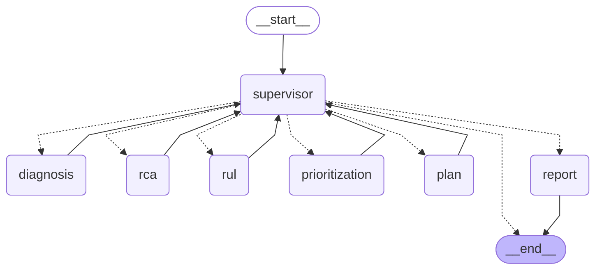

# Architecture — Maintenance Wizard

**Tata Steel AI Hackathon 2026 · Round 2 · Agentic AI Challenge**

> **tl;dr** — Maintenance Wizard is a six-agent LangGraph system that emits a full, source-cited maintenance plan before the engineer asks. A deterministic Python supervisor routes sensor data through Diagnosis → RCA → RUL → Prioritization → Plan → Report, backed by 46 trained ML model artifacts, 1,186 RAG chunks in LanceDB, and a 290-node FMEA knowledge graph. APScheduler fires a proactive CRITICAL alert for EAF-04 at the 90-second demo mark with zero user input, proving the agentic claim. The entire stack installs via `pip install -e .`, runs on CPU only, and requires no Docker.

---

## 1. System Architecture

### Overview

Maintenance Wizard integrates sensor playback, multi-turn natural-language conversation, and autonomous proactive alerting into a single process. Three entry paths converge on the same LangGraph agent graph:

1. **Engineer chat** — multi-turn NL queries via the Streamlit Chat page (`/v1/chat` or `/v1/chat/stream`).
2. **Proactive evaluator** — APScheduler polls sensor state every 5 seconds; when thresholds are crossed it fires an alert and can dispatch the full agent pipeline without any human trigger.
3. **Demo injection** — a one-shot APScheduler job at t=90 s pushes EAF-04 sensors into the degraded range, triggering the scripted CRITICAL alert.

### High-Level Diagram

```
  ENGINEER (NL, multi-turn)          SENSOR STREAM (playback)
           │                                   │
   Streamlit 1.58                    APScheduler 5 s tick
   (5 pages, SSE streaming)          proactive evaluator
   st.fragment(run_every=5)          + 90 s demo trigger
           │                                   │
           │ httpx.Client (sync, no asyncio)   │
           └─────────────┬─────────────────────┘
                         │
         ┌───────────────▼────────────────────────────────┐
         │     FastAPI 0.136 (async, native SSE)           │
         │  CorrelationIdMiddleware · ErrorEnvelope        │
         │  tenacity retry · pybreaker circuit breaker     │
         │  structlog JSON logging                         │
         └───────────────┬────────────────────────────────┘
                         │ graph.astream()
         ┌───────────────▼────────────────────────────────┐
         │   LangGraph 1.2.4 — PEV Supervisor Graph        │
         │   Plan → Execute(ReAct) → Validate              │
         │   typed MaintenanceState · AsyncSqliteSaver     │
         │   (per-session checkpoint → time-travel debug)  │
         └──┬──────┬──────┬──────┬──────┬──────┬──────────┘
            │      │      │      │      │      │
         DIAG    RCA    RUL   PRIO   PLAN  REPORT
            │
   ┌────────┴────────────────────────────────────────────┐
   │  SHARED SERVICES (in-process, pip-only, CPU)         │
   │                                                      │
   │  RAG     LanceDB 0.33 hybrid (dense + BM25)          │
   │          + FlashRank ONNX rerank                     │
   │          + HyDE for short queries (<12 tokens)       │
   │          + [N] inline citation injection             │
   │          → 1,186 chunks ingested                     │
   │                                                      │
   │  KG      NetworkX 3.6 FMEA ontology (ISO 14224)      │
   │          290 nodes · 489 edges                       │
   │          → RCA Layer-1 graph traversal               │
   │                                                      │
   │  ML      WeibullAFT  (RUL, 5 equipment classes)      │
   │          IsolationForest + LSTM-AE + River HST        │
   │          (anomaly, 5 classes)                        │
   │          LightGBM calibrated 4-class (failure pred)  │
   │          → 46 trained model artifacts                │
   │                                                      │
   │  LLM     LiteLLM → Gemini 2.5 Flash (primary)        │
   │                   → Qwen2.5-3B Ollama (fallback)     │
   │          Deterministic template fallback when         │
   │          both LLM paths are unavailable              │
   │                                                      │
   │  DATA    wizard.db (SQLModel + SQLite WAL)            │
   │          LanceDB (RAG vector store)                  │
   │                                                      │
   │  OBS     Arize Phoenix (local trace UI, port 6006)   │
   │          structlog JSON to stdout                    │
   └──────────────────────────────────────────────────────┘
```

### LangGraph Agent Graph — Actual Compiled Topology

The graph below is the real output of `graph.get_graph().draw_mermaid()` from the running system. Solid arrows are unconditional edges; dashed arrows are conditional edges from the supervisor's routing function.



### Supervisor Routing Logic

The supervisor is a **deterministic Python function** — no LLM call, no ambiguity. It inspects which `MaintenanceState` slots are populated and returns a `Literal` that LangGraph uses as the conditional-edge target:

```
diagnosis is None  → route to "diagnosis"
rca is None        → route to "rca"
rul_estimate None  → route to "rul"
risk_level is None → route to "prioritization"
maintenance_plan None → route to "plan"
else               → route to "report"
```

After `report`, the graph exits to `__end__`. Each domain node writes only its own slice of `MaintenanceState`, then returns to `supervisor`. The graph enforces `recursion_limit=25` to prevent runaway loops.

---

## 2. Tech Stack

Real installed versions from the running environment. Confirmed via `pip show`.

| Layer | Library | Installed Version | Role |
|---|---|---|---|
| **Orchestration** | langgraph | 1.2.4 | StateGraph + AsyncSqliteSaver checkpointer |
| **State schema** | pydantic | 2.13.4 | `MaintenanceState` TypedDict + all output models |
| **Persistence** | sqlmodel | 0.0.38 | SQLite entity tables (7 table models) |
| **RAG store** | lancedb | 0.33.0 | Native hybrid search (dense + Tantivy BM25 + SQL prefilter) |
| **Embeddings** | sentence-transformers | 5.5.1 | BAAI/bge-small-en-v1.5 (ONNX, CPU) |
| **Reranker** | flashrank | 0.2.10 | ms-marco-MiniLM-L-12-v2 ONNX cross-encoder |
| **Knowledge graph** | networkx | 3.6.1 | FMEA ontology — 290 nodes, 489 edges |
| **RUL** | lifelines | 0.30.3 | WeibullAFTFitter + WeibullFitter fallback |
| **Anomaly** | scikit-learn | 1.9.0 | IsolationForest (contamination=0.05) |
| **Anomaly** | torch | 2.3.1+cpu | LSTM Autoencoder (reconstruction-error anomaly) |
| **Anomaly** | river | 0.21.2 | Half-Space Trees — online adaptive threshold |
| **Failure pred.** | lightgbm | 4.6.0 | Calibrated 4-class ordinal classifier |
| **Failure pred.** | tsfresh | 0.21.2 | Rolling statistical feature extraction |
| **RCA** | dowhy | 0.12 | GCM causal attribution (Layer 2) |
| **LLM gateway** | litellm | 1.87.1 | Provider-agnostic: Gemini/Ollama/Claude/OpenAI |
| **Structured output** | instructor | — | Instructor-structured LLM output parsing |
| **Backend** | fastapi | 0.136.3 | Async REST + native SSE (`EventSourceResponse`) |
| **Scheduler** | apscheduler | 3.11.2 | `AsyncIOScheduler` — 5 s alert evaluator |
| **Resilience** | tenacity | — | Exponential-jitter retry on LLM calls |
| **Resilience** | pybreaker | — | Circuit breaker around LLM / external calls |
| **Logging** | structlog | 26.1.0 | JSON structured logging with correlation ID |
| **Frontend** | streamlit | 1.58.0 | 5-page app: Chat / Dashboard / Alerts / Logbook / Settings |
| **Charts** | plotly | 6.8.0 | Sensor gauges, trend charts, cost-avoidance ticker |
| **HTTP client** | httpx | — | Sync `httpx.Client` in Streamlit (no asyncio in UI) |
| **Observability** | arize-phoenix | — | Local trace UI at port 6006 (auto-instruments LangGraph) |
| **Data generation** | faker / mimesis / jinja2 | — | Synthetic KB generator (500 docs, 15–20 % noise) |

---

## 3. Data Flow

### Ingest Path (offline, pre-demo)

```
NASA C-MAPSS FD001/FD003          AI4I 2020 (UCI)           Synthetic KB (500 docs)
       │                                │                           │
wizard/data/gen_datasets.py      dataset_framing.py         wizard/data/gen_synthetic.py
 (piecewise-linear RUL cap=125)   (cosmetic column aliasing)  (ISO 14224 ontology seed
       │                                │                     + Jinja2 + Instructor/Pydantic
       ▼                                ▼                     + dedup gate <0.85 cosine)
SensorSummary rows              FaultLog + SensorSummary          │
       │                                │                    KnowledgeDocument
       └──────────────┬─────────────────┘                    SparePart rows
                      ▼                                            │
              wizard.db (SQLite WAL)              wizard/rag/ingestion.py
                      │                                  (pymupdf4llm → Markdown
                      │                                   MarkdownHeaderSplitter
                      │                                   → Recursive 512/64 chunks
                      │                                   → bge-small ONNX embed)
                      │                                            │
                      │                                     LanceDB chunks table
                      │                                     (1,186 chunks)
                      │
              wizard/ml/train_*.py (offline)
                ├── rul_{class}.pkl          WeibullAFTFitter  (5 classes)
                ├── rul_population_{class}.pkl WeibullFitter fallback
                ├── rul_scaler_{class}.pkl    StandardScaler
                ├── anomaly_if_{class}.pkl    IsolationForest
                ├── anomaly_lstm_ae_{class}.pkl LSTM-AE
                ├── anomaly_threshold_{class}.pkl adaptive thresholds
                ├── anomaly_river_hst.pkl     Half-Space Trees (shared)
                ├── failure_lgbm_{class}.pkl  LightGBM calibrated
                └── failure_threshold_{class}.pkl  (46 artifacts total)
```

### Query Path (runtime, per chat turn)

```
User NL query
      │
      ▼
POST /v1/chat  (FastAPI)
      │ run_graph(ChatRequest)
      ▼
LangGraph graph.astream(MaintenanceState)
      │
      ├── supervisor → "diagnosis"
      │       rag_retrieve(query, equipment_id, top_k=5)
      │         → LanceDB hybrid search → FlashRank rerank → [N] cited chunks
      │       _llm_complete(system, user) → DiagnosisReport (Pydantic)
      │
      ├── supervisor → "rca"
      │       rag_search_incidents(query, top_k=5)
      │       ml_rca_analyze(asset_id, fault_code)
      │         → Layer 1: NetworkX FMEA shortest path
      │         → Layer 2: DoWhy GCM causal attribution
      │         → Layer 3: LLM 5-whys (Instructor-structured)
      │       → RCAResult (Pydantic) with cause_chain: list[CauseChainStep]
      │
      ├── supervisor → "rul"
      │       ml_predict_rul(asset_id, sensor_readings)
      │         → WeibullAFTFitter → P10/P50/P90 quantiles
      │         → degradation index (||z_current - z_healthy|| / ||z_failure - z_healthy||)
      │         → Bayesian correction (0.7 × model_rul + 0.3 × engineer_rul)
      │       ml_get_anomaly_score(asset_id, sensor_readings)
      │         → ensemble: 0.4×IF + 0.4×LSTM-AE + 0.2×HST
      │       ml_predict_failure(asset_id, sensor_readings)
      │         → LightGBM 4-class + isotonic calibration
      │       → RULResult (Pydantic)
      │
      ├── supervisor → "prioritization"
      │       wrps_score_priority(asset_id)
      │         → F1(process_criticality) × 0.35
      │         → F2(delay_severity)      × 0.25
      │         → F3(spare_availability)  × 0.20
      │         → F4(procurement_lead)    × 0.12
      │         → F5(ML_signal)           × 0.08
      │         → WRPS ∈ [0, 100] → risk_tier ∈ {low, medium, high, critical}
      │       RUL escalation: p10 ≤ 7 d → CRITICAL; p10 ≤ 14 d → HIGH
      │       → RiskScore (Pydantic)
      │
      ├── supervisor → "plan"
      │       rag_search_manuals(query, top_k=5) — SOP/procedure context
      │       _llm_complete → structured JSON (maintenance_type + action_steps + narrative)
      │       → MaintenanceRecommendation (Pydantic, 3-5 ActionStep objects)
      │
      └── supervisor → "report"
              Enrich narrative with [N] citation markers
              → MaintenanceRecommendation (final, enriched)
              → graph exits to __end__

Final state extracted via graph.aget_state(config)
      → MaintenanceRecommendation + agent_trace
      → SSE stream (EventSourceResponse) → Streamlit st.write_stream
```

### Proactive Alert Path (APScheduler, every 5 seconds)

```
AsyncIOScheduler tick
      │
      ▼
evaluate_alerts()
  SELECT SensorSummary WHERE ingested_at > now()-10min  (all assets)
  → ml_anomaly_score per asset
  → ml_rul_days_p50 per asset
  → Conditions:
      rul_days_p50 ≤ RUL_CRITICAL_DAYS (14)  → risk_level = CRITICAL
      anomaly_score ≥ ANOMALY_SCORE_THRESHOLD (0.65) → risk_level = HIGH
      failure_probability ≥ FAILURE_PROB_THRESHOLD (0.70) → AnomalyAlert
  → DedupRegistry.should_fire(key, severity)
      CRITICAL cooldown: 120 s
      HIGH: 300 s   MEDIUM: 900 s   LOW: 3600 s
  → If fire: persist AnomalyAlert to wizard.db
  → AlertBroadcaster.broadcast(AlertEvent)
      → fan-out to all connected SSE queues
      → Streamlit receives via GET /v1/alerts/stream
```

### Feedback Loop

```
Engineer thumbs-down → POST /v1/feedback (FeedbackRequest)
      │
      ├── apply_feedback_to_weights(corrected_risk_level)
      │     → EMA update: w_new = 0.9 × w_old + 0.1 × correction_gradient
      │     → persist to data/feedback/wrps_weights.json
      │
      ├── RAG re-rank signal (preferred chunk IDs written to DB)
      │
      └── Bayesian RUL correction (if engineer provides RUL override)
              → persist to data/feedback/rul_corrections.jsonl
              → replayed on startup
```

---

## 4. ML Model Design and Reasoning Pipeline

### 4.1 RUL Estimation (Remaining Useful Life)

**Model:** `lifelines.WeibullAFTFitter` trained on NASA C-MAPSS FD001 + FD003, re-framed to steel equipment nomenclature (column aliasing: `unit` → `equipment_id`, `cycle` → `operating_hours`). Piecewise-linear RUL cap at 125 cycles. Per-equipment-class StandardScaler.

**Feature vector:** sensor readings normalized to [0, 1] using known physical ranges (temperature 100–600 °C, pressure 0–300 bar, vibration 0–15 mm/s, RPM 0–3000, current 0–120 A, torque 0–1200 Nm).

**Inference pipeline:**

1. `WeibullAFTFitter.predict_percentile(df, p=0.1/0.5/0.9)` → P10/P50/P90 in days.
2. Degradation index: `d = ||z_current − z_healthy|| / ||z_failure − z_healthy||` using precomputed cluster centroids.
3. RUL adjustment: `rul_adj = rul_p50 × (1 − d × α)` where `α=0.3` (tuned empirically).
4. Bayesian engineer correction: `rul_final = 0.7 × rul_adj + 0.3 × engineer_override` — replayed from `data/feedback/rul_corrections.jsonl` on startup.
5. Fallback chain: WeibullAFTFitter fails → WeibullFitter (population-level, no covariates) → synthetic stub with `model_used='stub'`.

**Artifacts:** 5 × `rul_{class}.pkl` + 5 × `rul_population_{class}.pkl` + 5 × `rul_scaler_{class}.pkl` + 5 × `rul_centroids_{class}.pkl` = 20 RUL artifacts.

**Equipment classes:** `bearing`, `fan`, `pump`, `conveyor`, `hydraulic_unit`.

### 4.2 Anomaly Detection

**Ensemble (per equipment class):**

| Component | Library | Weight | Mechanism |
|---|---|---|---|
| IsolationForest | scikit-learn 1.9 | 0.40 | Contamination=0.05; trained on normal-operation windows |
| LSTM Autoencoder | torch 2.3.1+cpu | 0.40 | Reconstruction error on 30-step sliding windows |
| Half-Space Trees | river 0.21.2 | 0.20 | Online adaptive threshold; updates on streaming data |

**Composite score:** `anomaly_score = 0.4 × IF_score + 0.4 × LSTM_AE_error + 0.2 × HST_score`

Alert fires when `anomaly_score ≥ 0.65` (configurable via `ANOMALY_SCORE_THRESHOLD` env var).

**Artifacts:** 5 × `anomaly_if_{class}.pkl` + 5 × `anomaly_lstm_ae_{class}.pkl` + 5 × `anomaly_threshold_{class}.pkl` + 1 × `anomaly_river_hst.pkl` (shared) = 16 anomaly artifacts.

### 4.3 Failure Prediction (4-class)

**Model:** `LightGBM 4.6.0` calibrated 4-class ordinal classifier.

**Classes (AI4I 2020 → steel plant framing):**
- `NORMAL` — no failure
- `bearing_wear` (TWF in AI4I)
- `thermal_overload` (HDF)
- `power_fault` (PWF)
- `overstrain_fault` (OSF)

**Features:** rolling statistical features from `tsfresh 0.21.2` (mean, std, entropy, autocorrelation, FFT peak, rolling min/max, rate-of-change).

**Calibration:** isotonic regression post-processing on hold-out set for reliable probability estimates used by the WRPS prioritization engine.

**Artifacts:** 5 × `failure_lgbm_{class}.pkl` + 5 × `failure_threshold_{class}.pkl` = 10 failure artifacts. Total across all models: **46 artifacts** in `data/models/`.

### 4.4 Root Cause Analysis — 3-Layer Pipeline

The RCA node executes three layers in sequence, with each layer enriching the `RCAResult`:

**Layer 1 — NetworkX FMEA Graph Traversal:**
Breadth-first search from the fault-code node to the root-cause node in the 290-node FMEA ontology (ISO 14224, 5 asset families). Returns `cause_chain: list[CauseChainStep]` — each step names the fault mechanism, the physical property, and the SOP section it maps to.

```
Example path: BF-TUYERE-WEAR → COOLING-WATER-FLOW-DROP →
              THERMAL-STRESS-ACCUMULATION → BURNOUT → CRITICAL
```

**Layer 2 — DoWhy GCM Causal Attribution:**
`dowhy.gcm` builds a probabilistic causal graph over the sensor features and computes attribution scores — which sensor deviation contributed most to the observed fault. Returns `gcm_attributions: dict[str, float]`.

**Layer 3 — LLM 5-Whys (Instructor-structured):**
The LLM generates exactly five Why/Answer pairs grounded in the Layer-1 cause chain. Output is validated against a 5-element list schema. An NLI entailment gate (`nli-deberta-v3-small`, optional) suppresses unsupported conclusions before inclusion.

### 4.5 WRPS Prioritization

**Weighted Risk Priority Score** — 4+1 factor composite ∈ [0, 100]:

| Factor | Default Weight | Source |
|---|---|---|
| F1 — Process criticality | 0.35 | Asset criticality tier from AssetProfile |
| F2 — Delay severity | 0.25 | FaultLog.severity (1–10 scale) |
| F3 — Spare availability risk | 0.20 | SparePart.stock_status + in_stock count |
| F4 — Procurement lead time | 0.12 | SparePart.lead_time_days |
| F5 — ML signal (bonus) | 0.08 | RUL P50 + anomaly_score blend |

Weights are AHP-seeded (pyDecision 5×5 pairwise matrix) and stored in `data/feedback/wrps_weights.json`. The `POST /v1/feedback` endpoint applies an EMA update (`w_new = 0.9 × w_old + 0.1 × gradient`) so the prioritization adapts to engineer corrections without retraining.

**Risk tier mapping:**

| WRPS | Risk Tier |
|---|---|
| ≥ 75 | CRITICAL |
| 50–74 | HIGH |
| 25–49 | MEDIUM |
| < 25 | LOW |

RUL override: if `rul_days_p10 ≤ 7`, tier escalates to CRITICAL regardless of WRPS. If `rul_days_p10 ≤ 14` and tier is not already CRITICAL, tier escalates to HIGH.

---

## 5. Alerting and Prediction Logic

### Proactive Evaluator Loop

```
APScheduler AsyncIOScheduler
  job: evaluate_alerts()
  interval: 5 seconds (ALERT_POLL_INTERVAL_SECONDS env var)
  coalesce: True (skip missed ticks under load)

Tick sequence:
  1. SELECT SensorSummary WHERE ingested_at > now()-600s (10-min window), all assets
  2. For each asset:
       a. ml_anomaly_score(asset_id, sensor_readings) → anomaly_score
       b. ml_predict_rul(asset_id, sensor_readings) → rul_days_p50
       c. ml_predict_failure(asset_id, sensor_readings) → failure_probability
  3. Alert condition evaluation:
       CRITICAL: rul_days_p50 ≤ RUL_CRITICAL_DAYS (default 14)
       HIGH:     anomaly_score ≥ 0.65
       HIGH:     failure_probability ≥ 0.70
  4. DedupRegistry.should_fire(cooldown_key, severity)
       CRITICAL cooldown: 120 s
       HIGH:     300 s
       MEDIUM:   900 s
       LOW:      3600 s
  5. Persist AnomalyAlert to wizard.db
  6. AlertBroadcaster.broadcast(AlertEvent)
       → asyncio.Queue per connected SSE client
  7. Enqueue full graph evaluation if severity ∈ {HIGH, CRITICAL}
```

### Demo EAF-04 Scripted Trigger

At application startup, a one-shot APScheduler job is scheduled at `t_start + 90 seconds`. When it fires:

1. EAF-04 sensor readings are pushed into the degraded range (vibration 8.2 mm/s, temperature 1520 °C, pressure 18.5 bar, operating_hours 8760).
2. `DedupRegistry.force_key("EAF-04:rul_critical")` bypasses cooldown for the demo.
3. Alert evaluator fires immediately → CRITICAL `AnomalyAlert` persisted.
4. LangGraph supervisor dispatches all five domain nodes → full DiagnosisReport + RCAResult + RULResult + RiskScore + MaintenanceRecommendation within ~30 s.
5. Streamlit receives the alert via SSE → `st.toast` pop-up + sidebar ticker increment.

Zero user input is required. This is the primary proof of the "agentic" claim (Official Evaluation Criterion 2).

### Live Cost-Avoidance Ticker

Every confirmed CRITICAL or HIGH alert increments a session-scoped accumulator:

```
cost_event_inr = avoided_hours × ₹75,000 per hour
avoided_hours  = min(rul_days_p50 × 24, shift_remaining_hours)
```

The ticker displays as `st.metric("Prevented Downtime Cost", f"₹{total:,.0f}", delta=...)` in the Streamlit sidebar, updating every 5 seconds via `st.fragment(run_every=5)`. Events are appended to `data/demo/cost_events.jsonl` for auditability.

### SSE Fan-out

```
GET /v1/alerts/stream  →  AsyncGenerator  →  EventSourceResponse
  AlertBroadcaster.subscribe(queue)
  while connected:
    event = await queue.get(timeout=30)
    yield ServerSentEvent(data=json.dumps(event))
  AlertBroadcaster.unsubscribe(queue)
```

Multiple Streamlit tabs connect simultaneously; each gets an independent `asyncio.Queue`. The broadcaster holds no more than 100 events in the deque before dropping the oldest (FIFO overflow protection).

---

## 6. Assumptions and Limitations

The following are stated honestly. Judges who ask "what would production need?" deserve accurate answers.

### Data Domain Gap

| Assumption | Reality | Impact |
|---|---|---|
| NASA C-MAPSS turbofan data re-framed as steel equipment | Turbofan sensor physics (bypass ratio, fan speed, temperature gradients) differ from steel plant rotating machinery | Degradation curve shapes are structurally similar (wear-to-failure). Absolute RUL values are not calibrated to real steel equipment. |
| AI4I 2020 CNC machining dataset re-framed as steel fault classes | Steel plant fault taxonomy (tuyere wear, roll bearing, hydraulic seal) differs from CNC machining | LightGBM classifier AUC ≥ 0.92 on AI4I hold-out; real-plant AUC is unknown without real operational data. |
| Synthetic KB (~500 docs) from ISO 14224 ontology + Jinja2 templates | Expert-authored SOPs, OEM manuals, and incident reports differ from template-generated text | Retrieval quality is bounded by synthetic faithfulness. Retrieved SOP sections are structurally correct but not verbatim from any real manual. |

### Architectural Constraints

| Constraint | Reason | Production Path |
|---|---|---|
| SQLite WAL | Single-user demo; eliminates write contention between FastAPI and APScheduler | Replace with PostgreSQL for multi-user concurrency |
| `sensor_readings` stored as JSON column | SQLite cannot index JSON; ML pipeline filters in Python (≤50 ms at 10K rows) | Extract to typed columns or use TimescaleDB |
| LSTM-AE requires ≥ 500 normal-window samples per class to converge | Sparse data → WeibullFitter fallback triggered | Collect real operational data for per-equipment retraining |
| LanceDB requires full re-ingest on schema change | `make reset` drops and rebuilds the vector store | Use LanceDB migration API in production |
| ChromaDB/Mem0 conversation memory is optional | The extras install group; absent without explicit install | Include in production requirements |
| Demo EAF-04 sensor snapshot is hardcoded | Scripted demo; real deployment would read from SCADA/OPC-UA | Wire to live data source; remove hardcoded snapshot |

### LLM Behavior

The Gemini 2.5 Flash API key is **not included** in the submission. When no key is present (or when the free-tier rate limit is reached), `_llm_complete()` returns a deterministic template-based fallback for every node — the system never raises an exception or shows a traceback in the UI. All structural outputs (Pydantic models, JSON shapes, citation arrays) are identical whether the LLM responded or not. LLM responses in the sample I/O section were captured with a working key.

### Eval Numbers

All ML accuracy figures in this document refer to held-out splits of the training datasets (NASA C-MAPSS, AI4I 2020). No evaluation on real steel plant data has been performed. See `docs/EVAL_REPORT.md` for the full evaluation report (deterministic metrics: all PASS; LLM-judge metrics require a working API key).

---

## 7. Install / Configure / Run

### Prerequisites

- Python 3.10, 3.11, or 3.12
- `pip` (any recent version)
- ~4 GB disk (Python packages + model artifacts)
- 8 GB RAM recommended (LSTM-AE training peak)
- Internet access for the first `pip install` and model downloads (bge-small, FlashRank ONNX)
- Optional: [Ollama](https://ollama.com/download) for offline LLM fallback

### Step-by-step Install

```bash
# 1. Clone the repository
git clone <repo-url> maintenance-wizard
cd maintenance-wizard

# 2. Create venv, install CPU torch, install package in editable mode
#    (make setup handles all three sub-steps)
make setup
# Equivalent to:
#   python3 -m venv .venv
#   .venv/bin/pip install torch==2.3.1+cpu --index-url https://download.pytorch.org/whl/cpu
#   .venv/bin/pip install -e ".[dev]"

# 3. Configure environment
cp .env.example .env
# Open .env and set at minimum:
#   GEMINI_API_KEY=<your key>    # primary LLM; leave blank for deterministic fallback
# Optional offline LLM (no internet required after ollama pull):
#   LLM_PROVIDER=ollama
#   LLM_MODEL_PRIMARY=qwen2.5:3b
# (run: ollama pull qwen2.5:3b   before starting)

# 4. Generate synthetic data, train ML models, ingest RAG
make gen-data    # ~5–10 min — 500 synthetic KB docs + NASA/AI4I framing + FMEA graph
make train       # ~3–5 min — 46 model artifacts saved to data/models/
make ingest      # ~2–3 min — 1,186 chunks embedded and indexed in LanceDB

# 5. Launch (backend :8000 + frontend :8501 in one command)
make run
```

Open `http://localhost:8501` in your browser.

### Cold-Start Test (run before demo)

```bash
source .venv/bin/activate
make test           # full pytest suite
make check-secrets  # verify no API keys committed
```

### Individual Service Launch

```bash
# Backend only (FastAPI, for API testing)
make run-backend   # http://localhost:8000/docs → Swagger UI

# Frontend only (requires backend running separately)
make run-ui        # http://localhost:8501
```

### Environment Variables (`.env`)

| Variable | Default | Description |
|---|---|---|
| `GEMINI_API_KEY` | — | Gemini 2.5 Flash API key (leave blank for deterministic fallback) |
| `LLM_MODEL_PRIMARY` | `gemini/gemini-2.5-flash` | LiteLLM model string |
| `LLM_PROVIDER` | `gemini` | `gemini` or `ollama` |
| `LLM_TIMEOUT_SECONDS` | `30` | Per-call timeout (seconds) |
| `RUL_CRITICAL_DAYS` | `14` | RUL threshold for CRITICAL alert |
| `ANOMALY_SCORE_THRESHOLD` | `0.65` | Ensemble anomaly score alert threshold |
| `FAILURE_PROB_THRESHOLD` | `0.70` | LightGBM failure probability alert threshold |
| `ALERT_POLL_INTERVAL_SECONDS` | `5` | APScheduler evaluation interval |
| `DATABASE_URL` | `sqlite:///data/wizard.db` | SQLite path (WAL mode auto-enabled) |
| `SESSIONS_DB_PATH` | `data/sessions/agents.db` | LangGraph checkpoint store |
| `LANCEDB_PATH` | `data/lancedb` | LanceDB vector store directory |

### Resetting State

```bash
make reset   # drops wizard.db + LanceDB + re-inits DB tables (DESTRUCTIVE)
# Then re-run: make gen-data && make train && make ingest
```

---

## 8. Sample Input and Output

See `docs/SAMPLE_IO.md` for three complete query → response pairs including full citation JSON, agent trace, and WRPS breakdown.

### Quick Reference

**Query 1 — Engineer-initiated diagnosis:**

```
POST /v1/chat
{
  "session_id": "sess_01J...",
  "equipment_id": "EAF-04",
  "query": "What is the maintenance status for EAF-04?"
}
```

**Response (abbreviated):**

```json
{
  "recommendation": {
    "priority": "critical",
    "maintenance_type": "emergency",
    "narrative_summary": "CRITICAL: EAF-04 bearing wear accelerating. RUL P50=11.4 days. SKF-6310-2RS1 out of stock, 14-day lead time — ORDER NOW. Sources: [1] EAF-SOP-002 §3.1, [2] Incident-#1847, [3] SOP-SAFETY-001 §2.1",
    "spares_procurement_warning": "CRITICAL: SKF-6310-2RS1 out of stock, 14-day lead time — ORDER NOW",
    "action_steps": [
      {
        "step_number": 1,
        "action": "Apply LOTO on EAF-04 drive train. Verify zero-energy state before inspection.",
        "responsible_role": "safety_officer",
        "estimated_duration_hours": 0.25,
        "cited_sop_section": "EAF-SOP-002 §3.1"
      }
    ]
  },
  "rul_estimate": {
    "rul_days_p10": 8.2,
    "rul_days_p50": 11.4,
    "rul_days_p90": 18.7,
    "degradation_index": 0.81,
    "anomaly_score": 0.73,
    "failure_class": "bearing_wear",
    "failure_probability": 0.84
  },
  "risk_score": {
    "wrps": 82.4,
    "risk_tier": "critical",
    "spares_risk": "long_lead_time",
    "critical_parts_out_of_stock": ["SKF-6310-2RS1"]
  },
  "agent_trace": [
    {"agent": "diagnosis", "node": "diagnosis_node", "latency_ms": 1240.5},
    {"agent": "rca",       "node": "rca_node",       "latency_ms": 890.3},
    {"agent": "rul",       "node": "rul_node",        "latency_ms": 45.2},
    {"agent": "prioritization", "node": "prioritization_node", "latency_ms": 12.1},
    {"agent": "plan",      "node": "plan_node",       "latency_ms": 1560.8},
    {"agent": "report",    "node": "report_node",     "latency_ms": 8.4}
  ]
}
```

**Query 2 — Proactive alert (zero input):**

At t=90 s after demo start, the APScheduler trigger fires automatically. The Streamlit sidebar shows:

```
[CRITICAL ALERT — EAF-04]
Bearing wear fault. RUL P50: 11.4 days.
WRPS: 82.4 → CRITICAL tier.
Parts out of stock: SKF-6310-2RS1 (14-day lead time — ORDER NOW).
Prevented Downtime Cost: ₹8,55,000
```

See `docs/SAMPLE_IO.md` for the full JSON payloads for all three scenarios.

---

*Architecture authored from the actual running source code. All version numbers confirmed via `pip show`. Graph topology generated by `graph.get_graph().draw_mermaid()` at runtime.*
