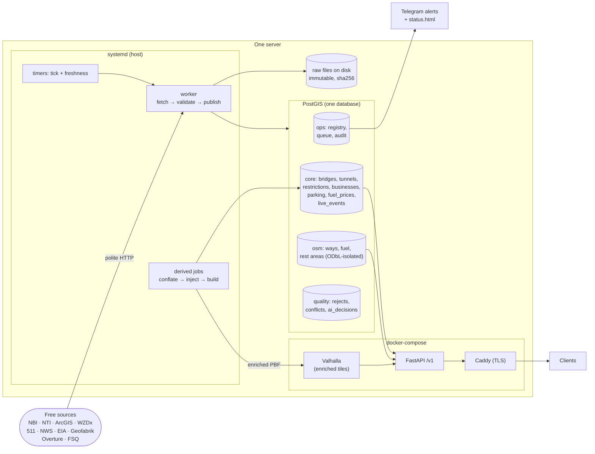

# Truck Intelligence Platform — MASTER PLAN

**Status:** FINAL — this is the canonical document.
**Date:** 2026-07-22
**Rule of precedence:** where the four design docs (`design/pipeline.md`, `design/storage.md`, `design/api-routing.md`, `design/quality-ai.md`) disagree with each other or with this plan, **this plan wins**. Every contradiction found in `design/CRITIQUE.md` is resolved here, in writing (see §3.1 "Canonical rulings").

---

## 1. Vision (5 lines)

1. A US-wide truck intelligence platform: truck-safe routing plus every fact a driver needs near the route — low bridges, tunnels, restrictions, parking, fuel, weather, closures, repair shops.
2. Built **only** on free, legal, verified sources: government open data, open GIS services, OpenStreetMap, open POI datasets. No paid keys, no scraping, ever.
3. The moat: we fuse authoritative government data (624k NBI bridges, state DOT restriction layers) onto the OSM routing graph — the exact fusion HERE/Trimble/ProMiles sell.
4. The differentiator free data can win on is **honesty**: every fact carries its source, age, and a confidence score; gaps are labeled "unknown", never faked.
5. Run by one AI-native solo developer on one server, with boring tech: PostGIS, Valhalla, FastAPI, Python, systemd. Simplicity is a requirement, not a preference.

---

## 2. Data source catalog

All sources below were live-verified on 2026-07-22, including an independent adversarial re-check (details + URLs in `research/*.md`).

| # | Category | Primary sources | What they give | Update cadence | License | Verified? |
|---|---|---|---|---|---|---|
| 1 | **Routing network + freight corridors** | OSM via Geofabrik US PBF (11.2 GB); NTAD NHS + National Network (STAA); FAF5 links + flows; HPMS; TIGER/Line | The only free routable network with truck restriction tags; federal truck-network overlays; freight flow volumes per link | OSM daily; federal layers annual-ish | ODbL (OSM); US public domain (federal) | ✅ all 8 checks confirmed |
| 2 | **Bridges** | FHWA NBI annual file (624,193 bridges); BTS hosted FeatureServer; state DOT services (WSDOT lane clearances, TxDOT nightly, PennDOT/PASDA posted roads, NYSDOT, RIDOT) | Measured clearances, load ratings, open/posted/closed status, coordinates; a few states publish real posted values | NBI annual; state layers daily–weekly | US public domain; state open data | ✅ 7/8 confirmed (Ohio TIMS uncertain from sandbox) |
| 3 | **Tunnels** | FHWA National Tunnel Inventory (~500 tunnels, annual); authority rule pages (PANYNJ, MTA, MDTA, MassDOT, VDOT, CDOT, PA Turnpike) — hand-curated; Federal Register API as change trigger | Clearances, height/hazmat restriction flags; the detailed class-by-class hazmat rules (curated by hand) | Annual (NTI); rules change rarely | US public domain; state public records | ✅ 6/8 fully confirmed; MDTA is bot-blocked → manual review |
| 4 | **Restrictions** | NBI-derived posting codes; PennDOT posted segments; NYC truck routes + low bridges; state 511 restriction endpoints (Idaho has a literal weight-limits endpoint); OSM maxheight/maxweight/hgv tags; MN/WI seasonal GIS | Point + segment limits (height, weight, bans), always labeled by authority level | Weekly–real-time (state); continuous (OSM) | Public domain / state open / ODbL | ✅ 8/8 confirmed (ND feed exists but ToS = non-commercial → **not used**) |
| 5 | **Parking / rest areas / weigh stations** | NTAD Truck Stop Parking (1,915 points, 2019-era); state rest-area GIS (CA, TX, IA, MN, WA, IN); CA + IL weigh stations; TPIMS live availability (8 Midwest states, registration); 511NY truck parking; OSM | Static locations + capacities; live availability where states built it (~10 states) | Static ~yearly; live 1–5 min | Public domain; state; ODbL | ✅ 7/8 confirmed with exact counts re-queried |
| 6 | **Fuel + prices** | OSM `amenity=fuel` (108,933 US stations); AFDC alt-fuel API (free key, note new domain `developer.nlr.gov`); EIA weekly diesel/gas averages (free key) | All station locations; CNG/LNG/EV/H2 stations; weekly regional price averages | OSM daily; AFDC continuous; EIA weekly | ODbL; US open data / CC-BY; public domain | ✅ 6/6 confirmed, counts exact |
| 7 | **Live ops (closures, construction, weather, water)** | WZDx registry (~40 registered feeds, ~25 open); ~19 state 511 APIs (free keys, ~10 calls/60s); Caltrans CWWP2 (no key, incl. chain controls); NWS `api.weather.gov` (no key); NOAA NWPS + USGS water gauges; OpenFEMA | Work zones, closures, incidents, weather alert polygons, flood forecasts, chain controls | 1–15 min | Public domain; state open data | ✅ 7/8 on-the-wire; one dead nowCOAST URL replaced with verified endpoint |
| 8 | **Businesses / POIs** | Overture Places (75.9M, CDLA-Permissive); Foursquare OS Places (100M+, Apache 2.0); OSM POIs; Census CBP/ZBP density stats; Name Suggestion Index (brands) | Repair, tire, towing, food, motels, truck stops — conflated, confidence-scored | Monthly (Overture/FSQ); daily (OSM) | Permissive (CDLA-P / Apache / BSD); ODbL (OSM) | ✅ 7/8 confirmed |

### ⚠️ Honest gaps — NO free legal source exists (we say so, we do not fake it)

| Gap | Who sells it | What we do instead |
|---|---|---|
| **Station-level fuel prices** | OPIS, GasBuddy, DTN | EIA weekly *regional* averages, labeled "regional estimate", never per-pump |
| **Ratings / reviews** | Google, Yelp, Tripadvisor (paid + storage-prohibited) | None. Multi-source confidence + brand signals; own ratings loop later |
| **Nationwide live probe speeds / traffic** | INRIX, HERE, TomTom, Google | Event-based proxy (incidents+closures+weather), labeled as such |
| **National real-time parking availability** | Trucker Path etc. | TPIMS + NY + FL only; per-state coverage flag tells the truth |
| **Live weigh-station open/closed status** | Drivewyze, PrePass | Absent. No column exists for it |
| **50-state posted-sign restriction database** | Trimble, HERE, ProMiles | NBI codes + state layers + OSM, confidence-labeled; the fusion is our v1 moat |
| **Current hazmat-route GIS (NHMRR)** | nobody (registry is HTML/PDF, bot-blocked) | Manual curated file + Federal Register API change trigger |
| **Machine-readable seasonal thaw restrictions (most states)** | nobody | MN/WI GIS + curated advisory layer with official links |
| **Truck toll prices** | TollGuru etc. | `tolls_present` flag only |
| **Bridge-strike incident database** | internal DOT data | Not available; we don't pretend |

Also excluded by legality even though technically reachable: ND's live restriction feed (non-commercial ToS), all bot-blocked pages (FMCSA, MDTA, MTA, chain locators — manual review only).

---

## 3. System architecture

### 3.1 Canonical rulings (the one-page reconciliation)

These ten decisions resolve every contradiction in CRITIQUE.md. They are binding.

1. **History model = snapshot-swap + reconstructible history** (not SCD2). Entity tables have **no** `valid_from`/`valid_to`. Every published row carries `(source_id, run_id, ingested_at, observed_at)`. Past states are reconstructed on demand by replaying immutable raw files. Native history is kept **only** for true time series: `core.fuel_prices` (one row per region per week) and `core.live_events` (lifecycle + 90-day archive to Parquet).
2. **One lineage schema:** `ops.sources` + `ops.source_runs` (key: `run_id`), synced from the YAML registry. Storage.md's `sources`/`ingest_runs` are deleted; their useful extra columns (`verify_status`, `attribution_text`, `authority_class`, `base_trust`, `trust`) move into `ops.sources`.
3. **One naming map** (§5.1). Schemas are always qualified: `ops` / `staging` / `core` / `osm` / `quality`.
4. **ODbL posture, decided once:** (a) *unconflated* OSM mirrors live in the `osm` schema only, joined at query time; the engine refuses to load `share_alike: true` sources anywhere else. (b) Exactly **two deliberate ODbL-derivative artifacts** exist, documented in `ATTRIBUTION.md`: the conflated `core.restrictions` table and the enriched PBF/Valhalla graph. They are internal; if either is ever published *as a database*, it must be published under ODbL. The app always shows "© OpenStreetMap contributors". (c) `core.businesses` conflates **Overture + FSQ attributes only** — no OSM attribute values (names, phones, hours) are copied in, so the table stays permissively licensed. OSM POIs are used only as a query-time corroboration signal from the `osm` schema.
5. **`osm.ways` exists and is loaded.** A registry source (`osm_ways`) runs `osmium tags-filter` to extract *highways only* from the Geofabrik PBF and loads them into `osm.ways` (a fraction of the full 11.2 GB). Corrected claim: *the routable graph never enters Postgres; a filtered ways mirror lives in `osm` for conflation.*
6. **A fourth job type: `derived`.** Registry entries with `kind: derived` and `depends_on: [nbi_annual, penndot_posted, osm_ways, ...]` run after their upstream sources publish. They own conflation (`core.restrictions`, `core.businesses`) and the enrichment build. Multi-source tables are never `snapshot_swap` per source (one source's swap would wipe the others' rows) — the derived job rebuilds the whole table, then swaps atomically.
7. **The enrichment loop is a scheduled pipeline job**, not a footnote. Weekly flow: download PBF → conflate gov data to OSM ways → inject tags via pyosmium (HIGH/MEDIUM confidence only) → `valhalla_build_tiles` → smoke-test 5 canned truck routes → atomic symlink swap. Owner: the `pbf_enriched` derived job. Per-source `max_runtime_s: 28800` so the reaper never kills it.
8. **Hardware, one line:** start on **one VPS: 8 vCPU, 16 GB RAM, 500 GB NVMe (~$60–80/mo)**. Neither the 16 GB nor the 64 GB claim is research-verified for a US-national Valhalla build — so the **first Phase-3 task is an empirical build test**. If it OOMs: build per-region tiles and merge (supported by Valhalla), or rent a temporary high-RAM box for the weekly build and rsync tiles to the serving box. MVP needs no Valhalla at all.
9. **Deployment, one sentence:** the four serving pieces (PostGIS, Valhalla, FastAPI, Caddy) run in **one `docker-compose.yml`**; all Python workers and timers run as **systemd user units on the host**. Logs: journald for systemd units, `docker logs` for services.
10. **Queue bugs fixed by decree:** the job queue uses a **partial unique index** `(source_id) WHERE status IN ('queued','running')` — not `UNIQUE(source_id, status)`, which deadlocks after the second completed run. The stuck-job reaper uses per-source `max_runtime_s` (default 2 h) — never a global 2-hour kill. After every snapshot/derived swap, the publish step **re-applies role grants from a checked-in `grants.sql`** and **enqueues a rescore job** (swaps replace the table object, which would otherwise silently drop grants and nightly-computed quality columns).

### 3.2 One diagram

### 3.3 Plain-language walkthrough (discover → download → validate → enrich → store → serve)

- **Discover.** Every source is one YAML file in git (the *registry*). It says where the data lives, how often to check, what license it has, and what quality gates apply. A tiny systemd timer ("tick", every minute) reads the registry and drops due jobs into a Postgres queue table. New WZDx feeds are discovered weekly from the federal registry, but a **human approves** each new feed (license reading is a legal judgment, not code).
- **Download.** One worker process drains the queue. All HTTP goes through one `polite_get()` helper: rate-limited per host, descriptive User-Agent with contact email, honors `Retry-After`, backs off on 403/429 — never works around them. Unchanged data (same ETag/hash) is skipped for free. Every downloaded file is stored immutably on disk, named by its SHA-256 hash. Fix a parser later? Replay from disk, never re-hit the source.
- **Validate.** Rows pass a ladder of cheap deterministic gates before publishing: schema (required fields), coordinates (range, in-US, lat/lon-swap detection), dedup, cross-source consistency, scoring. A truncated file (90% fewer rows) can never replace a good table — the gate aborts, the old table stays live, an alert fires. Rejects are stored and replayable.
- **Enrich.** The weekly `derived` jobs run after their inputs publish: match NBI bridges and state posted segments to OSM ways (`osm.ways`, PostGIS proximity + name matching), score each match HIGH/MEDIUM/LOW, inject only HIGH/MEDIUM as standard OSM tags into a local copy of the PBF, rebuild Valhalla tiles, smoke-test 5 canned truck routes, and atomically flip a symlink. LOW-confidence matches are never injected — they surface as API warnings instead.
- **Store.** One PostGIS database, five schemas: `ops` (registry, queue, audit), `staging` (per-source scratch), `core` (what the app reads), `osm` (ODbL-isolated mirrors), `quality` (rejects, conflicts, AI decisions). Reference tables are rebuilt and atomically renamed (snapshot-swap); live feeds upsert with a soft-close lifecycle; fuel prices accumulate weekly history.
- **Serve.** FastAPI reads PostGIS and proxies Valhalla. Routing takes the driver's real truck dimensions per request (Valhalla dynamic costing). Live closures are passed as per-request exclusions — no tile rebuild needed. Every response carries source, vintage, confidence, attribution, and a non-removable advisory disclaimer.

---

## 4. Component list

| Component | What it is | Tech | Why | ~Size |
|---|---|---|---|---|
| **Source registry** | One YAML file per source, in git; synced to `ops.sources` | YAML + pydantic | Adding a source = adding a file, not code; git log = config audit trail | ~40–80 YAML files + ~200 lines sync |
| **Ingestion engine** | tick + worker + fetchers + loaders + politeness + alerts + freshness | Python 3.12, `requests`, `psycopg`, `ogr2ogr` | Generic engine, four load patterns; only parsers are per-source | ~2,000 lines |
| **Parsers** | Raw file → normalized rows, by name (survives column shifts like SNBI 2028) | Python, ~1 per format | NBI, generic GeoJSON, WZDx, EIA, CSV… | ~12–15 small files |
| **Job queue** | One Postgres table, `FOR UPDATE SKIP LOCKED`, partial unique index | Plain SQL | 0.14 jobs/sec peak; job + data commit in one transaction; no Redis/Celery/Kafka | 1 table + ~50 lines |
| **Derived jobs (the moat)** | Conflation (NBI/state→OSM ways), businesses conflation, PBF tag injection, Valhalla build | Python + PostGIS SQL + pyosmium + osmium | Turns free gov data into routing constraints — the product | ~600–900 lines |
| **PostGIS** | The one database: entities, geometry, search, live events, lineage | Postgres 16 + PostGIS 3.4 (docker-compose) | Concurrent writers + serving API + real spatial queries disqualify embedded DBs; no-rewrite path to managed Postgres | 1 service, <50 GB data |
| **Valhalla** | Self-hosted routing engine on enriched tiles | Official Docker image (MIT), never patched | Only free engine with full per-request truck dimensions (height/weight/length/hazmat) on one graph | 1 container + tile dir |
| **API service** | Everything under `/v1`; validation, units, warnings, attribution | FastAPI + pydantic, uvicorn | One language end-to-end; pydantic validates safety-critical truck dims; OpenAPI docs free | ~1,500–2,500 lines |
| **Quality layer** | Validation ladder, dedup, conflicts, trust + confidence scoring, nightly recompute | SQL + Python, 1 nightly systemd timer | Deterministic, replayable, explainable — "why 65?" is answerable | ~600 lines + `quality` schema |
| **AI sidecar (optional)** | 3 narrow batch jobs (§8) | Claude Agent SDK, nightly service | Polish, not load-bearing; platform fully works with it off | ~300 lines |
| **Monitoring** | `status.html` (static, regenerated every 10 min) + Telegram/ntfy alerts + weekly digest | SQL over `ops.source_runs` + tiny script | Audit table already holds every metric; no Prometheus/Grafana to babysit | ~200–300 lines |
| **Caddy** | TLS + gzip + static files | Caddy (docker-compose) | Zero-config HTTPS | 1 config file |
| **Raw zone + backups** | Immutable content-addressed files; nightly `pg_dump` + restic | Filesystem | Replay, dedup, disaster recovery with zero tooling | disk only |

Total the owner must understand: ~5,500 lines of Python/SQL, one database, two containers-worth of serving, two timers, one queue.

---

## 5. Storage schema summary

### 5.1 The naming map (canonical — use these names everywhere)

| Concept | Canonical name | Load pattern | History |
|---|---|---|---|
| Source catalog | `ops.sources` | registry-synced | git |
| Run audit / lineage | `ops.source_runs` (`run_id`) | engine-written | append-only |
| Job queue | `ops.job_queue` | engine | ephemeral |
| Live-feed health | `ops.feed_health` | engine | rolling |
| Per-source scratch | `staging.<source_id>` | truncated per run | none |
| Bridges (NBI + state overlays) | `core.bridges` | snapshot_swap | replay raw |
| Tunnels (NTI + curated rules ref) | `core.tunnels` | snapshot_swap | replay raw |
| Restrictions (conflated; ODbL-derivative) | `core.restrictions` | **derived** | replay + rebuild |
| Businesses (Overture + FSQ) | `core.businesses` | **derived** | replay + rebuild |
| Parking / rest areas / weigh stations | `core.parking_sites` (`kind` column) | snapshot_swap | replay raw |
| Fuel price estimates (EIA weekly) | `core.fuel_prices` | upsert | **native time series** |
| Live events (WZDx, 511, NWS, TPIMS…) | `core.live_events` | event_lifecycle | **native lifecycle + Parquet archive** |
| OSM highways mirror (for conflation) | `osm.ways` | snapshot_swap (osm schema) | replay raw |
| OSM fuel stations | `osm.fuel_stations` | snapshot_swap (osm schema) | replay raw |
| OSM rest areas / weigh points | `osm.rest_areas`, `osm.weigh_points` | snapshot_swap (osm schema) | replay raw |
| Quality artifacts | `quality.rejects`, `quality.conflicts`, `quality.ai_decisions` | quality jobs | append |

### 5.2 Conventions

- **Geometry:** everything `geometry(*, 4326)`, cast to `geography` at query time for meter-true distances. One SRID, by decree.
- **Lineage:** single-source tables carry `(source_id, run_id, ingested_at)`. Merged tables (`core.businesses`) instead carry `present_in TEXT[]` + per-source attribute blobs in `props JSONB` — this is the **documented exception** to the single-`source_id` rule, not a violation of it.
- **Quality columns on every entity table:** `observed_at` (when the fact was true in the world — never the fetch date), `confidence SMALLINT`, the four stored components (`conf_trust`, `conf_fresh`, `conf_complete`, `conf_agree`), `flags TEXT[]`. Recomputed nightly; re-enqueued automatically after any swap.
- **`props JSONB`** holds the full cleaned source record; promoted columns stay few and stable.
- **Search:** Postgres FTS (`tsvector`) + `pg_trgm` on businesses. No Elasticsearch.
- **Honest absences (by design):** no station-price column, no ratings columns, no live-speed column, no weigh-station-status column, no national posted-sign column. `businesses.address_norm` exists (AI job 2 writes it). `core.restrictions` realistic v1 volume: **~0.7–1M rows** (NBI-derived points + a few state layers + sparse OSM) — 1–5M only if many state adapters land; do not size or promise beyond this.
- **Scale path (documented, not pre-built):** managed Postgres → read replica → pgbouncer → partition `live_events` → S3 raw zone. No schema rewrite at any step.

---

## 6. API surface summary

All under `/v1`. GeoJSON everywhere. US truck units at the boundary (13'6", lbs), converted once to Valhalla's metric. Auth: `X-API-Key` (hashed in DB). Rate limits: routing 60/min, data 300/min, live 120/min. Every list endpoint requires a spatial filter (`bbox` ≤ 4°×4°, `near`, or `state`). One error envelope with stable codes.

| Group | Endpoints | Notes |
|---|---|---|
| **Routing** | `POST /v1/route`, `/v1/route/matrix`, `/v1/isochrone` | Per-request truck dims → Valhalla truck costing; live closures passed as `exclude_locations`/`exclude_polygons`; post-route audit warns about near-misses and LOW-confidence restrictions |
| **Data layers** | `GET /v1/bridges`, `/v1/bridges/{nbi_id}`, `/v1/tunnels`, `/v1/restrictions`, `/v1/parking`, `/v1/rest-areas`, `/v1/weigh-stations`, `/v1/fuel`, `/v1/fuel/prices`, `/v1/places` | Vintage + source + confidence on every feature; `/v1/fuel/prices` is explicitly `"kind": "regional_weekly_estimate"` |
| **Along-route** | `POST /v1/along-route` | "What's ahead?" — buffered polyline, results ordered by distance along route. **Input caps (binding):** decoded length ≤ 3,500 mi, `buffer_mi` ≤ 10, ≤ 25,000 points; violations → `invalid_geometry` / `buffer_too_large`. Implementation note: `ST_LineFromEncodedPolyline(..., nPrecision => 6)` — the default precision 5 lands coordinates 10× off |
| **Live** | `GET /v1/live/closures`, `/v1/live/weather-alerts`, `/v1/live/parking`, `/v1/live/chain-controls`, `/v1/live/congestion` | All read `core.live_events`; per-state `coverage` field tells the truth; congestion is event-based proxy, labeled |
| **Meta** | `GET /v1/meta/coverage`, `/v1/meta/attributions`, `/v1/health` | Honesty as an API: vintages, gaps, license obligations, feed liveness |

**Routing failure design (binding, from CRITIQUE D1):**
1. Valhalla call has a **5 s timeout** → `503 upstream_unavailable` (same for PostGIS down).
2. Closure exclusion is corridor-based, and the real route can leave the corridor — so after routing, the returned geometry is **intersected with active closures; on a hit, Valhalla is re-called once** with the union of exclusions; if it still hits, the route is served with a `severe` warning.
3. **Safety policy, written down:** if the post-route audit finds an on-route restriction tighter than the truck (a graph bug), the API returns HTTP 200 **with a blocking-level warning** and logs an incident — warn-and-serve, never silent, never a bare error that hides the reason.
4. Every route response carries the non-removable disclaimer: *"Advisory routing from public data. Not for enforcement. Obey posted signs."*

**DEF ruling (binding, from CRITIQUE C1):** the brand→DEF heuristic ("major chain truck stops dispense DEF") is a *deterministic, rule-based, labeled* inference — it is config in git, not AI. It is permitted as the **one documented exception** to the no-inference rule, renders as `"def": "inferred"`, never as fact. Everything else stays banned (no "other Love's have scales"-style amenity filling, ever).

---

## 7. Validation + confidence scoring summary

**The ladder (deterministic first, every record, between staging and core):**

1. **Schema** — required fields present, types parse → reject to `quality.rejects` (replayable).
2. **Coordinates** — range/junk, in-US (TIGER polygons — public domain, keeps ODbL out of the quality layer), swapped-coordinate detection. Flag or reject; **never silently "fix"** a coordinate.
3. **Dedup** — within-source: natural keys. Cross-source (businesses): block by 150 m + name trigram → score → auto-merge ≥ 0.85, auto-distinct ≤ 0.55, gray zone → AI (truck-core categories only). Merges are reversible; all source blobs kept.
4. **Cross-source consistency** — tolerance checks (e.g., NBI vs OSM clearance within 6 in) → disagreements persist in `quality.conflicts`, shown to users as badges.
5. **Scoring** — `confidence = 100 × (0.35·Trust + 0.25·Freshness + 0.20·Completeness + 0.20·Agreement − penalties)`, components stored on the row. Bands: ≥80 high, 50–79 medium (badge always visible), <50 advisory/unverified.

**Key rules:**
- **Two-winner conflicts:** display shows the highest-authority value; **routing takes the most restrictive value**. Over-caution costs minutes; the opposite error is a bridge strike.
- **Trust is per-source, assigned by authority class** (federal 0.95 → state 0.90 → curated 0.85 → open aggregate 0.65 → community 0.55) and **can only go down** (staleness, contradictions) — no self-reinforcing feedback loops.
- **Two freshness clocks, never confused:** the pipeline's source SLO ("is the feed alive?" — NBI SLO is **13 months**, live feeds 1 h, daily 36 h) vs the record's `observed_at` ("when was this true?" — NTAD parking amenities date to the ~2019 survey, and are shown as such, even when re-downloaded today).
- **Tri-state honesty:** a road with zero restriction rows is *unknown*, not *unrestricted*. NULL renders as "unknown", never as "no".
- **Quality jobs are audited like everything else (binding, from CRITIQUE D3):** the nightly quality and AI jobs write `ops.source_runs` rows under synthetic source ids (`quality_nightly`, `quality_ai`) with their own 36 h SLOs — so the freshness alert catches a silently failing quality job exactly like a dead feed.

---

## 8. AI usage (only where it earns its place)

~98% of quality work is deterministic SQL/Python. AI does exactly **three narrow, offline, cached, logged batch jobs**:

1. **Business dedup, gray zone only** — merge/distinct/unsure verdicts on ~10–20k truck-core candidate pairs (bootstrap), then tens/month. Sonnet-class.
2. **Address parsing residue** — strings the `usaddress` library fails on (~2–5%); output must re-segment the input only; a post-check rejects any token not present in the input. Haiku/Sonnet-class.
3. **Category long-tail** — unmapped source-category strings → our ~25-slug taxonomy; every verdict is appended to the static mapping table, so it becomes a deterministic rule and never costs a call again. Haiku-class.

**Mechanically enforced ground rules:** the AI connects as a Postgres role (`ai_writer`) with grants on **only** `quality.ai_decisions` and `businesses(category, canonical_key, address_norm)` — it structurally *cannot* write a weight limit, clearance, price, or coordinate. Output schemas are enums/ids only (no field can carry "13.5 t"). Every call is cached by input-hash, logged, human-overridable; `unsure` is always legal and maps to the safe default. Nothing user-facing ever waits on a model. After any table swap, `grants.sql` is re-applied so the role's access survives (ruling §3.1-10).

**Honest dependency note (binding, from CRITIQUE C3):** the sidecar authenticates via the existing Max-subscription OAuth token (`CLAUDE_CODE_OAUTH_TOKEN`). That is a consumer-subscription dependency that can break (limits, expiry, ToS changes) at any time. **The sidecar is optional polish by design** — with it off, the platform is 2–5% less polished, never less truthful. A paid API key is the named upgrade path if AI jobs ever become load-bearing.

---

## 9. Compliance box

**License obligations we carry:**
- **ODbL (OSM, Overture transportation):** show "© OpenStreetMap contributors" in the app and API `attribution` field. Keep unconflated OSM in the `osm` schema (engine-enforced). The two ODbL-derivative artifacts (`core.restrictions`, enriched graph) are documented; publishing either *as a database* triggers share-alike.
- **Permissive attributions:** Overture (CDLA-Permissive-2.0), Foursquare OS Places (Apache 2.0), NSI (BSD-3), AFDC (credit NREL/AFDC + OEDI CC-BY-4.0).
- **US federal data:** public domain; courtesy attribution to FHWA/BTS/EIA/NOAA/USGS/FEMA/Census (and it keeps provenance visible).
- **State DAAs:** each 511 Developer Access Agreement is read, signed, and stored in `legal/`; `ATTRIBUTION.md` + `/v1/meta/attributions` are auto-generated from the registry — compliance as config, never memory.

**Rate-limit etiquette (engine-enforced, one choke point):** per-host token bucket (default 1 req/s); descriptive User-Agent with contact email everywhere (NWS requires it); honor `Retry-After`; per-key 511 throttles (10 calls/60 s) encoded in the registry; Overpass public instance kept far under fair use (bulk work uses Geofabrik); robots.txt checked daily for any non-API HTML fetch; annual files probed with cheap conditional requests (51 weeks/year end in one HEAD).

**What we will never do:** scrape bot-blocked sites (FMCSA, MDTA, MTA, GasBuddy, chain locators — a 403 means no, and we back off, never spoof headers); bypass authentication, CAPTCHAs, or paywalls; use ToS-restricted data (ND's non-commercial feed, Waze partner feeds, NPMRDS); store Google/Yelp/Tripadvisor content; fabricate any operational fact (prices, clearances, limits, availability, ratings); auto-edit OSM (mechanical-edit policy — our enriched PBF stays local; hand-validated fixes may be contributed manually).

---

## 10. Roadmap

**Cadence rule:** the builder is an AI-native solo dev working with AI agents. Phases are measured in **active build hours** (focused human-at-the-keyboard time driving agents), never weeks or sprints. Elapsed calendar time is dominated by external waits (API key emails, DAA approvals, a Valhalla build running overnight) — those are flagged per phase as "wait items", they cost no build hours.

### Phase 1 — MVP (~8–12 active hours)
- **Objective:** prove the whole spine end-to-end: registry → polite fetch → raw zone → validate → PostGIS → API, with honest labeling.
- **Features:** the 4 MVP datasets (§11), 5 endpoints, validation gates 1–2, freshness SLO alerts, `status.html`.
- **Deliverables:** running compose + systemd stack on the dev box; `ops.source_runs` answering "what ran last night"; a map client can plot bridges/parking/alerts from the API.
- **Risks:** ArcGIS pagination quirks (mitigation: read `maxRecordCount` from metadata, never hardcode); scope creep (mitigation: no Valhalla, no conflation, no AI in this phase — by rule).
- **Wait items:** EIA free key (email, minutes).

### Phase 2 — Ingestion breadth + quality layer (~15–20 active hours)
- **Objective:** all verified source families flowing; the quality ladder live.
- **Features:** WZDx multi-feed poller (~25 open feeds) + feed health circuit breaker; 3–5 state 511 adapters; NTI tunnels + curated tunnel-rules file; OSM mirrors into `osm` schema (`osm.ways`, fuel, rest areas); Overture+FSQ businesses via DuckDB filter; dedup + conflicts + confidence scoring; nightly quality job writing its own `source_runs` rows.
- **Deliverables:** `/v1/fuel`, `/v1/places`, `/v1/tunnels`, `/v1/live/closures` live; confidence + provenance on every feature; weekly digest.
- **Risks:** dead/stale WZDx feeds (mitigation: circuit breaker is built in this phase); per-state 511 schema drift (mitigation: one normalizer to the WZDx-like event shape).
- **Wait items:** per-state 511 keys + DAAs (days, human latency); TPIMS registration emails.

### Phase 3 — The moat: routing + enrichment (~20–30 active hours)
- **Objective:** truck-legal routing on an enriched graph — the thing competitors charge for.
- **Features:** Valhalla up on vanilla Geofabrik tiles first (hour one of this phase: **empirical US build test** — ruling §3.1-8); NBI→OSM conflation with HIGH/MEDIUM/LOW scoring; pyosmium tag injection; weekly `pbf_enriched` derived job (download → conflate → inject → build → smoke-test → swap); `/v1/route` with per-request dims, live-closure exclusion, post-route audit + re-route loop; `/v1/along-route`; `/v1/restrictions`.
- **Deliverables:** a 13'6" truck routed around a 12'4" underpass that vanilla OSM misses — the demo that *is* the product; conflation review queue for LOW matches.
- **Risks:** US-national build exceeds 16 GB RAM (mitigation: regional builds + merge, or temporary build box — decided by the hour-one test, not by hope); carried-vs-under bridge disambiguation errors (mitigation: LOW matches are never injected, only warned).
- **Wait items:** none hard; tile builds run unattended for hours.

### Phase 4 — Production hardening (~10–15 active hours)
- **Objective:** unattended-for-weeks reliability on a rented VPS.
- **Features:** VPS deploy (compose + systemd units + restic backups); API keys + rate limiting + ETag caching; `/v1/meta/coverage` complete; AI sidecar (3 jobs) with kill switch; remaining state adapters (PennDOT, WSDOT, NYC, TxDOT); seasonal advisory layer (MN/WI GIS + curated); manual-review cadence for bot-blocked sources with staleness SLOs.
- **Deliverables:** public HTTPS API with docs at `/docs`; disaster-recovery drill executed once (restore dump + replay); `ATTRIBUTION.md` + `legal/` complete.
- **Risks:** solo-operator alert fatigue (mitigation: circuit breakers + one-alert-per-degradation are already the design); consumer-token AI dependency (mitigation: §8 — optional by design).
- **Wait items:** VPS provisioning, domain/TLS (minutes each).

### Phase 5 — Scaling (metric-triggered, not scheduled)
- **Objective:** grow only when measurements demand it. Nothing here is pre-built.
- **Triggers → levers:** API p95 > 200 ms sustained → managed Postgres + read replica; multi-node → Redis rate limits; `live_events` bloat → monthly partitioning; heavy corridor traffic → materialized corridor cache; ratings demand → **platform-owned** user ratings (new table, never scraped); revenue → the named paid upgrades (OPIS prices, probe traffic) as clearly-labeled premium layers.
- **Risks:** premature scaling (mitigation: every lever has a written trigger; touching one without its trigger is a design violation).

---

## 11. MVP definition

The smallest end-to-end slice that proves the platform: **one registry, one worker, one database, one API — four sources through four different load paths, honestly labeled.**

**Datasets (4):**
1. **FHWA NBI bridges** — annual bulk ZIP → `bulk_http` + `snapshot_swap` → `core.bridges` + derived low-clearance view. Proves: bulk path, unit conversion (meters→feet), vintage probing, the biggest table (~624k rows).
2. **NTAD Truck Stop Parking** — ArcGIS FeatureServer (1,915 points) → `arcgis` + `snapshot_swap` → `core.parking_sites`. Proves: ArcGIS pagination/metadata path, honest `observed_at` (2019 survey era, not download date).
3. **NWS weather alerts** — `api.weather.gov/alerts/active` → `live_json` + `event_lifecycle` → `core.live_events`. Proves: live polling, soft-close lifecycle, no-key polite access.
4. **EIA weekly diesel prices** — free-key API → `upsert` → `core.fuel_prices`. Proves: keyed source, native time series, "regional estimate" labeling.

**API endpoints (5):**
1. `GET /v1/bridges?bbox=…&max_clearance_lt_in=…` — the signature low-bridge query.
2. `GET /v1/parking?bbox=…` — with capacity + vintage badge.
3. `GET /v1/live/weather-alerts?bbox=…` — active NWS polygons.
4. `GET /v1/fuel/prices?region=…` — `"kind": "regional_weekly_estimate"`.
5. `GET /v1/meta/coverage` (+ `/v1/health` free) — the honesty surface, from day one.

**Validation checks:**
- Gate 1 schema: required NBI items present; parse-by-name mapping.
- Gate 2 coordinates: range, in-US, lat/lon-swap detection; reject with reason, never auto-fix.
- Registry gates: `min_rows` (NBI ≥ 550k), `max_row_delta_pct` (10%), geometry-valid ≥ 98%.
- Freshness SLOs + Telegram alert: NBI 13 months, NTAD 8 days, NWS 1 h, EIA 9 days — one 10-min timer that catches every failure class.
- Every row published with `(source_id, run_id, ingested_at, observed_at)`; every fetch (success/skip/fail) is one `ops.source_runs` row; `status.html` renders it.

**Explicitly NOT in MVP:** Valhalla/routing, conflation/enrichment, AI jobs, confidence formula (columns exist, formula lands in Phase 2), state 511 adapters, businesses conflation. The MVP proves the spine; the moat is Phase 3.

---

*Companion detail docs: `design/pipeline.md` (ingestion mechanics), `design/storage.md` (full DDL), `design/api-routing.md` (endpoint contracts, Valhalla comparison), `design/quality-ai.md` (scoring + AI mechanics), `research/*.md` (source verification evidence). Where they conflict with this plan, this plan wins — the specific rulings are in §3.1.*
