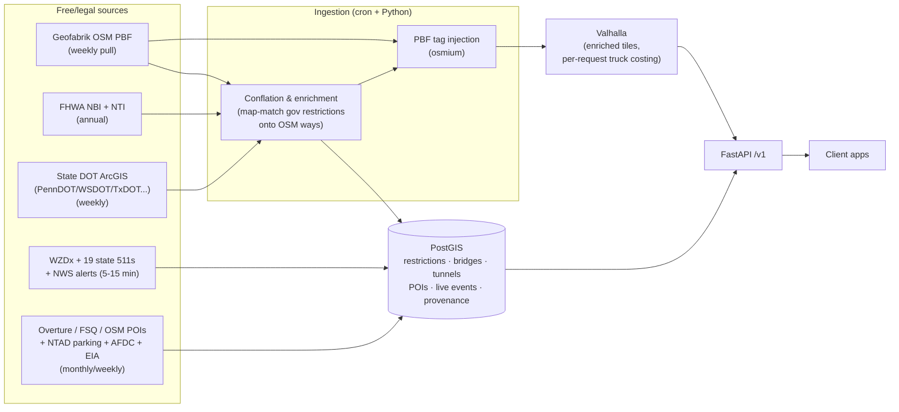

# Truck Intelligence Platform — Routing Engine + API Layer Design

**Author:** API + routing architect
**Date:** 2026-07-22
**Status:** Proposed (v1)
**Inputs:** verified source research in `../research/` (routing-network.md, bridges.md, tunnels.md, restrictions.md, businesses.md, fuel.md, live-ops.md, parking-rest-weigh.md)

**Ground rules honored throughout:**
- Free + legal sources only. Where no free source exists, the design says so and does NOT fake the feature.
- Solo AI-native developer. Boring tech, few moving parts, everything explainable in one read.
- Every choice comes with a WHY and the alternatives it beat.

---

## 0. The whole system on one page

Four deployable pieces, one VM, one `docker-compose.yml`:

1. **PostGIS** — the single database. All government/POI/live data lands here.
2. **Valhalla** — self-hosted routing engine, fed an *enriched* OSM extract.
3. **FastAPI** — the one API service. Everything under `/v1`.
4. **Caddy** — TLS + gzip + static tiles. (Any reverse proxy works; Caddy = zero-config HTTPS.)

Plus cron jobs (plain Python scripts, systemd timers) that pull sources on their natural cadences.



Two request paths only:
- **Routing** → FastAPI validates + converts units → Valhalla → FastAPI post-checks the route against PostGIS (warnings, live closures) → response.
- **Everything else** (bridges, restrictions, POIs, fuel, live) → FastAPI → PostGIS → GeoJSON out.

---

# PART 1 — Routing Engine

## 1.1 The requirement that decides everything

Per-request truck dimensions: a driver enters **their** rig's height/weight/length/hazmat and gets a legal route. That means the engine must apply vehicle parameters **at query time**, not at graph-build time.

## 1.2 Comparison: OSRM vs Valhalla vs GraphHopper

| | **OSRM** | **Valhalla** | **GraphHopper (OSS)** |
|---|---|---|---|
| License | BSD-2 | **MIT** | Apache-2.0 |
| Language / ops | C++ | C++ | Java (JVM tuning) |
| Consumes Geofabrik `.osm.pbf` | Yes | Yes | Yes |
| Truck restrictions from OSM tags | Only what the Lua profile bakes in at build | Reads maxheight/maxweight/hazmat etc. at tile build | Encoded values + `truck.json` custom model |
| **Per-request truck dimensions** | **NO** — costs baked at build time (maintainer-confirmed, issues #6522/#4504). Workaround = N pre-built graphs for N truck classes | **YES, fully** — `costing: "truck"` with request-time `height, width, length, weight, axle_load, axle_count, hazmat, top_speed, use_truck_route, hgv_no_access_penalty` (verified in API docs) | **Yes, with caveat** — per-request custom models require flexible mode (`ch.disable=true`), losing the contraction-hierarchy speedup |
| Query speed | Fastest (CH) | Fast enough (dynamic costing, tiled graph) | Fast in CH mode — but CH mode is exactly what per-request dims disable |
| Extras we actually need | — | **Isochrones, matrix, map-matching (Meili), `exclude_locations`/`exclude_polygons` per request** | Isochrones, matrix |
| RAM for US graph | High (national CH) | Moderate (tiled, mmap'd) | High in flexible mode |

*(OpenRouteService was also reviewed: it does per-request truck restrictions but is a heavier-to-host GPL fork of GraphHopper 4.0 — strictly dominated by Valhalla for our needs. Details in research file.)*

## 1.3 Pick: **Valhalla**

**Why (in order of weight):**

1. **One graph serves every truck.** Dynamic costing means "enter your dimensions" works natively. OSRM would force ~5-10 pre-built truck-class graphs (5-10× build time, disk, and update complexity) and still quantize the driver's real dimensions — a correctness *and* simplicity loss.
2. **GraphHopper's per-request mode gives up its main advantage.** With CH disabled it's no faster than Valhalla, and we'd take on JVM ops for nothing. It remains the credible fallback if we ever hit a Valhalla wall (good docs, Apache-2.0).
3. **The extras are load-bearing, not nice-to-have.** `exclude_locations`/`exclude_polygons` per request is how we inject **live closures** without rebuilding tiles (see §1.6). Map-matching (Meili) is reusable for conflation QA. Isochrones power future "reachable within HOS drive time" features.
4. **MIT license, active project** (v3.8.2, 2026-07), designed at Mapzen precisely for the "runtime costing" problem.

**Trade-offs accepted:** slower per-query than OSRM-with-CH (tens vs single-digit ms — irrelevant at our scale); C++ build is opaque, so we run the official Docker image and never patch the engine.

## 1.4 The moat: enriching OSM with government restriction data

**The honest problem:** OSM is the *only* free routable network with truck restriction tags, but its US coverage is patchy — absence of `maxheight` can mean "no restriction" or "nobody mapped it," and you cannot tell which. Meanwhile the government publishes authoritative structure data (NBI: 624k bridges with measured clearances, load ratings, posting status; state DOTs: posted weight segments, per-lane clearances) that is **not on any routable graph**. Every commercial truck-nav vendor (HERE, Trimble, ProMiles) charges for exactly this fusion. Doing it well on free data **is the product**.

### 1.4.1 What gets conflated (v1 scope)

| Source | Signal extracted | Cadence |
|---|---|---|
| **NBI annual file** (public domain) | Item 54 min vertical underclearance (the classic low bridge, applies to the road *under*); Item 10 min vertical clearance on the carried route; Item 41 open/posted/closed; Items 64/66 operating/inventory load rating; Item 70 posting code. Units are meters/metric tons — convert once at ingest | Annual |
| **National Tunnel Inventory** (public domain) | Tunnel restriction flags + clearances, decoded per SNTI spec | Annual |
| **PennDOT posted & bonded roads** (open, match layer by name-prefix `PA RMS POSTED` — the suffix datestamp drifts) | Actual posted weight-restriction *segments* — real sign values | Weekly poll |
| **WSDOT Bridge Vertical Clearance** (open REST) | Per-lane clearances + advisories | Weekly poll |
| **TxDOT / NYSDOT / Ohio TIMS / RIDOT** (open REST; Ohio + RIDOT prod endpoints still need one-time manual confirmation — flagged UNCERTAIN in research) | State-verified bridge + clearance + commercial-vehicle layers | Weekly poll |
| **NYC Open Data low bridges + truck routes** (Socrata) | The #1 truck-strike metro, parkway low bridges | Weekly poll |

Expansion is deliberately incremental: national NBI baseline first, then one state adapter at a time, starting with top freight + strike-prone states (NY, PA, TX, OH, WA, CA, IL, GA). Each adapter is a ~100-line Python script with the same output schema.

### 1.4.2 Conflation: matching gov points/segments to OSM ways

NBI gives a point + descriptive fields, not an OSM way id. Matching is the hard, valuable part. Pipeline (pure PostGIS + Python, no exotic tools):

1. **Candidate fetch** — for each NBI structure, nearest OSM highway ways within 30 m (`ST_DWithin` on the ways table we already load via osm2pgsql).
2. **Carried vs. under disambiguation** — Item 54 (underclearance) must attach to the road *passing under* the bridge, not the road on it. Heuristics, in order: OSM `bridge=yes`/`layer` tags identify the carried way (so the *other* crossing way is "under"); fuzzy name/route-ref match of NBI Item 7 "facility carried" and Item 6 "feature intersected" against OSM `name`/`ref`; bearing agreement.
3. **Confidence score** per match:
   - **HIGH** — single candidate + name/ref corroboration → auto-inject.
   - **MEDIUM** — single plausible candidate, no name match → inject, flagged in provenance.
   - **LOW** — multiple candidates or contradictions → **never injected**; written to a review file (`review_queue` table). Served via the API as an *area warning* only.
4. **Never weaken OSM.** If OSM already carries an equal-or-stricter `maxheight`/`maxweight`, we do nothing. Gov data only *adds* restrictions where OSM is silent or looser. Rationale: the OSM value is usually the *signed* value (legally binding); NBI is the *measured* value — when both exist, the sign wins for routing and the mismatch is surfaced as a warning, not silently resolved.
5. **Safety buffer** — NBI clearances are measured, not signed, and resurfacing eats inches between inspections. We inject `measured − 3 inches` and label it `derived`. (Commercial vendors do the same thing; we just say so out loud.)
6. **Linear segments** (PennDOT posted roads etc.) match by geometry overlap instead of point-snap: buffer 20 m, `ST_Intersects`, keep OSM ways with >60 % length overlap.

Every conflated record keeps full provenance: `source, source_id, source_vintage, match_confidence, raw_value, injected_value`. This table — not the Valhalla graph — is the canonical restriction store; the graph is a derived artifact.

### 1.4.3 Injection into the router

**Static restrictions → PBF tag injection (chosen).** A pyosmium pass over the Geofabrik extract adds standard OSM tags (`maxheight=4.1`, `maxweight=21`, …) to HIGH/MEDIUM-confidence matched ways, then `valhalla_build_tiles` runs on the modified PBF. Valhalla consumes the tags natively — zero engine modification.

- *Why not Valhalla graph post-processing or a custom Lua/config layer?* Tag injection is the only approach where the enrichment is engine-agnostic (works identically if we ever swap to GraphHopper), testable with plain osmium tooling, and understandable by reading one script.
- *Why not upload our edits to OSM?* Automated edits violate OSM's mechanical-edit policy. The modified PBF stays local. (Manually validated fixes *can* be contributed upstream by hand — good citizenship, separate workflow, never the pipeline.)

**Live closures → per-request exclusion (chosen).** Bridge/road closures from WZDx + 511 land in PostGIS (§2). At route time, FastAPI collects active closures intersecting the request's rough corridor and passes them to Valhalla as `exclude_locations` / `exclude_polygons`. No rebuild, seconds-fresh.

- *Why not rebuild tiles on live events?* A US tile build takes hours; closures change by the minute. Request-time exclusion is exactly what the Valhalla API feature exists for.

**Rebuild cadence:** weekly (Geofabrik pull → enrich → inject → build → atomic tile-dir swap → health-check route → cut over). Weekly is enough because everything faster-moving than OSM edits flows through the live path.

### 1.4.4 Licensing consequence (stated, not hidden)

Injecting public-domain government data *into* an OSM-derived graph creates an ODbL **derivative database**. Consequence: the enriched restriction network is ODbL (share-alike if we ever publish that database), and the app must display "© OpenStreetMap contributors". The untouched government source tables in PostGIS remain public-domain in a separate schema (collective-database pattern), so ODbL does not cascade into our POI/business layers. This is a fully acceptable cost; we are not selling the raw database, we are selling the service.

### 1.4.5 What enrichment does NOT fix (honest limits, surfaced in the product)

- **No legal-grade guarantee of restriction *absence*.** Neither OSM nor NBI can certify a road is unrestricted. Every route response carries a non-removable disclaimer: *"Advisory routing based on public data. Obey posted signs."* This mirrors FHWA's own "not for navigation/enforcement" disclaimers on NN/HPMS.
- **NBI is annual** → up to ~12 months stale on posting changes. Mitigated (not solved) by weekly state-DOT polls and live 511/WZDx.
- **Actual posted sign values nationwide** (tons per axle config, ft-in on the sign) exist free only in a few states (PA, RI, WSDOT lanes). Elsewhere we serve NBI codes/ratings labeled as such. The complete version is the paid gap (Trimble/HERE/ProMiles) — we say so.
- **Seasonal spring-thaw load postings** are PDFs/press releases per state; no machine-readable feed exists at any price. v1 ships a static "frost-law states + typical windows + official links" advisory layer, not fake data.
- **Toll pricing** — no free truck toll-rate source. Routes flag `toll=true` edges (OSM) and nothing more.
- **Local truck bans** (municipal ordinances) — thousands of jurisdictions, mostly unmapped anywhere free. OSM `hgv=no` where mapped; otherwise unknown, and we say unknown.

---

# PART 2 — REST API Design

## 2.1 Framework: FastAPI (confirmed, with reasoning)

- **Why FastAPI:** the entire ingestion/conflation pipeline is already Python (osmium, shapely, psycopg) — one language for the whole platform is the biggest simplicity win available. Pydantic gives request validation (truck dims have units and bounds — validation bugs here are safety bugs). OpenAPI docs are auto-generated at `/docs`, which *is* our API documentation. Async handles the "proxy Valhalla + query PostGIS concurrently" pattern cleanly.
- **Alternatives:** Go (chi/echo) — faster and lighter, but a second language for a solo Python dev and no geo ecosystem to match shapely/pyproj; Node/Express — fine, same second-language objection; Django REST — heavier than needed, sync-first. None beats "one language, one repo."
- **Serving:** uvicorn behind Caddy. One process, scale later by adding workers. No Kubernetes, no queues, no microservices — a single modular FastAPI app with routers per domain.

## 2.2 Cross-cutting conventions

| Concern | Decision | Why |
|---|---|---|
| **Versioning** | URL prefix `/v1/...`. Breaking change → `/v2`, run both during migration | Visible in logs/caches/curl, trivially routable. Header-versioning is invisible and error-prone; per-endpoint versions are chaos |
| **Auth** | `X-API-Key` header. Keys issued by admin CLI, stored as SHA-256 hashes in Postgres with `tier`, `created_at`, `revoked_at` | Solo-operator scale. OAuth2/JWT adds a token service and refresh flows nobody needs yet. Hashing = a DB leak doesn't leak keys |
| **Rate limiting** | Token bucket per key per endpoint class, in-process (`slowapi`): **routing 60/min**, **data reads 300/min**, **live 120/min**. Responses carry `X-RateLimit-Limit/-Remaining/-Reset`; 429 includes `Retry-After` | Single-node deployment → no Redis needed (in-process buckets are exact enough). Classes differ because a route costs ~50× a POI lookup. Redis becomes necessary only at multi-node — noted for later, not built now |
| **Formats** | GeoJSON `FeatureCollection` for all geo lists; route geometry as GeoJSON LineString (optional `polyline6` for bandwidth) | GeoJSON plugs into MapLibre/Leaflet/QGIS with zero client code |
| **Units** | API speaks US truck units: feet/inches, pounds, miles (drivers think in 13'6", not 4.11 m). Converted once at the FastAPI boundary to Valhalla's metric | Unit confusion is the classic truck-router bug; one conversion point, tested hard |
| **Pagination** | `limit` (default 100, max 1000) + `offset`; **every list endpoint requires a spatial filter** (`bbox` ≤ 4°×4°, or `near`, or `state`) | Mandatory spatial bounds keep result sets small enough that offset pagination is honest. Cursor pagination is better for unbounded feeds — we don't have unbounded feeds, so we don't pay its complexity |
| **Filtering** | Common: `bbox=minLon,minLat,maxLon,maxLat` · `near=lon,lat&radius_mi=` · `state=TX`. Per-domain extras listed per endpoint | Three spatial idioms cover every real client question |
| **Caching** | Static datasets: `Cache-Control: public, max-age=86400` + `ETag` = hash of (dataset vintage, query params) → `304` on `If-None-Match`. Live endpoints: `max-age=60`. Routes: `no-store` | Our static data changes weekly/annually — let CDNs and clients do the caching work. ETags are nearly free because every dataset already tracks vintage |
| **Errors** | One envelope: `{"error": {"code": "...", "message": "...", "details": {...}}}` with stable machine codes (`invalid_bbox`, `rate_limited`, `route_not_found`, `dims_out_of_range`, …) | Clients branch on `code`, humans read `message` |
| **Live updates** | **Polling only** in v1 (with ETag/`max-age=60`). No WebSockets/SSE | Upstream feeds themselves refresh at 1-15 min; a socket layer would add ops burden to deliver fake real-time. Revisit only if a client genuinely needs push |
| **Attribution** | `/v1/meta/attributions` + `attribution` field in every response envelope | ODbL and state-DOT courtesy requirements are license obligations, so they're API features |

## 2.3 Endpoint catalog

### Routing

| Method | Path | Purpose |
|---|---|---|
| `POST` | `/v1/route` | Truck-legal route with per-request dimensions |
| `POST` | `/v1/route/matrix` | Small distance/time matrices (≤ 25×25), same truck params |
| `POST` | `/v1/isochrone` | Drive-time polygon from a point, truck costing |

`POST` because truck params + waypoints are a structured body; GET query strings for this are unreadable and hit URL limits.

**`POST /v1/route` request:**
```json
{
  "locations": [
    {"lon": -74.0060, "lat": 40.7128},
    {"lon": -75.1652, "lat": 39.9526}
  ],
  "truck": {
    "height_in": 162,
    "width_in": 102,
    "length_ft": 73,
    "weight_lb": 80000,
    "axle_count": 5,
    "hazmat": false
  },
  "options": {
    "avoid_tolls": false,
    "prefer_truck_routes": true,
    "geometry": "geojson"
  }
}
```

**Response (trimmed):**
```json
{
  "route": {
    "distance_mi": 97.4,
    "duration_s": 6390,
    "geometry": {"type": "LineString", "coordinates": [[-74.006, 40.7128], ...]},
    "legs": [{"summary": "I-95 S", "distance_mi": 97.4, "duration_s": 6390, "maneuvers": [...]}],
    "tolls_present": true
  },
  "warnings": [
    {
      "type": "low_clearance_near_route",
      "severity": "info",
      "message": "Bridge 0.3 mi off-route on NY-908M: measured clearance 12'10\" (your height 13'6\"). Do not deviate here.",
      "location": {"lon": -73.98, "lat": 40.85},
      "source": {"dataset": "NBI", "vintage": "2025", "confidence": "high"}
    },
    {
      "type": "clearance_margin",
      "severity": "caution",
      "message": "Tightest clearance on route: 14'0\" measured (margin 6\"). Verify posted signs.",
      "source": {"dataset": "NBI", "vintage": "2025", "confidence": "medium"}
    }
  ],
  "excluded_live_closures": 2,
  "disclaimer": "Advisory routing from public data. Not for enforcement. Obey posted signs and local ordinances.",
  "attribution": ["© OpenStreetMap contributors (ODbL)", "FHWA NBI 2025", "USDOT BTS NTAD"]
}
```

**How `/v1/route` works internally (the part worth understanding):**
1. Validate + convert units → Valhalla `truck` costing (`height`, `width`, `length`, `weight`, `axle_load`, `hazmat`, `use_truck_route`).
2. Fetch active closures intersecting the straight-line corridor (buffered) from PostGIS → pass as `exclude_locations`/`exclude_polygons`.
3. Call Valhalla `/route`.
4. **Post-route audit:** buffer returned geometry 150 m, query the canonical restriction table for (a) restrictions ON the route tighter than the truck (shouldn't happen — if found, it's a graph bug: log loudly, warn the user), (b) near-misses just off-route (drivers deviate; #1 strike cause), (c) LOW-confidence restrictions on the route that were deliberately not injected → surfaced as warnings. This audit is what makes patchy data *safe to use*: the graph routes on what we trust; the API warns about what we half-trust.

### Data layers (all GET, all GeoJSON, all support `bbox`/`near`/`state` + `limit`/`offset`)

| Path | Extra filters | Source of truth (vintage exposed per feature) |
|---|---|---|
| `/v1/bridges` | `max_clearance_lt_in`, `posted=true`, `closed=true`, `min_rating_lt_lb` | NBI (annual) + state DOT overlays (weekly) |
| `/v1/bridges/{nbi_id}` | — | Full NBI record, decoded + both unit systems |
| `/v1/tunnels` | `hazmat_restricted=true` | National Tunnel Inventory + curated authority rules (PANYNJ/MDTA/VDOT), each rule carrying `source_url` + `last_reviewed` because several authority sites are bot-blocked and reviewed manually |
| `/v1/restrictions` | `type=height,weight,length,hazmat,ban`, `min_confidence=high` | The canonical conflated restriction table — the moat, queryable directly |
| `/v1/parking` | `amenity=showers,scales`, `min_spaces=` | NTAD Truck Stop Parking (2019-era amenities — labeled) + OSM/Overture conflation |
| `/v1/rest-areas` | `open_now=true` (where state 511 reports status) | State DOT layers + OSM |
| `/v1/weigh-stations` | — | Stitched state DOT layers + OSM `amenity=weighbridge`; **no live open/closed status — that's Drivewyze/PrePass proprietary, honestly absent** |
| `/v1/fuel` | `fuel_type=diesel,def,cng,ev`, `brand=` | OSM `amenity=fuel` + AFDC alt-fuel API; DEF flag only where OSM `fuel:adblue` exists or chain-inference (labeled `inferred`) |
| `/v1/fuel/prices` | `region=` (PADD/state) | **EIA weekly regional averages only — station-level prices do not exist free; response is explicitly `"kind": "regional_weekly_estimate"`.** No fake per-station prices, ever |
| `/v1/places` | `category=repair,towing,food,medical,...`, `q=` name search | Overture Places + FSQ OS + OSM, conflated; `confidence` per feature; **no ratings/reviews (no legal free source — stated in docs)** |

**Example:** `GET /v1/bridges?bbox=-74.3,40.5,-73.7,41.0&max_clearance_lt_in=164&posted=true` →
```json
{
  "type": "FeatureCollection",
  "features": [{
    "type": "Feature",
    "geometry": {"type": "Point", "coordinates": [-73.9821, 40.8542]},
    "properties": {
      "nbi_id": "330558",
      "facility_carried": "HENRY HUDSON PKWY",
      "feature_intersected": "W 158TH ST",
      "min_underclearance_in": 148,
      "min_underclearance_display": "12'4\"",
      "status": "open_posted",
      "operating_rating_lb": 71650,
      "source": {"dataset": "NBI", "vintage": "2025", "match_confidence": "high"}
    }
  }],
  "meta": {"count": 41, "limit": 100, "offset": 0, "dataset_vintage": "NBI-2025 + NYSDOT-2026-07-19"},
  "attribution": ["FHWA NBI 2025", "NYSDOT", "© OpenStreetMap contributors"]
}
```

### Along-route corridor queries (the trucker's real question)

| Method | Path | Purpose |
|---|---|---|
| `POST` | `/v1/along-route` | "Given my route, what's ahead?" — POIs/hazards within a buffer, ordered by distance along the route |

`POST` with the route geometry in the body (encoded polyline6 from a prior `/v1/route` call, or any client geometry). Stateless by design — no server-side route ids to store, expire, or leak (why: state is the enemy of a solo-run service).

**Request:**
```json
{
  "geometry_polyline6": "}~kbHtyeu@...",
  "buffer_mi": 3,
  "categories": ["parking", "fuel", "weigh-stations", "live-closures"],
  "range_mi": {"from": 50, "to": 250}
}
```
**Response:** one `FeatureCollection` per category; every feature gets `route_mi` (distance along route) and `off_route_mi` (detour estimate, straight-line — labeled as such). Implementation is one PostGIS pattern: `ST_LineLocatePoint` + `ST_DWithin` on the buffered line — no extra services.

### Live layer

| Path | Content | Freshness (exposed as `observed_at` + `feed_lag_s`) |
|---|---|---|
| `/v1/live/closures` | Road/bridge/lane closures + work zones, WZDx-normalized from ~38 WZDx feeds + 19 state 511 APIs | 5-15 min poll |
| `/v1/live/weather-alerts` | NWS CAP alerts (api.weather.gov) clipped to bbox/route | 5 min poll |
| `/v1/live/parking` | Real-time truck-parking availability — **TPIMS 8 states + NY + FL only; `coverage` field tells the truth per state** | 1-5 min where covered |
| `/v1/live/chain-controls` | Caltrans CWWP2 chain controls (CA only in v1) | 10 min |
| `/v1/live/congestion` | **Event-based proxy only** (incidents + closures + weather density). **No probe speeds — nationwide probe data is paid-only (Google/HERE/INRIX/TomTom), and NPMRDS is legally restricted. We do not fake a traffic layer** | n/a |

All live data is normalized into one PostGIS `events` table (WZDx-like schema: type, severity, geometry, start/end, source, observed_at) by per-feed adapter scripts. One table → one query path → one endpoint family.

### Meta (honesty as API surface)

| Path | Purpose |
|---|---|
| `/v1/meta/coverage` | Per-dataset: vintage, states covered, known gaps, confidence definitions. Machine-readable version of "what we don't know" |
| `/v1/meta/attributions` | Every license obligation in one place |
| `/v1/health` | Valhalla up, PostGIS up, tile build date, per-feed last-success timestamps |

`/v1/meta/coverage` exists because our differentiator is *trustworthy* data with visible provenance — clients (and our own UI) render coverage honestly instead of implying nationwide completeness we don't have.

## 2.4 What v1 deliberately does NOT include (and why)

| Not built | Reason |
|---|---|
| Toll price estimates | No free truck toll-rate source exists (FHWA data is tabular, priceless, biennial). Flagging `tolls_present` only |
| Station-level fuel prices | OPIS/GasBuddy own this; ToS bar reuse. Regional EIA estimates only, labeled |
| Ratings/reviews on places | Google/Yelp/Tripadvisor forbid free reuse; scraping refused. Provenance + multi-source confidence instead |
| Live weigh-station status | Drivewyze/PrePass proprietary; no state publishes a public feed |
| Nationwide live parking | TPIMS ≈ 10 states; the rest is crowdsourced-proprietary. Coverage field tells the truth |
| Predictive traffic / ETAs with congestion | Requires paid probe data; refusing to fake it |
| Webhooks/streaming | Polling matches upstream cadence; sockets add ops for no data gain |
| Multi-node infra (Redis, queues, k8s) | Single VM handles this load; every deferred piece has a named trigger to revisit (multi-node → Redis rate limits; heavy corridor traffic → materialized corridor cache) |

---

## 3. Assumptions

1. Single region (one VM, US-focused). Latency SLO ~200 ms for data reads, ~1-2 s for routes — fine for the use case.
2. US-national Valhalla tile build fits on a 64 GB RAM / 500 GB NVMe box (research-verified sizes; if build memory becomes a problem, build per-region and merge — supported by Valhalla).
3. Clients are our own apps first, third-party API consumers later; API-key tiers exist from day one so opening up later is config, not surgery.
4. Ohio TIMS + RIDOT production endpoints, TPIMS per-state registrations, and FL511 data-use agreement each need one-time manual onboarding (flagged UNCERTAIN in research) — the pipeline treats every state adapter as optional and degrades to national-baseline data when absent.
5. Legal posture: advisory product. The disclaimer is part of the API contract (non-removable field), matching FHWA's own "not for navigation/enforcement" stance on its layers.

## 4. Summary of key decisions

| # | Decision | One-line why |
|---|---|---|
| 1 | Valhalla over OSRM/GraphHopper | Only engine with full per-request truck dimensions on one graph; MIT; exclude-polygons enable live closures without rebuilds |
| 2 | Enrichment = conflate NBI + state DOT onto OSM, inject tags into PBF pre-build | Authoritative gov data lands on the only free routable graph — engine-agnostic, testable, and it's the moat |
| 3 | Confidence-tiered injection (HIGH/MEDIUM inject, LOW warn-only) + post-route audit | Patchy data becomes safe: route on what we trust, warn about what we half-trust, never silently guess |
| 4 | Live closures via per-request `exclude_locations`, not tile rebuilds | Tile builds take hours; closures change by the minute |
| 5 | FastAPI + PostGIS + Caddy on one VM | One language end-to-end for a solo Python dev; Pydantic validates safety-critical inputs; OpenAPI docs for free |
| 6 | `/v1` URL versioning, `X-API-Key`, in-process token-bucket limits, ETag caching, offset pagination with mandatory spatial bounds | Each is the simplest mechanism that is still correct at single-node scale, with named triggers for when to upgrade |
| 7 | GeoJSON everywhere, US units at the boundary | Zero-friction for map clients; drivers think in 13'6", Valhalla thinks in meters — one tested conversion point |
| 8 | Honest-gap endpoints (`/v1/meta/coverage`, labeled estimates, absent features) | We do not design around data that doesn't exist; provenance and honesty are the differentiator free data can actually win on |
