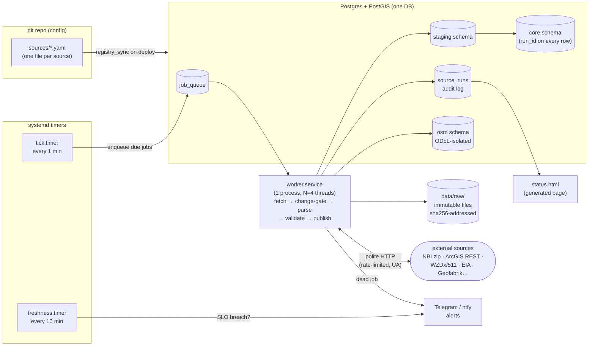

# Truck Intel — Autonomous Ingestion Pipeline Design

**Author:** ingestion pipeline architect · **Date:** 2026-07-22
**Scope:** the fully autonomous data pipeline for every source in the verified digest — registry, bulk import, incremental sync, change detection, scheduling, retry/recovery, monitoring, versioning, audit, lineage.
**Prime directive:** boring, simple, understandable by one person. Every choice below states WHY and what was rejected.

---

## 0. Design at a glance

- **One box.** A single Linux server (or the dev laptop for v0). Postgres + PostGIS is the only stateful service.
- **One language.** Python 3.12 + `requests` + `psycopg`. `ogr2ogr` (GDAL) for shapefile/FGDB conversion. `osmium`/Valhalla for the OSM routing graph (isolated — see §5.3).
- **One queue.** A plain Postgres table drained with `SELECT … FOR UPDATE SKIP LOCKED`. No Redis, no Celery, no Kafka.
- **One scheduler.** systemd timers fire a tiny "tick" script that reads the source registry and enqueues due jobs. A single worker service (systemd) drains the queue.
- **One registry.** One YAML file per source, in git. Adding a source = adding a file + a parser mapping. No code change to the engine.
- **Three load patterns.** `snapshot-swap` (reference data), `upsert` (keyed data with real cursors), `event-lifecycle` (live feeds). Nothing else.
- **Everything auditable.** Immutable raw files on disk (content-addressed), `source_runs` audit table, `run_id` stamped on every row → full lineage with zero extra tooling.

Scale check that justifies all of this: ~40–80 sources; the largest file is the 11.2 GB US OSM PBF (weekly); the largest table is NBI at ~624k rows; live polling is ~40 feeds × every 5 min ≈ 12k tiny jobs/day. This is **small data with many small sources**. That fact drives every decision.

---

## 1. Goals, non-goals, assumptions

### Goals
1. Autonomous: runs for weeks unattended; failures retry themselves; humans get pinged only when a source is genuinely broken or stale beyond its SLO.
2. Legal by construction: rate limits, User-Agent, ToS, licensing, and attribution are **registry fields enforced by the engine**, not tribal knowledge.
3. Replayable: any parser bug can be fixed and re-run from stored raw files without re-hitting the source.
4. Understandable: the owner can read this doc + ~6 Python modules and know the whole system.

### Non-goals (honest — do not design around data that does not exist)
- **No nationwide real-time truck restriction / bridge closure / probe-speed layer.** Those are the digest's confirmed paid gaps (HERE/INRIX/Trimble territory). The pipeline ingests what exists and labels coverage honestly; it does not fake completeness.
- **No station-level fuel prices.** Only EIA weekly regional averages, stored and displayed as *estimates* (see §14).
- **No scraping of bot-blocked sites** (fmcsa.dot.gov, mdta.maryland.gov, chain locators, GasBuddy…). These become `kind: manual` registry entries that generate periodic human-review reminders (§8.5). Legally public ≠ open to automation; we honor the 403.
- **No streaming/sub-minute latency.** Fastest cadence is ~2–5 min polling — that matches what the free feeds themselves refresh at.

### Assumptions
- One VPS: 4–8 vCPU, 16 GB RAM, 500 GB disk (~$40–80/mo class). Postgres 16 + PostGIS 3.4 local.
- Disk is cheap enough to keep all raw annual vintages + last ~30 days of live-feed snapshots.
- Free API keys (511 states, WZDx feeds that need them, EIA, AFDC) live in a `.env` file, referenced **by env-var name** in the registry — never committed.
- The serving/API layer reads the same Postgres; it is out of scope here except for the atomic-publish contract (§9).

---

## 2. Why boring tech — alternatives considered

| Need | Chosen | Rejected | Why the simple thing wins |
|---|---|---|---|
| Orchestration | systemd timers + queue table + 1 worker | **Airflow / Prefect / Dagster** | Our DAGs are 4 shallow steps (fetch→parse→validate→publish), identical for every source. Airflow buys DAG UIs, backfill semantics, and executor fleets — and costs a scheduler, metadata DB, webserver, and upgrade treadmill that a solo dev must babysit. When the "DAG" is a straight line, an orchestrator is pure overhead. |
| Queue | Postgres table + `FOR UPDATE SKIP LOCKED` | **Celery+Redis / RabbitMQ / Kafka / SQS** | ~12k jobs/day peak ≈ 0.14 jobs/sec. Kafka is for replayable firehoses; Celery adds a broker + serialization + worker mgmt. `SKIP LOCKED` is a documented, battle-tested pattern; the queue lives in the same DB as the data, so job + data commit in **one transaction** (exactly-once effects for free). One backup covers everything. |
| Scheduler | systemd timers | **cron** / APScheduler in-process | systemd gives `Persistent=true` (missed runs fire after reboot), jitter, journald logs, `OnFailure=` hooks, and service dependency ordering — cron has none of that. In-process schedulers die with the process. We already run systemd services elsewhere; zero new concepts. |
| Transform | Plain SQL files + small Python parsers | **dbt** | dbt shines with dozens of analysts and hundreds of models. We have ~20 transforms, one author. A `transforms/*.sql` folder run by the worker is greppable and has no manifest/profile machinery. |
| Geo ETL | `ogr2ogr` + PostGIS SQL | GeoPandas everywhere / Spark | `ogr2ogr` reads every format the government publishes (SHP, FGDB, GeoJSON, CSV) straight into PostGIS in one command. GeoPandas is fine for one-offs but loads everything into RAM; Spark is absurd at this size. |
| Monitoring | `source_runs` table + freshness-check timer + Telegram/ntfy alert + generated static status page | **Prometheus + Grafana**, OpenLineage/Marquez | The audit table already contains every metric we'd chart (durations, rows, failures, staleness). A 150-line status script renders it. Prometheus is a second data system to feed and secure. Lineage tooling is overkill when `run_id` on every row answers "where did this row come from" with one join. |
| Raw storage | Local disk, content-addressed | S3/MinIO | One box, one rsync/restic backup. S3 becomes worth it only if multiple machines need the raw files. Path layout (§5.1) is S3-compatible if we migrate later. |

**The one place we accept a heavier tool:** Valhalla for routing-graph builds — because writing a truck router is not simpler than running Valhalla, and it consumes Geofabrik PBF + OSM restriction tags natively (MIT-licensed, self-hosted, digest-verified).

---

## 3. Architecture overview



Flow in one sentence: **timers enqueue due source-jobs into a Postgres queue; one worker drains it, fetching politely, skipping unchanged data, archiving raw bytes, loading through staging into core with validation gates, and writing an audit row that powers monitoring, versioning, and lineage.**

---

## 4. Source registry — config, not code

One YAML file per source under `sources/`, validated by a pydantic model, synced into a `sources` DB table by `registry_sync` (runs on deploy and on worker start). Git is the source of truth — adding/pausing a source is a reviewed commit, and `git log sources/nbi.yaml` *is* the config audit trail.

**Why one file per source (vs one big YAML):** small diffs, no merge conflicts, `ls sources/` is the inventory, and a broken edit breaks one source, not the loader.

### 4.1 Registry schema (every field the engine reads)

```yaml
# sources/nbi_annual.yaml  — full example, annotated
id: nbi_annual                      # unique, snake_case; used in paths, tables, logs
name: FHWA National Bridge Inventory (annual bulk)
category: bridges
kind: bulk_http                     # bulk_http | arcgis | live_json | socrata | pbf | manual
enabled: true

fetch:
  url: https://www.fhwa.dot.gov/bridge/nbi/2025/delimited/NBI2025.zip   # per-vintage; see probe
  probe_url: https://www.fhwa.dot.gov/bridge/nbi/ascii.cfm   # page to detect NEW vintages
  timeout_s: 300
  auth: null                        # or {type: api_key, env: WZDX_TX_KEY, in: query, param: key}

politeness:
  min_interval_s: 0                 # per-host token bucket; 0 = default 1 req/s
  user_agent: "TruckIntel/0.1 (+https://truckintel.example; ops@truckintel.example)"

schedule:
  cron: "0 6 * * 1"                 # weekly probe for a new annual file (cheap HEAD/page check)
  cadence_class: slow               # live | daily | slow  → which tick lane, queue priority

change_detection: etag_sha256       # etag_sha256 | arcgis_editdate | payload_hash | none

load:
  mode: snapshot_swap               # snapshot_swap | upsert | event_lifecycle
  target: core.nbi_bridges
  natural_key: [structure_number, state_code]   # required for upsert/event modes
  parser: parsers/nbi.py            # maps raw → staging columns BY NAME (SNBI-proof, §13.1)

validation:                         # gates between staging and core
  min_rows: 550000
  max_row_delta_pct: 10             # vs last successful run
  geometry_valid_pct: 98
  required_columns: [structure_number, state_code, lat, lon, item41, item54, item63, item64, item65, item66, item70]

freshness_slo_hours: 8760           # annual dataset: alert if no successful run in 12 months
retry: {max_attempts: 5, base_backoff_s: 300}

license:
  name: US-PD
  attribution: "Federal Highway Administration (FHWA), US DOT"
  share_alike: false                # true ONLY for OSM-derived sources → forces osm schema (§5.3)
  tos_notes: "Public domain; no restrictions. Units: meters / metric tons — convert in parser."

verify_flags: []                    # carried from research digest, e.g. "UNCERTAIN: vintage lag"
```

The engine is generic; **only `parser` is per-source code** (a function `parse(raw_path) -> iterator of dicts`). Everything else — scheduling, fetching, retries, hashing, staging, swapping, auditing — is shared.

Secrets: `auth.env` names an environment variable; `registry_sync` fails loudly if a referenced env var is missing, so a forgotten key is caught at deploy, not at 3 a.m.

---

## 5. Storage layout

### 5.1 Raw zone — immutable, content-addressed files

```
data/raw/{source_id}/{YYYY-MM-DD}/{sha256[:16]}.{ext}      # the bytes exactly as fetched
data/raw/{source_id}/{YYYY-MM-DD}/{sha256[:16]}.meta.json  # url, headers, fetched_at, run_id
```

- **Why immutable + hashed:** replay (fix parser → re-run from disk), dedup (same hash = no new file), and integrity (the audit row stores the hash; the file can always be re-verified).
- Retention: annual/reference vintages kept **forever** (they're small — NBI is 51 MB/yr); live-feed payloads pruned after 30 days by a weekly `prune` job; the 11 GB OSM PBF keeps latest 2 only.

### 5.2 Database zones (one Postgres, three schemas + queue)

| Schema | Contents | Who writes |
|---|---|---|
| `ops` | `job_queue`, `sources`, `source_runs`, `feed_health` | engine only |
| `staging` | one table per source, `TRUNCATE`d per run | parsers |
| `core` | published tables the app reads; every row has `source_id`, `run_id`, `ingested_at` | publish step only |
| `osm` | anything derived from OSM/Overpass/Geofabrik | OSM jobs only (see below) |

### 5.3 ODbL isolation (legal simplicity by architecture)

OSM data is ODbL: share-alike applies to *derivative databases*. The two digest-sanctioned safe patterns are (a) use OSM only inside the router and (b) keep OSM-derived tables separable. So:

- Geofabrik PBF → **Valhalla graph** on disk (routing engine consumes it directly; never enters Postgres).
- Any OSM-derived lookup tables (fuel stations, rest areas, maxheight points) live in the **`osm` schema only** and are joined to core data **at query time, never materialized into core tables**.
- The registry's `license.share_alike: true` flag makes the engine **refuse** a `load.target` outside the `osm` schema. A wrong config physically cannot contaminate the proprietary DB.

**Why:** licensing enforced by code beats licensing enforced by memory. This one constraint keeps the whole platform's IP position clean.

---

## 6. The queue — one table, one pattern

```sql
CREATE TABLE ops.job_queue (
  id            bigserial PRIMARY KEY,
  source_id     text NOT NULL REFERENCES ops.sources(id),
  run_after     timestamptz NOT NULL DEFAULT now(),
  priority      int NOT NULL DEFAULT 100,      -- live=10, daily=50, slow=100
  attempts      int NOT NULL DEFAULT 0,
  status        text NOT NULL DEFAULT 'queued', -- queued|running|done|dead
  last_error    text,
  locked_at     timestamptz,
  UNIQUE (source_id, status) DEFERRABLE          -- at most one queued/running job per source
);
```

Worker claim (the whole "message broker"):

```sql
UPDATE ops.job_queue SET status='running', locked_at=now()
WHERE id = (SELECT id FROM ops.job_queue
            WHERE status='queued' AND run_after <= now()
            ORDER BY priority, run_after
            FOR UPDATE SKIP LOCKED LIMIT 1)
RETURNING *;
```

- **Why `SKIP LOCKED`:** lets 4 worker threads (or a second worker process later) pull safely with zero coordination code.
- **Why UNIQUE(source_id, status):** a slow bulk job can never stack duplicate jobs behind itself; the tick enqueuer's insert simply no-ops (`ON CONFLICT DO NOTHING`).
- **Stuck-job reaper:** the freshness timer also resets any `running` row with `locked_at < now() - interval '2 hours'` back to `queued` (+1 attempt) — covers worker crashes/OOM without any heartbeat protocol.
- **Why not priorities-as-separate-queues:** one table + a priority int keeps live feeds from starving behind an 11 GB PBF download; the worker also dedicates 1 of its 4 threads to `priority <= 10` jobs so live polling never waits on bulk.

---

## 7. Scheduling

Two systemd timers, that's all:

| Timer | Interval | Job |
|---|---|---|
| `truckintel-tick` | every 1 min (`Persistent=true`, 10 s jitter) | `tick.py`: for each enabled source, if `cron` says due and no queued/running job exists → `INSERT` into `job_queue`. Pure enqueuer, finishes in milliseconds. |
| `truckintel-freshness` | every 10 min | `freshness.py`: SLO checks (§11), stuck-job reaper (§6), feed-health circuit-breaker resets (§10). |

- **Why timers enqueue instead of running work:** the timer must never be long-running or overlapping; the queue absorbs bursts, ordering, and retries. Separation of "when" (cron expr in YAML) from "how" (worker) is the entire orchestration model.
- Cron parsing = `croniter` (tiny library) against `sources.last_success_at`. Missed windows (laptop asleep, server reboot) self-heal: the next tick sees "due" and enqueues — `Persistent=true` makes even the timer itself catch up after reboot.
- The worker is `truckintel-worker.service` (`Restart=always`), a ~300-line loop: claim job → dispatch by `kind` → write `source_runs` → commit. `OnFailure=` on the unit sends a Telegram ping if the service itself dies repeatedly.

---

## 8. Fetch + change detection, by source kind

All HTTP goes through one `polite_get()` helper: per-host token bucket (default 1 req/s, overridable per source), registry User-Agent header, `timeout`, honors `Retry-After` on 429/503, and records bytes + status in the run row. One choke point = provable politeness.

### 8.1 `bulk_http` (NBI, NTI XLSX, TIGER zips, FAF5, Geofabrik PBF, EIA bulk)
1. `HEAD` (or conditional `GET` with stored `ETag`/`If-Modified-Since`).
2. `304`/same `ETag` → run recorded as `skipped_unchanged`, done. (Free bandwidth, free politeness.)
3. Else stream-download to temp, compute SHA-256 while streaming; if hash equals last stored hash (some servers don't do ETags) → `skipped_unchanged`.
4. New hash → move into raw zone → parse → load.

**Annual-vintage probing:** for sources like NBI where a *new URL* appears each year, the weekly job first fetches the cheap `probe_url` index page and regex-scans for a newer vintage link; the current concrete URL is stored in `sources.state_json` (not hand-edited YAML) once discovered. Why: no human has to remember "it's June, check FHWA."

### 8.2 `arcgis` (NTAD layers, NBI hosted FeatureServer, state DOT services, Caltrans)
1. Probe `?f=json` service metadata → `editingInfo.lastEditDate` (when present) + `returnCountOnly=true` count.
2. Both unchanged since last run → `skipped_unchanged`. (Many ArcGIS servers omit `lastEditDate`; count-only is the fallback, and a monthly **forced full pull** backstops silent in-place edits.)
3. Changed → paginate `query?where=1=1&outFields=*&f=geojson&resultOffset=N&orderByFields=OBJECTID` in `maxRecordCount` pages (2000 default; read it from metadata, never hardcode — digest showed servers ranging 200 → 200,000).
4. Concatenate pages to one GeoJSON file in raw zone → load.

**Why full re-pull instead of incremental where-clauses:** these layers are small (1,915 truck-parking points; even NBI's 620k points is a ~40-min one-time paginate). Incremental `EditDate > X` queries need per-layer field knowledge and miss deletes; full re-pull + snapshot-swap is self-healing and identical for every layer. Simplicity wins at this size.

**Layer-name drift guard:** the adversarial pass caught PASDA's layer renaming (`PA RMS POSTED 2026_01` → `2026_07`). Registry supports `layer_match: {name_prefix: "PA RMS POSTED"}` — the fetcher resolves the layer ID from the service directory each run instead of hardcoding it.

### 8.3 `live_json` (WZDx feeds, 511 APIs, NWS alerts, Caltrans CWWP2, NWPS/USGS water, TPIMS)
1. `GET` every cycle (2–15 min per registry cron) — no conditional caching games; these payloads are tiny.
2. SHA-256 the canonicalized payload; unchanged → `skipped_unchanged` (still counts as a *successful health check* — see `feed_health`).
3. Changed → raw zone → parse to normalized event rows → `event_lifecycle` load (§9.3).

Per-key throttles (511's 10 calls/60 s) are trivially satisfied: one call per state per 2–5 min. The registry's `min_interval_s` encodes each Developer Access Agreement's limit so compliance is config, not discipline.

### 8.4 `socrata` (WZDx **registry** itself) — weekly CSV pull that *reconciles the registry*: new active feeds → the run **drafts** a `sources/wzdx_<agency>.yaml` file into a `proposed/` folder and pings Telegram; a human reviews, adds the key if needed, commits. **Why human-in-loop:** each feed may need a free key + its own terms reading — that's a legal judgment, not an engineering step.

### 8.5 `manual` (FMCSA NHMRR pages, MDTA/PANYNJ/VDOT tunnel rule pages, spring-thaw postings)
No fetching at all. The tick enqueues a job whose only action is: create a review task + Telegram reminder ("Quarterly: re-check NHMRR state pages in a browser; update `data/curated/nhmrr.csv`"), tracking last-reviewed date in `source_runs` like any other run. Curated CSVs live in git under `data/curated/` and load through the same staging→validate→publish path.
**Why this exists in-pipeline:** honest gaps still need freshness tracking and lineage; a curated file whose review is 400 days overdue should page us exactly like a stale feed. Change detection helper where legal: the Federal Register API (open JSON) watches for NHMRR notices and bumps the review task early.

### 8.6 `pbf` (Geofabrik → Valhalla)
Weekly: download `us-latest.osm.pbf` (ETag-gated), `valhalla_build_tiles` into a **new** tile directory, smoke-test 5 canned truck routes against the new graph, then atomically flip a `current` symlink and reload Valhalla.
**Why weekly full rebuild, not minutely diffs:** the minutely-diff + incremental-tile machinery is the single most complex thing in OSM ops; weekly staleness is fine for base-map/routing data because the *live* layers (closures, work zones) come from the live feeds anyway. Build takes a few hours on 16 GB RAM — scheduled Sunday 02:00, priority `slow`.

---

## 9. Load patterns (exactly three)

### 9.1 `snapshot_swap` — reference data (NBI, NTI, ArcGIS layers, TIGER, FAF5, AFDC, curated CSVs)
Parse into `staging.<source_id>` → run validation gates (§10.2) → inside one transaction: build `core.<target>_new` (indexes included), `ALTER TABLE ... RENAME` swap, drop old.
**Why:** atomic for readers, self-healing (every run rebuilds the world), trivially reasoned about. Deletes at the source are handled for free. The old table's content lives on in the raw file + `run_id`, so "what did we serve last Tuesday" is answerable.

### 9.2 `upsert` — keyed data where the source gives real change history (AFDC station change files, EIA weekly series)
`INSERT ... ON CONFLICT (natural_key) DO UPDATE`, with `valid_from` kept on price/series rows so history accumulates (EIA weekly prices are a time series — we *want* every week, not the latest snapshot).

### 9.3 `event_lifecycle` — live feeds (WZDx, 511 events, NWS alerts, TPIMS availability)
One normalized table `core.live_events` (WZDx-shaped, per the live-ops research recommendation: geometry, event_type, severity, start/end, source_id, external_id, raw jsonb):

- Feed event present + new → `INSERT` (status `active`).
- Present + changed hash → `UPDATE`, bump `last_seen_at`.
- Present + unchanged → touch `last_seen_at` only.
- **In DB but missing from feed → mark `closed_at = now()`** (kept 90 days, then archived to a monthly parquet file).

**Why soft-close instead of delete:** a flapping feed must not erase real closures; history of events is itself valuable (e.g., chronic work-zone corridors); and Tier-safety — the pipeline never destroys data, it supersedes it.

---

## 10. Retry, failure recovery, validation

### 10.1 Retry policy (engine-level, identical everywhere)
- Failure → `attempts += 1`, `run_after = now() + base_backoff × 2^attempts` (cap 6 h), status back to `queued`.
- `attempts > max_attempts` → status `dead` + Telegram alert with the last error and the exact `curl` to reproduce.
- **Transient vs permanent:** HTTP 5xx/timeout/connection-reset retry; **404/410/schema-validation-failure go straight to `dead`** — retrying a permanently moved URL just burns politeness budget. 403 also goes straight to dead with a special note ("possible bot-block — do NOT retry harder; consider `kind: manual`"), because our legal posture is to back off, never to evade.
- Dead jobs are re-armed only by a human (`./ops requeue <source_id>`) or by the next natural cron slot for `live` sources (a dead 5-min feed shouldn't need a human at 3 a.m. — see circuit breaker).

### 10.2 Validation gates (between staging and publish)
Per-source thresholds from YAML: minimum rows, max % row-count delta vs last success, % valid geometries, required columns present. **Gate failure = publish aborted, old core table stays live, alert fired.**
**Why:** the classic silent catastrophe is a source shipping a truncated file; a 90 %-smaller NBI must never replace a good one. The delta check also catches upstream schema renames (parser yields nulls → required-column gate trips).

### 10.3 Circuit breaker for live feeds (`ops.feed_health`)
Per feed: rolling success/failure counters. **5 consecutive failures → feed marked `degraded`**, polling drops to once/hour (not zero — feeds resurrect), one alert fires (not one per failure — alert fatigue is a real failure mode for a solo operator). First success resets it. The adversarial pass proved this necessary: MN's WZDx feed timed out mid-verification; registry entries are known to go stale.

### 10.4 Disaster recovery
Postgres nightly `pg_dump` + raw zone in the same restic backup. Restore = restore dump, restart worker; anything missed re-enqueues on the next tick. No queue state is precious — jobs are derived from the registry, so the queue can even be truncated safely.

---

## 11. Monitoring & alerting

Everything derives from two tables the pipeline already writes:

- **`ops.source_runs`** (the audit log, §12) → per-source last success, durations, rows, bytes, error streaks.
- **`ops.feed_health`** → live-feed liveness.

Surfaces:
1. **Freshness SLO check** (10-min timer): `now() - last_success_at > freshness_slo_hours` → Telegram alert. SLOs are per-source in YAML (live feed: 1 h; daily: 36 h; annual: 13 months). This is the single most important alert in the system — it catches *everything*: dead timers, dead worker, dead source, revoked key.
2. **`status.html`** — regenerated every 10 min by the freshness job from one SQL query: table of every source with last run, rows, staleness vs SLO, health color. Served as a static file. **Why static HTML over Grafana:** zero services, zero auth surface, readable on a phone.
3. **Dead-job + service-failure alerts** via Telegram/ntfy (both are free; the alerter is a 20-line function with a fallback to email).
4. **Weekly digest**: one message summarizing runs, skips, data deltas, feeds degraded, disk usage, and any `verify_flags` sources still unconfirmed.

---

## 12. Versioning, audit log, lineage

One mechanism serves all three:

```sql
CREATE TABLE ops.source_runs (
  run_id        bigserial PRIMARY KEY,
  source_id     text NOT NULL,
  started_at    timestamptz, finished_at timestamptz,
  outcome       text,          -- success | skipped_unchanged | failed | dead | gated
  fetch_url     text,
  raw_sha256    text, raw_bytes bigint, raw_path text,
  rows_staged   int, rows_published int, row_delta_pct numeric,
  error         text,
  source_vintage text          -- e.g. 'NBI-2025', 'arcgis lastEditDate', feed timestamp
);
```

- **Audit:** every fetch attempt — successful, skipped, or failed — is one row. "What did the pipeline do last night" is `SELECT * FROM source_runs WHERE started_at > …`.
- **Lineage:** every published row carries `(source_id, run_id, ingested_at)`. Row → run → raw file (by `raw_path`/`raw_sha256`) → exact upstream URL + timestamp. Two joins, no lineage framework.
- **Versioning:**
  - *Raw:* immutable content-addressed files, annual vintages kept forever (§5.1).
  - *DB:* snapshot-swap keeps only current, **but** `source_vintage` + raw files make any past state reconstructible by replaying a parser against an old raw file into a scratch schema (`./ops replay nbi_annual --raw <sha> --to scratch`). We deliberately do **not** keep bitemporal core tables — the app serves "current best known," and reconstructible-on-demand history is 10× simpler than valid-from/valid-to everywhere. (Exceptions that *are* time series — EIA prices, live events — keep history natively per §9.)
- **Attribution & license ledger:** `registry_sync` also regenerates `ATTRIBUTION.md` + an `/attribution` JSON blob from the registry's `license` blocks — every source the platform uses, with required credit lines (OSM's "© OpenStreetMap contributors", state DOT DAAs, FHWA/BTS/NOAA/USGS/FEMA). Compliance artifact generated from config, never hand-maintained; signed DAA PDFs are checked into `legal/` next to it.

---

## 13. Three concrete flows, end to end

### 13.1 Bulk download — FHWA NBI annual file (`bulk_http` + `snapshot_swap`)

Registry: `sources/nbi_annual.yaml` (shown in §4.1). Cadence: weekly probe, real work ~once/year.

```
Mon 06:00  tick.py: cron due → INSERT job (priority slow)
06:00:xx   worker claims job
  1. PROBE   GET ascii.cfm index page (polite_get, 1 req) → regex vintage links
             → newest = 2025, matches state_json.current_vintage → no new year
  2. HEAD    delimited ZIP URL with stored ETag → 304 Not Modified
  3. RECORD  source_runs: outcome=skipped_unchanged (4 s total)   ← 51 weeks/year end here

…the week FHWA publishes NBI2026:
  1. PROBE   finds NBI2026 link → state_json.current_vintage = 2026
  2. GET     stream 51 MB ZIP → sha256 → data/raw/nbi_annual/2027-06-14/ab12…zip
  3. PARSE   parsers/nbi.py: unzip → read comma-delimited (single-quote qualifier),
             map BY ITEM NAME via a config dict (survives the 2028 SNBI column shift
             as a mapping-file change, per FHWA's published crosswalk — not a rewrite),
             convert m→ft and metric tons→US tons (Coding Guide units warning),
             parse packed DMS lat/lon (Items 16/17) → WGS84 point,
             flag rows whose coords fall outside their state polygon (known NBI quirk)
             → COPY into staging.nbi_annual  (~624k rows, <2 min)
  4. VALIDATE min_rows 550k ✓ · delta vs 2025 = +0.4% ✓ · geometry_valid 99.1% ✓
             · required item columns present ✓
  5. PUBLISH  BEGIN; build core.nbi_bridges_new (+GiST index); RENAME swap; COMMIT
  6. DERIVE  transforms/nbi_derived.sql →
             core.low_clearance_points (Item 10/54 < 14'0"),
             core.posted_bridges (Item 41 posted/closed + Item 70 code),
             each row still carrying run_id
  7. RECORD  source_runs: success, rows=624193, vintage=NBI-2026 → status page green
```

Honesty carried into the data: derived tables store the posting **code**, never a fabricated sign value (the digest is explicit that NBI has no posted-tonnage field), and every row is servable with a "NBI-2026, annual snapshot" provenance badge.

### 13.2 ArcGIS REST — BTS NTAD Truck Stop Parking (`arcgis` + `snapshot_swap`)

Registry: `sources/ntad_truck_parking.yaml` — verified-live FeatureServer, 1,915 points, US-PD. Cron: daily 05:00 (cheap probe; upstream changes ~yearly). SLO: 8 days.

```
05:00  tick enqueues → worker claims
  1. PROBE   GET …/FeatureServer/0?f=json  → maxRecordCount=2000 (read, not assumed),
             editingInfo.lastEditDate = 1758777600000
             GET …/query?where=1=1&returnCountOnly=true → count=1915
             both == last run → outcome=skipped_unchanged (2 requests, 3 s)  ← most days

…the day BTS updates the layer:
  2. FETCH   query?where=1=1&outFields=*&f=geojson&orderByFields=OBJECTID
             &resultOffset=0,2000 → 1 page (1,915 ≤ 2000); concat → raw zone
  3. PARSE   generic geojson parser + field-map from YAML → staging
  4. VALIDATE min_rows 1500 ✓ · delta ✓ · geometry ✓
  5. PUBLISH  swap → core.truck_parking_static
  6. RECORD  success, vintage='lastEditDate 2026-09-25'
```

Same engine path scales to the big/quirky ArcGIS sources with only registry changes: NBI hosted FeatureServer = 311 pages of 2000 (one-time ~40 min, then probe-gated — and its **known 2023-vintage caveat** from the adversarial pass is encoded as `verify_flags`, with the bulk ZIP as the authoritative sibling source); PASDA = `layer_match: name_prefix` (§8.2); Ohio TIMS stays `enabled: false` until its UNCERTAIN flag is cleared from the production network.
Static NTAD capacities are honestly labeled Jason's-Law-survey era (~2019) in metadata; real-time availability is a *different* source class (TPIMS via `live_json`, ~10 states only — the gap stays visible, per §14).

### 13.3 Live feed — WZDx work zones (`live_json` + `event_lifecycle`)

Two-level design: the **registry-of-feeds** (Socrata, weekly, human-in-loop §8.4) discovers feeds; each approved feed is its own YAML with its own key/cadence/health. Example: `sources/wzdx_wsdot.yaml` → `https://wzdx.wsdot.wa.gov/api/v4/WorkZoneFeed`, open, cron `*/5 * * * *`, priority 10, SLO 1 h.

```
Every 5 min  tick enqueues (UNIQUE constraint prevents pile-up if last poll is slow)
  worker (live-reserved thread):
  1. GET     feed URL (User-Agent, key from env if feed needs one) → WZDx v4 GeoJSON
  2. HASH    canonicalized body == last hash → skipped_unchanged,
             feed_health.success++, last_seen=now()          (~90% of polls, 1 req, <1 s)
  3. CHANGED → raw zone → normalize: for each feature,
             external_id = feed_id + event id · geometry · type · lanes · start/end ·
             verification status · raw jsonb
  4. LIFECYCLE (one transaction):
             new ids INSERT active · changed ids UPDATE · all present touch last_seen_at ·
             ids in DB but absent from feed → closed_at=now()
  5. RECORD  source_runs (success, rows_published=Δ) + feed_health reset

Failure path (real, per adversarial pass — MN feed timed out):
  timeout → retry backoff 60s→2m→4m… → 5 consecutive fails →
  feed_health='degraded', poll drops to hourly, ONE Telegram alert:
  "wzdx_mn degraded 47m — last error: timeout. Other 39 feeds healthy."
  First success auto-restores 5-min polling.
```

The same `live_json`+`event_lifecycle` machinery runs NWS alerts (2-min cron, `/alerts/active`, no key), the 9-state IBI/one511 family (one shared client, per-state key + 10-calls/60 s encoded as `min_interval_s: 30`), Caltrans CWWP2 chain controls, and NWPS/USGS water — **one engine, ~25 registry files, one normalized `live_events` table** feeding the map.

---

## 14. Honest-gap handling — what the pipeline refuses to fake

These are pipeline design commitments, not footnotes:

| Digest gap | Pipeline behavior |
|---|---|
| No nationwide legal truck-restriction DB | Serve NBI codes + state-DOT layers + OSM (in `osm` schema) each with a **source+vintage confidence badge**; no merged "restrictions" table pretending to be complete. Coverage map generated from actual loaded sources. |
| No national real-time closures / probe speeds | `live_events` coverage is whatever feeds exist (~19 states + WZDx); the API exposes per-state coverage metadata so the UI can say "no live data for this state" instead of showing false green. |
| Station-level fuel prices don't exist free | Store EIA weekly PADD/state averages in `core.fuel_price_estimates` — table name itself says estimate; joined to OSM stations only at query time (ODbL) and labeled with week + region. |
| Bot-blocked official pages (FMCSA, MDTA, chain locators) | `kind: manual` review tasks with staleness SLOs (§8.5). Zero automated requests to 403-ing hosts. |
| Seasonal spring-thaw postings (per-state PDFs) | `manual` curated CSVs with a **February-through-April monthly** review cadence for frost-law states; ND's ArcGIS feed stays `enabled: false` (non-commercial ToS) until written permission exists. |
| Ratings/reviews for businesses | Not ingested at all. No Google/Yelp scraping path exists in this design. |
| UNCERTAIN endpoints (Ohio TIMS, INDOT 403, RIDOT staging, FL511 TPAS) | Registry entries exist but `enabled: false` + `verify_flags`; the weekly digest lists them until a human verifies from the prod network and flips the flag. |

---

## 15. Politeness & legal compliance (engine-enforced)

- Single `polite_get()` choke point: per-host token bucket, descriptive User-Agent with contact info (NWS requires it; everyone deserves it), `Retry-After` honored, hard per-run request budgets for Overpass (public-instance fair use: we stay far under 10k/day by preferring Geofabrik bulk for anything big).
- robots.txt checked once/day per host for any non-API HTML fetch (probe pages); disallowed → source auto-flips to `manual` + alert.
- Keys: env-only, per-source, never logged (run rows store URLs with key params redacted).
- Every signed Developer Access Agreement stored in `legal/`; `ATTRIBUTION.md` auto-generated (§12).
- 403/429 responses are **backed off from, never worked around** — no header spoofing, no CAPTCHA games, ever.

---

## 16. Repo layout (the whole system)

```
truck-intel/
  sources/            *.yaml (registry) + proposed/ (auto-drafted, human-reviewed)
  parsers/            nbi.py, geojson_generic.py, wzdx.py, eia.py …   (~1 file/format)
  transforms/         *.sql derived tables (run post-publish)
  engine/             tick.py worker.py fetchers.py loaders.py registry.py
                      politeness.py alerts.py freshness.py   (~2,000 lines total)
  ops                 CLI: run <source> · replay · requeue · status · prune
  systemd/            truckintel-{worker.service,tick.timer,freshness.timer}
  data/raw/ data/curated/ legal/ ATTRIBUTION.md
  tests/              parser fixtures (one real raw sample per source, in git-lfs)
```

**Definition of understandable:** ~2k lines of engine, three load patterns, two timers, one queue, one audit table. The owner can single-step any source with `./ops run nbi_annual --dry-run` and read exactly what production would do.

---

## 17. Trade-offs accepted (eyes open)

1. **Single box, single worker process** — a dead server stops everything. Accepted: freshness alerts catch it in ≤10 min (from a phone), restore is one restic + systemd sequence, and none of this data is life-safety-latency-critical at minutes scale. Second worker later = start the same service on another box pointing at the same DB (`SKIP LOCKED` already permits it).
2. **Full re-pull over incremental for ArcGIS** — spends bandwidth to buy correctness + uniformity. At these sizes (MBs) it's the right trade everywhere except the one-time 620k-point paginate.
3. **Weekly OSM rebuild, not minutely diffs** — up to 7-day base-map staleness, in exchange for deleting the most failure-prone component in OSM ops. Live layers cover the freshness that matters.
4. **No bitemporal core tables** — history is reconstructible (raw + replay), not instantly queryable. If a future feature needs time-travel queries, add `valid_from/valid_to` to that one table then.
5. **Human-in-loop for new feeds and manual sources** — the pipeline is autonomous at *operating* sources, deliberately not at *adopting* them, because adoption = license/ToS judgment. This is a feature.
