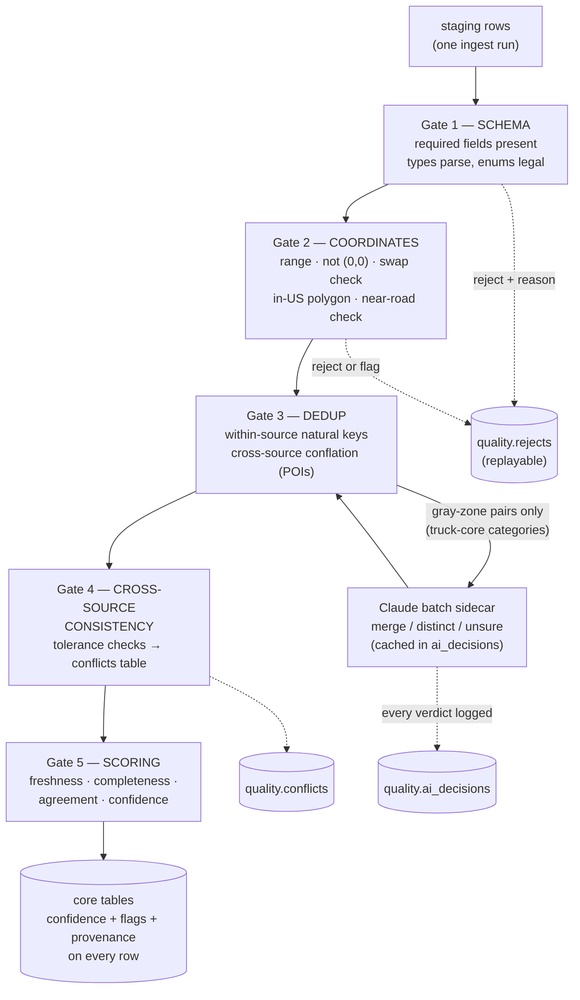

# Validation, Data Quality & AI Usage — Truck Intelligence Platform

**Author:** Validation, data quality & AI usage architect · **Date:** 2026-07-22
**Status:** Proposed
**Reads:** research digest + `../research/*.md` · designed to plug into `storage.md` (PostGIS schema, `sources`, `ingest_runs`) and `pipeline.md` (staging→validate→publish gates, freshness SLOs, `source_runs`).

---

## 0. TL;DR

- **Deterministic rules first, AI last.** ~98% of all quality work is SQL + Python rules that a human can read and replay. AI is used in exactly **three narrow jobs** (business dedup gray-zone, address-parse residue, category long-tail), all offline, all cached, all logged.
- **Hard rule, enforced by mechanism not policy:** the AI writer runs as a Postgres role that **cannot write operational-fact columns** (weight limits, clearances, hazmat flags, prices). Its output schemas contain enum verdicts only — there is literally no channel through which a model can invent a weight limit.
- **Confidence is a formula, not a vibe:** `100 × (0.35·Trust + 0.25·Freshness + 0.20·Completeness + 0.20·Agreement − penalties)` — components stored on the row so the UI can always answer "why 65?".
- **Conflicts don't pick one winner — they pick two:** *display* shows the highest-authority value; *routing constraints* take the most restrictive value. A 6-inch over-caution is a detour; the opposite error is a bridge strike.
- **Freshness has two clocks:** the pipeline's source SLO (is the feed alive?) and the record's `observed_at` (when was this fact true in the world?). Fetch date never masquerades as observation date.
- **Trust is per-source, assigned by authority class, and can only go down** (staleness, contradictions) — never up. No self-reinforcing feedback loops a solo dev can't debug.

---

## 1. Scope, assumptions, and what this doc does NOT fix

| # | Assumption | Consequence here |
|---|-----------|------------------|
| V1 | Storage & pipeline are as designed in the sibling docs: one PostGIS, staging→core, `run_id` on every row, registry YAML per source. | All quality machinery is columns + a `quality` schema + one nightly job. No new services. |
| V2 | Volumes: NBI ~620k, restrictions ~1–5M segments, truck-relevant POIs ~2–5M, live events ~50–100k active. | Everything below runs in single-node SQL in minutes. No distributed dedup frameworks. |
| V3 | Claude access = **Claude Agent SDK on the existing Max-subscription OAuth token** (`CLAUDE_CODE_OAUTH_TOKEN`), same auth as the rest of the stack. No API key exists. | AI jobs are batch, resumable, budget-capped, and tolerant of subscription rate limits. Nothing user-facing ever waits on a model. |
| V4 | The research digest's gaps are real. | Validation **cannot conjure** posted-sign values, restriction *absence* certainty, real-time bridge closures, or station-level fuel prices. This doc scores and labels what exists; it never fills gaps with guesses. §12 restates this. |

**What validation cannot fix (honest, up front):** a perfectly scored database is still incomplete where the sources are incomplete. OSM `maxheight` coverage is uneven; NBI is up to ~12 months stale by design; no source certifies "this road has no restrictions." Our job is to make every record's reliability *visible*, not to fake completeness.

---

## 2. The validation ladder — deterministic first

Every record passes the same ladder between staging and core (extending pipeline.md's validate step). Order matters: cheap structural checks reject garbage before expensive conflation runs, and AI sees only the tiny residue that survives everything else.



**Why a ladder and not a rules engine (Great Expectations, Soda, dbt tests):** those tools shine when many analysts share hundreds of ad-hoc expectations. We have ~5 gate types applied uniformly, and the pipeline doc already has per-source `validation:` blocks in the registry YAML. A rules engine would add a DSL, a config layer, and a dependency — to express checks that are each ~10 lines of SQL/Python. Rejected for the same reason Airflow was: the shape of our problem is small and uniform.

**Rejects are data, not garbage:** failed rows land in `quality.rejects` with `(run_id, source_id, reason, raw_payload)`. Why: a spike in rejects is the earliest schema-break detector, and fixing a parser means replaying rejects, not re-fetching.

---

## 3. Duplicate detection

### 3.1 Within-source — exact keys, boring on purpose

Every registry entry already declares a `natural_key` (pipeline.md §4.1): NBI = `(structure_number, state_code)`, NTI tunnel ID, AFDC station `id`, WZDx event `id`, OSM element id. Within-source dedup is `INSERT … ON CONFLICT` on that key. Duplicate natural keys **within one file** (it happens — government CSVs contain repeated rows) → keep the last, count logged in `source_runs`; count > 0.5% of rows → warning on the status page.

**Why nothing fancier:** authoritative sources have real identifiers. Fuzzy-matching where exact keys exist is self-inflicted damage.

### 3.2 Cross-source POI conflation (businesses: Overture + FSQ + OSM) — the real problem

Three POI datasets describe the same truck stop with different names ("Love's #291" / "Loves Travel Stop" / "Love's Travel Stop & Country Store"), coordinates 40 m apart. Storage.md's `businesses.canonical_key` and `present_in[]` expect us to resolve this.

**Pipeline (deterministic core):**

1. **Block** — candidate pairs = different-source POIs within **150 m** (`ST_DWithin` on geography, GiST index) with name trigram similarity > 0.3 (`pg_trgm`). Why 150 m: truck-stop footprints are huge; tighter blocking splits real matches. Why trigram pre-filter: kills the "McDonald's next to the Shell" false pairs cheaply.
2. **Normalize names** before comparison: lowercase, strip punctuation/`#NNN` store numbers, expand a ~50-entry abbreviation table (`tvl ctr → travel center`, `svc → service`). A static table, in git — not AI. Why: the vocabulary of US truck-stop naming is small and stable.
3. **Score** each pair:
   `sim = 0.60·name_trgm + 0.25·(1 − min(dist_m,150)/150) + 0.15·bonus`
   where `bonus` = 1 if brand, phone (last-10-digits), or normalized street address matches, else 0.
4. **Thresholds:**
   - `sim ≥ 0.85` → **auto-merge** (union attributes per §7's authority ladder; all source ids kept in `present_in`).
   - `sim ≤ 0.55` → **auto-distinct**.
   - `0.55 < sim < 0.85` → **gray zone**.
5. **Gray zone routing — the one place AI earns its seat (§10.1):**
   - **Truck-core categories** (fuel/truck stop, parking, repair, towing, scales, CAT scales — ~200–300k POIs) → queued for Claude adjudication, verdict cached forever by pair-hash.
   - **Everything else** (restaurants, motels, generic retail near exits) → **default distinct**, both rows kept, confidence takes the single-source value. Why: a duplicate Subway is cosmetic; a duplicate/missed truck-repair shop matters. Spending model calls on 2M generic POIs fails the simplicity-and-budget test.

**Alternatives considered:** Splink/dedupe.io (probabilistic ER libraries) — real Fellegi-Sunter machinery, but they demand labeled training pairs, threshold tuning, and a mental model the owner would have to learn; our three-source, name+distance problem doesn't need EM-estimated weights. A pure-LLM pass over all pairs — orders of magnitude too many calls and non-reproducible. The hybrid (deterministic thresholds + LLM only in the gray band) is the standard 2026 pattern precisely because it caps cost and keeps 90%+ of decisions rule-explainable.

**Merge is always reversible:** a merged row stores every contributing source id + per-source attribute blob (storage.md `props`). Un-merging = re-running conflation with a changed verdict. No information is destroyed by a wrong merge.

---

## 4. Coordinate sanity

Three checks, in order, cheapest first. Coordinates are **never silently "fixed"** — a wrong-but-flagged coordinate is debuggable; a silently swapped one is a lie.

| Check | Rule | On failure |
|---|---|---|
| **C1 Range/junk** | lat ∈ [−90,90], lon ∈ [−180,180], not NULL, not (0,0), not integer-truncated (both values whole numbers) | **Reject** (reason `bad_coord`) |
| **C2 In-US** | Fast pre-filter: point in one of 4 bounding boxes (CONUS / AK / HI / PR-VI). Then exact: `ST_Covers` against Census TIGER state polygons, dissolved + 2 km buffer (coastal piers, border bridges). If the point fails but the **swapped** (lon,lat) passes → reject with reason `swapped_coord` (tell the human; don't auto-swap). | **Reject** (`out_of_us` / `swapped_coord`) |
| **C3 Near-road** | For road-bound categories only (bridges, tunnels, restrictions, weigh stations, parking, fuel): distance to nearest TIGER primary/secondary road (nation file, public domain) ≤ threshold — 100 m for bridges/restrictions, 500 m for parking/fuel/rest areas (they sit on frontage lots). | **Flag** `offroad` — row loads, confidence penalized (§9). Never rejected: rural roads are missing from TIGER's primary/secondary file, so this check is evidence, not proof. |

**Why TIGER (not OSM) for the reference polygons/roads:** TIGER is public domain — using it for validation keeps ODbL share-alike entirely out of the quality layer (storage.md's OSM-separability rule survives). OSM would be marginally more complete; the license entanglement isn't worth it for a *sanity check*.

**Why "near-road check" and not true snap-to-road:** actual snapping (moving points onto the network) belongs to Valhalla at route time — it map-matches against its own graph anyway. Doing it in the database would move authoritative coordinates (NBI surveyed points!) to fit a *different* road network than the router uses. We only measure distance and flag; we never move. Simpler and safer.

---

## 5. Missing-field detection

One **field manifest** per category, YAML in git, three tiers:

```yaml
# quality/manifests/fuel_stations.yaml
required:   [geom, name]                  # missing → reject (reason: missing_required)
important:                                # missing → load, completeness hit (weights)
  fuel_diesel: 3
  brand: 2
  opening_hours: 2
  truck_parking: 2
  phone: 1
optional:   [website, email]              # no effect on score
```

- **Completeness** (used in §9): `C = Σ weight_i·filled_i / Σ weight_i` over `important` fields. Weights encode trucker value (diesel flag matters more than phone).
- **A missing operational fact is NULL and renders as "unknown"** — never defaulted, never imputed, never inferred from siblings ("other Love's have scales" is exactly the fabrication the hard rule bans). The UI must have an honest "unknown" state; this is a product requirement emitted by the data layer.
- **Field-drift alarm** (cheap, catches upstream breaks): nightly, per source × field, compute fill-rate; if a field's fill-rate drops > 20 points vs its 30-day median → status-page warning + Telegram. Why: the most common silent failure in government feeds is a renamed column arriving as 100% NULL — row counts stay normal, `min_rows` gates pass, and only fill-rate sees it.

**Alternative considered:** per-field JSON-Schema validation on ingest — heavier config for the same effect; the manifest + drift alarm is ~60 lines of SQL total.

---

## 6. Freshness tracking — two clocks, never confused

| Clock | Question | Lives where | Owner |
|---|---|---|---|
| **Source freshness** | "Is the feed/file arriving on schedule?" | `source_runs.last_success_at` vs per-source SLO | pipeline.md §11 (already designed) |
| **Record freshness** | "When was this fact last true in the world?" | `observed_at` on every core row | **this doc** |

**`observed_at` selection rule (strict priority):**
1. In-data timestamp when the source provides one — OSM element `timestamp`, Overture `update_time`, ArcGIS `EditDate`, WZDx `update_date`, EIA period date.
2. Dataset vintage when only the dataset is dated — NBI rows get the NBI **survey/file year**, NTAD truck-parking amenity rows get the **~2019 Jason's-Law survey date** (per research), not the 2025 portal-modified date.
3. Fetch time **only** for true live feeds where emission ≈ observation (511 events, NWS alerts).

**Why this pedantry is load-bearing:** the single most misleading thing a data platform can do is show "updated today" on a 2019 amenity survey because the file was re-downloaded today. Rule 2 is what keeps us honest about NTAD.

Record freshness score (used in §9): `F = 0.5^(age_days / half_life)` — exponential decay, one half-life constant per category:

| Category | Half-life | Why |
|---|---|---|
| Bridges / tunnels (NBI/NTI) | 548 d | annual publication × 1.5 — still trustworthy between editions |
| Restrictions (state DOT layers) | 365 d | states republish irregularly; a year-old posting is meaningfully less certain |
| POIs (OSM/Overture/FSQ) | 730 d | businesses churn slowly; community edits cluster on changes |
| Parking amenities (NTAD) | 1095 d | survey-era data; decays slowly but from an already-old base |
| Fuel price *estimates* (EIA weekly) | 14 d | weekly cadence; two missed weeks ≈ stale |
| Live events | n/a | events carry explicit start/end; expiry beats decay — excluded from the formula, lifecycle-managed by the pipeline |

---

## 7. Cross-source consistency — and who wins

### 7.1 The two-winner rule (the core design decision)

When two sources disagree about the same physical fact:

- **Display value** = the **highest-authority** source's value, with a conflict badge and the dissenting value one tap away.
- **Routing constraint** = the **most restrictive** non-expired value across all sources.

**Why two winners instead of one:** the cost function is asymmetric. Routing a 13′6″ truck under a bridge OSM says is 13′0″ but NBI says is 13′9″ risks a bridge strike if OSM is right; detouring costs minutes if OSM is wrong. So the router is conservative by construction. But *displaying* the community value as the truth would misrepresent authority — the UI shows what the authoritative source says and discloses the disagreement. One winner would force choosing between safety and honesty; two winners gets both. (Trade-off accepted: routes are occasionally more conservative than physically necessary. That is the correct side to err on, and the conflict badge tells the driver why.)

### 7.2 Authority ladder (display precedence)

1. **State-published posted/legal values** — PennDOT posted roads, WSDOT lane clearances, TxDOT, state 511 restriction endpoints, curated official rules (tunnel hazmat). The sign is the law.
2. **Federal measured inventories** — NBI, NTI. Measured ≠ posted (research gap: NBI Item 70 is a code, not the sign) — authoritative about geometry, not about legality.
3. **Community observed** — OSM `maxheight`/`maxweight` (often transcribed *from the sign*, which is why it can legitimately disagree with NBI's measurement).
4. **Open aggregate** — Overture/FSQ (POI attributes only; never restriction values).

### 7.3 Concrete checks and tolerances

| Check | Sources | Tolerance | Within → | Beyond → |
|---|---|---|---|---|
| Vertical clearance | NBI measured vs OSM `maxheight` (matched by ≤ 50 m + same-road name/ref) | **0.15 m (~6 in)** — sign-vs-measured legitimately differ by a posted safety margin | corroborated: Agreement = 1 for both rows | conflict row; routing uses `min()`; display NBI + badge |
| Posted vs measured | State-DOT posted clearance vs NBI measured | posted ≤ measured + 0.05 m expected | corroborated | **posted > measured → data-error red flag, human review** (a sign can't promise more than the steel) |
| Weight limits | State posted (PennDOT etc.) vs OSM `maxweight` | 1 t | corroborated | conflict; routing uses `min()`; display state + badge |
| POI existence | AFDC vs OSM vs Overture/FSQ fuel stations (post-conflation) | n/a | multi-source `present_in` → Agreement boost | single-source → Agreement = 0.5 (no one to disagree) |
| Parking sites | NTAD Truck Stop Parking vs state TPIMS site lists vs OSM | 250 m match | corroborated | unmatched TPIMS site (real-time feed for a site NTAD lacks) → auto-create with state-authority provenance |

All violations land in **`quality.conflicts`** `(entity_type, entity_id, field, value_a, source_a, value_b, source_b, delta, status)` — persisted, shown on the status page, and re-checked each run (a conflict that disappears after a source update auto-closes). Open conflicts feed the record's confidence penalty (§9) and the source's contradiction rate (§8).

**Why persist conflicts instead of resolving-and-forgetting:** the conflict *is* information — "sources disagree here" is exactly what a driver planning a tight route needs surfaced, and the conflict backlog is the to-do list if manual curation time ever becomes available.

---

## 8. Per-source trust score

Two parts: a **static base** by authority class (assigned in the registry YAML, reviewed by a human, in git) and a **computed degradation** (nightly). Trust can only go *down* from base.

**Base trust by authority class:**

| Class | Base | Members (from digest) |
|---|---|---|
| `federal_authoritative` | 0.95 | NBI, NTI, NTAD layers, FAF5, EIA, NWS, TIGER |
| `state_authoritative` | 0.90 | State DOT GIS, 511 APIs, Caltrans CWWP2, TPIMS |
| `curated_manual` | 0.85 | Hand-curated official rules (PANYNJ/MDTA/VDOT tunnels, NHMRR) — high authority, but a human transcription step sits in the middle |
| `open_aggregate` | 0.65 | Overture, FSQ Places |
| `community` | 0.55 | OSM |

**Effective trust (nightly recompute, stored on `sources`):**

```
trust = clamp( base
             − 0.10 · min(1, overdue_ratio)        # overdue_ratio = max(0, staleness−SLO) / SLO
             − 0.10 · contradiction_rate           # share of its §7-checked values overruled by a
                                                   # HIGHER-authority source, trailing 90 days
             , base − 0.20, base )
```

- **Why trust never rises above base:** upward-drifting trust from agreement statistics creates a feedback loop (trusted sources win conflicts → win rate raises trust → they win more). One-directional degradation is boring, explainable, and safe — exactly what a solo operator can reason about at 2 a.m.
- **Why staleness degrades *trust* when freshness is already a separate term (§9):** the SLO term here is about the *source misbehaving* (feed silently dead ⇒ mild global distrust of everything it last said), while §9's F is about the *record aging normally*. Capped at −0.10 so an annual file being 1 month late never craters a category.
- **Why contradiction rate is capped and one-way:** a community source being overruled by a state DOT is expected and fine at low rates; a spike (>10–20% of checked values) signals systematic transcription problems and should cost trust. Only *higher-authority* overrules count, so two community sources bickering doesn't move anything.

**Alternative considered:** fully learned/Bayesian source reliability (à la truth-discovery literature). Rejected — needs labeled ground truth we don't have, and its failure mode (silent weight drift) is invisible. A 5-row table + 2 penalties is auditable in one `SELECT`.

---

## 9. Per-record confidence score — the formula

Computed at ingest and recomputed nightly (freshness decays, conflicts open/close). **Components are stored as columns** next to the final score — the UI and the owner can always decompose "why 65?".

```
confidence = round( 100 · clamp01(
      0.35 · T          # effective trust of the record's best (highest) contributing source
    + 0.25 · F          # freshness: 0.5^(age_days / half_life[category]), age from observed_at
    + 0.20 · C          # completeness: weighted fill of 'important' manifest fields (§5)
    + 0.20 · A          # agreement: 1.0 = corroborated by ≥2 independent sources within tolerance
                        #            0.5 = single-source (nothing to disagree with)
                        #            0.0 = at least one OPEN conflict on this record
    − P_geo             # 0.15 if flagged offroad / coordinate-suspect (§4)
    − P_conflict        # 0.10 per open conflict, capped at 0.20 (stacks with A=0 deliberately —
                        #      conflicted records must not hide in the middle band)
))
```

**Why these four components and these weights:** T first (who said it) because provenance dominates everything in a safety-adjacent product; F second because the digest's central honest finding is that free data is *stale* in specific, known ways; C and A equal thirds because a complete-but-uncorroborated record and a sparse-but-corroborated one are roughly equally usable. Weights are config in one place (`quality/scoring.yaml`), expected to be tuned once field feedback exists — the *structure* (linear, decomposable, stored components) is the commitment, not the exact numbers.

**Why a linear formula and not an ML model:** no labels, no debuggability, no way for the owner to explain a score to a user. A weighted sum with stored components is the strongest tool that stays fully explainable. Revisit only if real ground-truth labels (driver reports) ever accumulate.

**Worked examples (real shapes from the digest):**

| | T | F | C | A | penalties | **confidence** |
|---|---|---|---|---|---|---|
| **A. NBI bridge**, 100 d after annual file, complete, OSM maxheight agrees within 0.15 m | 0.95 | 0.5^(100/548)=0.88 | 1.0 | 1.0 | 0 | 0.33+0.22+0.20+0.20 = **95** |
| **B. OSM-only fuel station**, edited 400 d ago, diesel flag set but hours/phone missing | 0.55 | 0.5^(400/730)=0.68 | 0.6 | 0.5 | 0 | 0.19+0.17+0.12+0.10 = **58** |
| **C. Same bridge as A but OSM says 3.90 m vs NBI 4.20 m** (open conflict) | 0.95 | 0.88 | 1.0 | 0.0 | 0.10 | 0.33+0.22+0.20−0.10 = **65**; routing uses 3.90, display shows 4.20 + badge |

**Bands (product contract):** ≥ 80 **high** (plain display) · 50–79 **medium** (source + date badge always visible) · < 50 **low** (rendered as *advisory/unverified*, never as fact). Storage.md's `restrictions.authority_level` UI rule composes with this: a community-sourced restriction is advisory *regardless* of numeric score.

**Exclusions:** `live_events` skip the formula — an NWS alert is authoritative and expiring; its "confidence" is its source and its expiry timestamp. Forcing it through a decay formula adds nothing.

---

## 10. AI usage — only where it earns its place

### 10.0 Ground rules (mechanically enforced, not aspirational)

1. **AI never touches operational facts.** Weight limits, clearances, hazmat flags, restriction values, prices, open/closed status are **copied from a source or NULL** — never model-generated. Enforcement is structural, threefold:
   - **Postgres role:** all AI jobs connect as `ai_writer`, which has INSERT on `quality.ai_decisions` and column-level UPDATE grants on exactly `businesses(category, canonical_key, address_norm)` — and *no* grant on bridges, tunnels, restrictions, fuel values, or any numeric fact column. A fabricated limit cannot physically reach the database.
   - **Output schemas:** every AI call uses a strict JSON schema whose fields are enums and ids (`merge|distinct|unsure`, category slugs, address component strings). There is no field in which a number like "13.5 t" can be emitted.
   - **Audit:** every call logged to `quality.ai_decisions` `(job, input_hash, model, prompt_version, verdict, rationale, created_at)`; a weekly 50-sample human spot-check is a standing task.
2. **AI is offline-batch only.** Nightly systemd service; nothing in the serving path waits on a model. Max-OAuth subscription limits make this mandatory anyway (V3).
3. **Every AI decision is cached by input-hash and reversible.** Same input pair/string/category never hits the model twice; verdicts can be overridden by a human row in the same table (`decided_by='human'` wins).
4. **`unsure` is always a legal verdict** and always maps to the safe default (keep distinct / leave category `unclassified` / leave address unparsed). The model is never forced to guess.

### 10.1 Job 1 — Business entity-resolution, gray zone only (§3.2)

- **Input:** batches of ~40 candidate pairs, each with name, brand, address, category, distance apart, phone — from all contributing sources verbatim.
- **Output:** `{pair_id, verdict: merge|distinct|unsure, reason}` per pair.
- **Model:** Sonnet-class (judgment task; pin the model id in config). Volume: one-time bootstrap ~10–20k gray pairs in truck-core categories ⇒ ~250–500 calls spread over nights; steady state (monthly Overture/FSQ releases, ~1–2% churn) ⇒ tens of calls/month. Fits comfortably inside a Max subscription's batch headroom.
- **Why AI here at all:** the gray zone is precisely the set where string similarity fails but world knowledge succeeds ("Pilot #423" vs "Pilot Flying J Dedicated 76" — same network, different physical lot). The deterministic path already decided ~92–95% of pairs; this is the residue where a human would otherwise squint at two rows.

### 10.2 Job 2 — Address normalization, residue only

- **First line (not AI):** the `usaddress` Python library (CRF parser, pip-installable, US-specific) parses free-text addresses into components. **Why usaddress over libpostal:** libpostal is stronger internationally but drags a ~2 GB C model into the build — the wrong trade for a US-only platform run by one person. Why not regex: US address grammar defeats regex reliably.
- **AI residue:** strings `usaddress` fails on or tags with repeated labels (~2–5% typically — highway-exit style addresses like "I-40 Exit 79, jct US-183") go to Claude in batches of ~50, output = the same component schema `{number, street, unit, city, state, zip}` **as re-segmentation of the input string only** — the prompt forbids adding tokens not present in the input, and a post-check rejects any output token absent from the input (fabrication guard you can unit-test).
- Parsed components land in `businesses.address_norm`; the original string is always kept. Normalized addresses feed the §3.2 `bonus` term and display — they are never themselves operational facts.

### 10.3 Job 3 — Category mapping, long tail only

- **Problem:** Overture categories, FSQ categories, OSM tags, and NAICS codes must map into our ~25-slug truck taxonomy (`truck_stop`, `truck_repair`, `towing`, `cat_scale`, `truck_parking`, `tire_service`, …).
- **First line (not AI):** a static mapping table in git. The top few hundred source-category values cover ~95% of POIs (`amenity=fuel` + `hgv=yes` → `truck_stop_candidate`, etc.).
- **AI long tail:** unmapped source-category strings (a few thousand, once) → Claude classifies into the taxonomy or `unclassified`. **Every verdict is appended to the mapping table**, so the AI's output becomes a deterministic rule and that string never costs a call again. Model: Haiku-class (cheap classification). Steady state ≈ near zero calls.
- **Why AI here:** the long tail is unbounded messy vocabulary ("lorry fitter", "diesel performance & fab"), exactly what a small LLM classifies well — and the cache converts it into config.

### 10.4 Where AI is explicitly banned (and why)

| Non-use | Why banned |
|---|---|
| Inferring restriction values, clearances, weights, hazmat rules | The hard rule. Cost of a plausible-but-wrong limit is a bridge strike. Copied-or-absent, period. |
| Filling missing amenities ("most Love's have showers") | Statistical inference presented as fact = fabrication with extra steps. NULL renders as "unknown". |
| Coordinates (geocoding gaps, "correcting" points) | Sources are geodetic authority; model geo-guesses are unverifiable. §4 flags, never fixes. |
| Freshness/trust/confidence scoring | Formulas must be deterministic and replayable; a model in the scoring loop destroys explainability. |
| Parsing bot-blocked pages (FMCSA, MDTA, chain locators) | Access problem, not intelligence problem — automating it violates the legal constraint regardless of the tool. Manual curation path (pipeline.md §8.5) stands. |
| Anything in the request path | Latency, subscription limits, and nondeterminism in serving. Batch only. |

**One permitted assist at the edge of the curation workflow:** when a human pastes text from an officially reviewed page (tunnel rules, seasonal postings) into the curation flow, Claude may *draft* the structured YAML **as a re-transcription for human review** — the human diffs against the source and commits. The human is the author of record; git blame proves it. This is transcription assistance, not fact generation, and it stays out of the automated pipeline entirely.

### 10.5 Mechanics

One Python module (`quality/ai_jobs.py`) using the **Claude Agent SDK** authenticated by the existing `CLAUDE_CODE_OAUTH_TOKEN` (Max subscription — the same auth pattern jarvis-core already runs in production; no API key, honoring the constraint). Nightly `quality-ai.service` (systemd) runs jobs 1–3 sequentially with: per-night call budget (config, default 300), resume-from-cache, strict-JSON retry (2 attempts then `unsure`), and a kill switch env var. If the subscription is rate-limited or the token breaks, the pipeline is unaffected — gray-zone pairs simply wait, defaulting to distinct/unclassified until the next successful night. **Graceful absence is the design:** the platform is fully functional with the AI sidecar off; it is 2–5% less polished, never less truthful.

---

## 11. Quality schema (everything this doc adds)

```sql
CREATE SCHEMA quality;

CREATE TABLE quality.rejects (          -- Gate 1–2 failures, replayable
  id BIGSERIAL PRIMARY KEY, run_id BIGINT NOT NULL, source_id TEXT NOT NULL,
  reason TEXT NOT NULL, raw JSONB NOT NULL, created_at TIMESTAMPTZ DEFAULT now());

CREATE TABLE quality.conflicts (        -- §7 open disagreements
  id BIGSERIAL PRIMARY KEY, entity_type TEXT, entity_id BIGINT, field TEXT,
  value_a TEXT, source_a TEXT, value_b TEXT, source_b TEXT, delta NUMERIC,
  status TEXT DEFAULT 'open',           -- open | closed | human_resolved
  opened_at TIMESTAMPTZ DEFAULT now(), closed_at TIMESTAMPTZ);

CREATE TABLE quality.ai_decisions (     -- §10 full audit of every model verdict
  id BIGSERIAL PRIMARY KEY, job TEXT NOT NULL, input_hash TEXT NOT NULL,
  model TEXT, prompt_version TEXT, input JSONB, verdict JSONB, rationale TEXT,
  decided_by TEXT DEFAULT 'ai',         -- ai | human (human overrides win)
  created_at TIMESTAMPTZ DEFAULT now(), UNIQUE (job, input_hash, decided_by));

-- Columns added to every entity table (storage.md conventions):
--   observed_at TIMESTAMPTZ, confidence SMALLINT,
--   conf_trust NUMERIC(3,2), conf_fresh NUMERIC(3,2),
--   conf_complete NUMERIC(3,2), conf_agree NUMERIC(3,2),
--   flags TEXT[]                       -- e.g. {offroad, conflict_open}
-- Columns added to sources: authority_class TEXT, base_trust NUMERIC(3,2),
--   trust NUMERIC(3,2)                 -- nightly effective value (§8)
```

Plus one nightly systemd unit (`quality-nightly.service`): recompute trust → refresh F/A → rescore confidence → fill-rate drift check → regenerate quality section of `status.html`. All SQL + ~300 lines of Python. No new stateful services.

---

## 12. Honest gaps — what stays true no matter how good this layer is

Restated from the digest so nobody mistakes quality scoring for coverage:

1. **No certification of restriction absence.** A road with zero restriction rows is *unknown*, not *unrestricted*. The API must expose tri-state (`restricted / none_known / unknown`) — confidence scoring cannot manufacture the third state into the second.
2. **Posted-sign values nationwide don't exist free.** We score NBI codes + state layers + OSM honestly; the merged result still trails Trimble/HERE. The confidence number makes the gap *visible per record* — that is the product's honesty feature, not a fix.
3. **NBI/NTI are annual.** Between editions, only state feeds and OSM edits move; `observed_at` + F make that staleness legible.
4. **Cross-source agreement is only possible where sources overlap.** Most rural OSM maxheight tags have no second source; they stay single-source (A = 0.5) forever. That is correct, not a bug to tune away.
5. **Conflict resolution can't beat reality drift** — resurfacing changes clearances between any source's visits (research: signed-vs-measured gap). The conservative routing rule (§7.1) is the mitigation; certainty is not for sale at this price point (free).

---

## 13. Failure modes & trade-offs accepted

| Risk | Acceptance rationale / mitigation |
|---|---|
| Deterministic dedup wrongly merges two distinct POIs (sim ≥ 0.85 false positive) | Reversible by design (§3.2 — all source blobs kept); truck-core gray band gets AI+cache; generic-POI dupes are cosmetic. |
| AI adjudicates a pair wrong | Verdict logged + cached + human-overridable; worst case = one duplicate or one split POI, never a wrong operational fact (role grants make that impossible). |
| Weights in §9 are hand-set, not learned | Stored components + one config file = tunable in minutes once field feedback exists. Explainability today beats optimality on day one. |
| Conservative routing over-detours on stale conflicting data | Chosen deliberately (§7.1) — asymmetric cost. Conflict badge explains the detour. |
| TIGER near-road check misses rural roads → false `offroad` flags | Flag-not-reject + a generous threshold; flags feed a penalty, never a rejection. |
| Max-OAuth rate limits stall AI jobs | Sidecar is optional by design (§10.5); defaults are safe (`distinct` / `unclassified`); cache means stalls only delay polish. |

---

*End of design. Companion docs: `storage.md` (schema this plugs into), `pipeline.md` (gates this extends). Everything here is SQL + ~4 small Python modules + 1 nightly timer — no new services, no new databases.*
