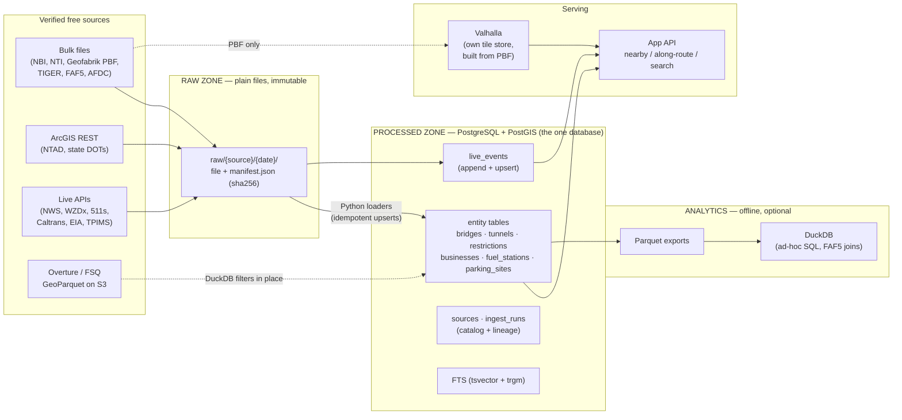

# Storage & Geospatial Architecture — Truck Intelligence Platform

**Author:** Storage & geospatial architecture architect
**Date:** 2026-07-22
**Status:** Proposed
**Reads:** research digest + `../research/*.md` (verified sources, 2026-07-22)

---

## 0. TL;DR

- **One primary store: PostgreSQL 16 + PostGIS 3.4.** Everything queryable lives here — entities, geometry, history, full-text search, live events.
- **Raw zone = plain files on disk** (`raw/{source}/{date}/`), immutable, with a manifest per fetch. No database involved.
- **DuckDB is a tool, not a store.** It reads Overture GeoParquet straight off S3 during ingest and runs offline analytics over Parquet exports. It never serves the app and holds no state of record.
- **The Valhalla routing graph is NOT in the database.** Valhalla builds its own tiles from the OSM PBF. Postgres stores everything *around* the route (bridges, restrictions, POIs, events); Valhalla answers "what is the route".
- **History = `valid_from`/`valid_to` on the row + `ingest_runs` lineage.** No separate history database, no event-sourcing framework.
- **Search = Postgres FTS + pg_trgm.** No Elasticsearch.
- Scales to enterprise by moving the *same* schema to managed Postgres (RDS/Neon/Supabase) — zero rewrite.

---

## 1. Assumptions (stated up front)

| # | Assumption | Why it matters |
|---|-----------|----------------|
| A1 | Solo AI-native developer, one Linux box or one VPS to start. | Every choice biases toward "one process to babysit", not "one k8s cluster". |
| A2 | ETL is Python scripts on cron/systemd timers. | Loaders must be idempotent re-runnable scripts, not a workflow engine. |
| A3 | Valhalla (self-hosted, MIT) is the routing engine, fed by the Geofabrik US PBF. | The 11.2 GB OSM graph never enters Postgres — Valhalla's tile store owns it. |
| A4 | Data volumes (from verified research): NBI ~620k bridges, NTI ~500 tunnels, OSM fuel ~109k stations, NTAD parking ~1.9k–8k sites, FAF5 ~487k links, US-filtered truck-relevant POIs ~2–5M (from Overture 75.9M worldwide), restrictions ~1–5M segments, live events ~50–100k active. | Total processed zone < ~50 GB. A single Postgres node handles this for years — no distributed anything needed. |
| A5 | Read traffic starts small (one app), grows later. | Optimize for correctness + simplicity now; scale levers documented, not pre-built. |
| A6 | ODbL (OSM) share-alike must stay auditable. | Every row carries `source_id`; OSM-derived rows are always identifiable and separable. |

---

## 2. The database decision: PostGIS vs DuckDB+spatial vs SQLite/SpatiaLite

The platform's core query shapes decide this:

1. **Nearby** — "fuel stations with diesel within 5 miles of here" → spatial index + point-radius.
2. **Along-route** — "low bridges, closures, parking along this 800-mile polyline" → buffer a linestring, intersect several tables, order by distance-along-route. This is THE product query.
3. **Live upserts** — 19 state 511 feeds + ~40 WZDx feeds + NWS alerts polled every few minutes, upserting concurrently while the API reads.
4. **Point-in-time** — "what did we know about this bridge in March?"
5. **Text search** — "Love's Travel Stop Amarillo", fuzzy.

| Criterion | **PostGIS** | **DuckDB + spatial** | **SQLite/SpatiaLite** |
|---|---|---|---|
| Spatial power (ST_DWithin on geography, KNN `<->`, GiST, linear referencing) | Full, mature, the industry reference | Growing but partial; R-tree index is file-embedded, no geography type, weaker linear referencing | Works but clunky; spheroid distance awkward; extension packaging pain on every OS |
| Concurrent writers (many pollers) + readers (API) | MVCC — designed for exactly this | **Single-writer process lock** — pollers would queue or corrupt | Single-writer with WAL workarounds; fine embedded, painful as a service |
| Serving a web API | Native (it's a server) | Not a server; embedded per-process | Not a server |
| Analytics over Parquet / S3 | Possible (FDW) but clumsy | **Best in class** — reads Overture GeoParquet on S3 directly | No |
| Full-text + fuzzy search | Built-in (tsvector, pg_trgm) | No real FTS story | FTS5 is decent, trigram weak |
| Ops burden for a solo dev | One `docker run postgis` or `apt install`; boring, documented everywhere | Zero (a file) — but only because it does less | Zero (a file) |
| Path to enterprise | **Same schema → RDS/Cloud SQL/Neon/Supabase, replicas, partitioning. No rewrite.** | Would require migrating to a server DB anyway | Would require migrating to a server DB anyway |
| Ecosystem fit | osm2pgsql, ogr2ogr, QGIS, GeoServer, Martin tile server all speak PostGIS natively | Good GDAL support | Aging ecosystem |

**Decision: PostGIS is the primary and only store of record.**

**Why (the one-paragraph version):** the moment you have *concurrent live-feed writers plus a serving API plus real spatial queries*, embedded databases (DuckDB, SQLite) are disqualified — they are single-writer files, not services. That leaves PostGIS, which also happens to be the best spatial engine of the three, has built-in search, and is the only one with a genuine no-rewrite path to enterprise (every cloud has managed Postgres+PostGIS). It costs one running service — that is the entire price, and it's the boring-tech service with the most documentation on earth.

**Why the others still appear (in their lane):**
- **DuckDB** = ETL and analytics *tool*. It filters Overture's 75.9M-place GeoParquet down to US truck-relevant categories **without downloading the whole dataset** (`SELECT ... FROM read_parquet('s3://overturemaps...')`), and runs ad-hoc corridor analytics over Parquet exports. It writes nothing the app depends on.
- **SQLite** = not used. Its only advantage (zero ops) is real, but it buys three migrations later. Rejected.

**Trade-off accepted:** you must run and back up one Postgres instance (`pg_dump` nightly + raw zone = full recovery). That is the entire operational cost of this decision.

---

## 3. The four zones



### 3.1 Raw zone — as-downloaded files

```
data/raw/{source_slug}/{YYYY-MM-DD}/
    <files exactly as downloaded>        # zip, pbf, csv, geojson, json pages
    manifest.json                        # url, fetched_at, sha256, size, http_status, etag
```

- **Why plain files, not a database or object store:** you can `ls` it, `sha256sum` it, re-run a loader against it, and diff two vintages with zero tooling. It is the disaster-recovery layer and the "reproduce any processed row" layer.
- **Immutable:** a fetch never overwrites a previous date's directory. Loaders read raw, never write it.
- **Paginated API pulls** (ArcGIS REST 2k-record pages, Socrata) are concatenated into one file per run so the raw artifact is one thing, not 300 fragments.
- **Retention:** keep every vintage of annual/small datasets (NBI is ~56 MB/yr — trivial). For high-frequency live feeds keep 30 days of raw then delete — the *processed* `live_events` table is the durable record. Optionally `rclone` the raw tree to any S3-compatible bucket for off-box safety (infra cost, not a data cost; the free-data constraint is unaffected).
- **What is NOT here:** nothing scraped, nothing from bot-blocked sites (FMCSA/MDTA/MTA pages are manual-review only, per research — their facts enter via hand-curated seed files, below).

### 3.2 Curated seed files (small but important)

Some verified truths only exist as human-readable pages (tunnel hazmat rules from PANYNJ/MDTA/VDOT, NHMRR hazmat routes, seasonal thaw postings). The compliant path is **manual curation**:

```
data/curated/{topic}.yaml     # hand-maintained, git-versioned, cites source URL + date checked
```

Loaders treat curated files exactly like a source (`sources.access_method = 'curated'`). Git history *is* their version history. This honors the gap honestly: these facts are few, high-value, and legally must pass through human eyes anyway.

### 3.3 Processed zone — PostGIS (schema in §4)

Clean, deduplicated, conflated tables. Every row traces to an `ingest_run` and a `source`. All geometry in **EPSG:4326** (`geometry(*, 4326)`), cast to `geography` at query time for meter-true distances — one SRID everywhere is a simplicity rule; reprojection headaches are eliminated by decree.

### 3.4 Analytics zone — Parquet + DuckDB (offline)

A weekly export script dumps entity tables to `data/analytics/parquet/`. DuckDB runs ad-hoc questions ("truck-POI density per FAF5 corridor mile") without touching the serving database. FAF5 links + assignment tables (~487k rows) load into Postgres too (they're small and useful as a map overlay), but heavy model-flow analytics stays in DuckDB. **Why:** analytics queries never contend with the app, and Parquet is the lingua franca if an enterprise data team appears later.

---

## 4. Core schema

Conventions applied to every entity table (**why:** one mental model, learned once):

- `id BIGINT GENERATED ALWAYS AS IDENTITY PRIMARY KEY` — surrogate key.
- `source_id TEXT REFERENCES sources` + `source_record_id TEXT` — where it came from and its natural key there. `UNIQUE (source_id, source_record_id, valid_from)`.
- `geom geometry(Point|LineString|MultiPolygon, 4326)` + `GiST` index.
- `props JSONB` — the full cleaned source record. **Why:** promoted columns stay few and stable; everything else remains queryable without migrations. Postgres JSONB indexing covers the long tail.
- **History (SCD2-lite):** `valid_from DATE NOT NULL`, `valid_to DATE NULL` (NULL = current), `ingest_run_id BIGINT REFERENCES ingest_runs`. When a new vintage changes a record, the loader closes the old row (`valid_to = today`) and inserts the new one. Partial index `WHERE valid_to IS NULL` keeps "current" queries at full speed. **Why this and not temporal tables/extensions:** it's ~10 lines of loader logic, readable by anyone, and annual datasets (NBI/NTI) churn so little that history stays tiny. Point-in-time = `WHERE valid_from <= :d AND (valid_to IS NULL OR valid_to > :d)`.

```sql
-- ============================================================
-- CATALOG + LINEAGE
-- ============================================================
CREATE TABLE sources (
  source_id        TEXT PRIMARY KEY,          -- 'nbi', 'nti', 'osm-geofabrik', 'overture-places',
                                              -- 'ntad-parking', 'afdc', 'eia', 'nws', 'wzdx-<agency>',
                                              -- '511-<state>', 'curated-tunnel-rules', ...
  name             TEXT NOT NULL,
  category         TEXT NOT NULL,             -- 'bridges','tunnels','restrictions','businesses',
                                              -- 'fuel','live-ops','parking-rest-weigh','routing-network'
  url              TEXT,
  access_method    TEXT NOT NULL,             -- 'bulk','arcgis-rest','rest-api','geoparquet','curated'
  license          TEXT NOT NULL,             -- 'us-pd','ODbL-1.0','CDLA-Permissive-2.0','Apache-2.0',
                                              -- 'state-open-attribution', ...
  attribution_text TEXT,                      -- rendered verbatim in the app where required
  share_alike      BOOLEAN NOT NULL DEFAULT FALSE,  -- TRUE for ODbL → keeps OSM-derived rows auditable
  update_cadence   TEXT,                      -- 'annual','monthly','weekly','daily','1-5min'
  requires_key     BOOLEAN NOT NULL DEFAULT FALSE,  -- free key still = free
  verify_status    TEXT NOT NULL DEFAULT 'verified', -- 'verified','uncertain','broken' (from research flags)
  notes            TEXT
);

CREATE TABLE ingest_runs (
  ingest_run_id    BIGINT GENERATED ALWAYS AS IDENTITY PRIMARY KEY,
  source_id        TEXT NOT NULL REFERENCES sources,
  started_at       TIMESTAMPTZ NOT NULL,
  finished_at      TIMESTAMPTZ,
  status           TEXT NOT NULL,             -- 'running','success','partial','failed'
  raw_path         TEXT,                      -- pointer into raw zone (or curated file + git sha)
  raw_sha256       TEXT,                      -- reproducibility: this exact input produced these rows
  records_seen     INTEGER,
  records_upserted INTEGER,
  records_closed   INTEGER,                   -- rows given valid_to this run (disappeared from source)
  error            TEXT
);
```

**Why these two tables are the backbone:** every "where did this number come from / how stale is it / what does attribution require" question — which a truck-safety product WILL be asked — is answered by two joins, not archaeology.

```sql
-- ============================================================
-- BRIDGES  (~620k rows; NBI annual + state DOT clearance layers)
-- ============================================================
CREATE TABLE bridges (
  id                   BIGINT GENERATED ALWAYS AS IDENTITY PRIMARY KEY,
  source_id            TEXT NOT NULL REFERENCES sources,
  source_record_id     TEXT NOT NULL,          -- NBI: state_code + structure_number (Item 8)
  state_fips           CHAR(2) NOT NULL,
  route_carried        TEXT,                   -- facility carried (Item 7)
  feature_crossed      TEXT,                   -- (Item 6)
  geom                 geometry(Point, 4326) NOT NULL,
  year_built           SMALLINT,
  min_vert_clearance_m NUMERIC(4,2),           -- NBI measured minimum (Item 10). HONEST: measured,
                                              --  NOT the legally binding posted sign value.
  posting_status_code  TEXT,                   -- NBI Item 70 RELATIONAL CODE — not tons-on-a-sign.
  operating_rating_mt  NUMERIC(6,2),           -- metric tons (Item 64)
  inventory_rating_mt  NUMERIC(6,2),           -- (Item 66)
  condition_deck       SMALLINT, condition_super SMALLINT, condition_sub SMALLINT,
  on_nhs               BOOLEAN,
  clearance_confidence TEXT NOT NULL DEFAULT 'nbi-measured',
                                              -- 'state-dot-lane-level' (WSDOT/TxDOT enrich),
                                              -- 'nbi-measured', 'osm-tag'
  props                JSONB NOT NULL DEFAULT '{}',
  valid_from           DATE NOT NULL,
  valid_to             DATE,
  ingest_run_id        BIGINT NOT NULL REFERENCES ingest_runs,
  UNIQUE (source_id, source_record_id, valid_from)
);
CREATE INDEX bridges_geom_gix ON bridges USING GIST (geom) WHERE valid_to IS NULL;
CREATE INDEX bridges_current_ix ON bridges (state_fips) WHERE valid_to IS NULL;
```

**Honest-gap handling:** there is no free national posted-sign database (research gap). So `bridges` stores what NBI actually gives (measured clearance, rating codes) with a `clearance_confidence` label, and *state-published posted values* (PennDOT PASDA, WSDOT lane-level, TxDOT, RIDOT) land in `restrictions` as authoritative rows. We never fabricate a "posted limit" column pretending national coverage.

```sql
-- ============================================================
-- TUNNELS  (~500 rows; NTI annual + curated rules)
-- ============================================================
CREATE TABLE tunnels (
  id                   BIGINT GENERATED ALWAYS AS IDENTITY PRIMARY KEY,
  source_id            TEXT NOT NULL REFERENCES sources,
  source_record_id     TEXT NOT NULL,          -- NTI tunnel number
  name                 TEXT,
  state_fips           CHAR(2),
  geom                 geometry(Point, 4326) NOT NULL,
  length_m             NUMERIC(8,1),
  min_vert_clearance_m NUMERIC(4,2),
  hazmat_codes         TEXT[],                 -- SNTI coded restriction flags, decoded per spec PDF.
                                              -- HONEST: codes only — detailed class/quantity/escort
                                              -- rules have no machine-readable national source.
  rules_curated_ref    TEXT,                   -- key into curated/tunnel-rules.yaml (PANYNJ, MDTA,
                                              --  VDOT, MassDOT...) when hand-encoded; NULL = codes only
  props                JSONB NOT NULL DEFAULT '{}',
  valid_from DATE NOT NULL, valid_to DATE, ingest_run_id BIGINT NOT NULL REFERENCES ingest_runs,
  UNIQUE (source_id, source_record_id, valid_from)
);
CREATE INDEX tunnels_geom_gix ON tunnels USING GIST (geom) WHERE valid_to IS NULL;
```

```sql
-- ============================================================
-- RESTRICTIONS — the conflation table (~1–5M rows)
-- One row = one legal/physical limit on one place or segment,
-- from ANY source, always labeled with confidence.
-- ============================================================
CREATE TABLE restrictions (
  id               BIGINT GENERATED ALWAYS AS IDENTITY PRIMARY KEY,
  source_id        TEXT NOT NULL REFERENCES sources,
  source_record_id TEXT NOT NULL,
  kind             TEXT NOT NULL,      -- 'max_height','max_weight','max_length','max_width',
                                       -- 'axle_weight','truck_ban','hazmat_ban','seasonal_weight'
  geom             geometry(Geometry, 4326) NOT NULL,  -- Point (a sign/bridge) or LineString (a segment)
  value_num        NUMERIC(8,2),       -- normalized SI: meters or kg. NULL for bans.
  value_unit       TEXT,               -- 'm','kg' (display converts to ft-in / tons)
  applies_to       TEXT NOT NULL DEFAULT 'all_trucks',  -- 'all_trucks','combination','hazmat_class_1',...
  jurisdiction     TEXT,               -- 'federal','state:PA','city:NYC'
  authority_level  TEXT NOT NULL,      -- 'authoritative' (state DOT/NYC layer),
                                       -- 'derived' (from NBI fields), 'community' (OSM tag)
  seasonal_from    DATE,               -- spring-thaw windows; NULL = year-round.
  seasonal_to      DATE,               -- HONEST: most frost-law states are PDF-only →
                                       --  rows exist only where curated or state feed exists.
  license          TEXT NOT NULL,      -- copied from source at load: ODbL rows stay identifiable
  props            JSONB NOT NULL DEFAULT '{}',
  valid_from DATE NOT NULL, valid_to DATE, ingest_run_id BIGINT NOT NULL REFERENCES ingest_runs,
  UNIQUE (source_id, source_record_id, kind, valid_from)
);
CREATE INDEX restrictions_geom_gix ON restrictions USING GIST (geom) WHERE valid_to IS NULL;
CREATE INDEX restrictions_kind_ix  ON restrictions (kind, authority_level) WHERE valid_to IS NULL;
```

**Why one conflation table instead of per-source tables:** the app's question is "what limits apply near/along my route", not "what does PennDOT say". Source identity and trust level survive as columns (`source_id`, `authority_level`), so we get one query surface *and* full provenance. **Honest-gap handling:** `authority_level` is load-bearing — the UI must render community/derived rows as advisory, because no free source can certify a road is unrestricted (research: legal-grade absence-of-restriction is a commercial/liability gap; we do not pretend otherwise).

```sql
-- ============================================================
-- BUSINESSES  (~2–5M US truck-relevant POIs; Overture + FSQ + OSM conflated)
-- ============================================================
CREATE TABLE businesses (
  id            BIGINT GENERATED ALWAYS AS IDENTITY PRIMARY KEY,
  canonical_key TEXT NOT NULL UNIQUE,   -- stable conflation key (name+geohash based)
  name          TEXT NOT NULL,
  brand         TEXT,                   -- normalized via name-suggestion-index
  category      TEXT NOT NULL,          -- OUR taxonomy: 'truck_stop','truck_repair','tire',
                                        -- 'towing','restaurant','motel','parts','truck_wash',...
  geom          geometry(Point, 4326) NOT NULL,
  address       TEXT, city TEXT, state CHAR(2), zip TEXT,
  phone         TEXT,                   -- HONEST: fill rate materially below Google's; nullable
  opening_hours TEXT,                   -- OSM opening_hours syntax where present; nullable
  present_in    TEXT[] NOT NULL,        -- {'overture','fsq','osm'} — multi-source agreement
  confidence    NUMERIC(3,2) NOT NULL,  -- OUR proxy score: source agreement + Overture confidence
                                        --  + brand match + FSQ date_refreshed.
                                        -- HONEST: NO ratings/review columns exist ANYWHERE in this
                                        --  schema — no free legal source (Google/Yelp/TA all
                                        --  paid+ToS-restricted). If ratings ever ship, they are
                                        --  platform-owned user data in a NEW table, never scraped.
  props         JSONB NOT NULL DEFAULT '{}',   -- per-source attributes kept for audit
  search_tsv    tsvector GENERATED ALWAYS AS
                  (to_tsvector('english', coalesce(name,'') || ' ' || coalesce(brand,'') || ' ' ||
                   coalesce(city,''))) STORED,
  valid_from DATE NOT NULL, valid_to DATE, ingest_run_id BIGINT NOT NULL REFERENCES ingest_runs
);
CREATE INDEX businesses_geom_gix   ON businesses USING GIST (geom) WHERE valid_to IS NULL;
CREATE INDEX businesses_tsv_gix    ON businesses USING GIN (search_tsv) WHERE valid_to IS NULL;
CREATE INDEX businesses_name_trgm  ON businesses USING GIN (name gin_trgm_ops) WHERE valid_to IS NULL;
CREATE INDEX businesses_cat_ix     ON businesses (category, state) WHERE valid_to IS NULL;
```

**Why filter to truck-relevant categories at ingest (not load all 75.9M Overture places):** the product is truck intelligence, not a Yellow Pages. DuckDB does the category+US filter against Overture's S3 GeoParquet *before* anything touches Postgres — the serving DB stays small, fast, and comprehensible. The full Overture file remains one DuckDB query away if we widen scope.

**License note:** conflating ODbL (OSM) attributes into Overture/FSQ rows can make the *combined database* ODbL-share-alike. Simple compliance rule, enforced by design: `present_in` + per-source blobs in `props` keep OSM contributions separable; attribution strings come from `sources`. If lawyers ever demand it, OSM-derived attributes can be dropped or isolated by one query.

```sql
-- ============================================================
-- FUEL_STATIONS  (~110k OSM + AFDC alt-fuel; separate from businesses
-- because fuel has typed attributes + a price-region join)
-- ============================================================
CREATE TABLE fuel_stations (
  id            BIGINT GENERATED ALWAYS AS IDENTITY PRIMARY KEY,
  source_id     TEXT NOT NULL REFERENCES sources,
  source_record_id TEXT NOT NULL,
  name          TEXT, brand TEXT,
  geom          geometry(Point, 4326) NOT NULL,
  state         CHAR(2),
  has_diesel    BOOLEAN,                -- NULL = unknown (OSM tag absent ≠ no diesel)
  hgv_access    BOOLEAN,                -- OSM hgv=yes / fuel:HGV_diesel
  has_def       BOOLEAN,                -- HONEST: tri-state via NULL. OSM fuel:adblue is sparse in
                                        --  the US (7,690 objects worldwide) — NULL is the truth
                                        --  most of the time and the UI must say "unknown", not "no".
  alt_fuels     TEXT[],                 -- from AFDC API: 'ELEC','LNG','CNG','HY',...
  price_region  TEXT,                   -- FK-ish to fuel_prices.region_code (state or PADD)
                                        -- HONEST: NO station-level price column exists in this
                                        --  schema. None is legally obtainable free (OPIS/GasBuddy
                                        --  are the paid gap). Prices join at REGION level only and
                                        --  the UI labels them "regional average (EIA weekly)".
  props         JSONB NOT NULL DEFAULT '{}',
  valid_from DATE NOT NULL, valid_to DATE, ingest_run_id BIGINT NOT NULL REFERENCES ingest_runs,
  UNIQUE (source_id, source_record_id, valid_from)
);
CREATE INDEX fuel_geom_gix ON fuel_stations USING GIST (geom) WHERE valid_to IS NULL;

-- EIA weekly regional averages (~15 rows/week; the ONLY free legal price data)
CREATE TABLE fuel_prices (
  region_code   TEXT NOT NULL,          -- 'US','PADD1','PADD1A',...,'CA', state codes where published
  price_date    DATE NOT NULL,
  fuel_type     TEXT NOT NULL,          -- 'diesel','gasoline'
  usd_per_gal   NUMERIC(5,3) NOT NULL,
  source_id     TEXT NOT NULL REFERENCES sources,   -- 'eia'
  PRIMARY KEY (region_code, price_date, fuel_type)
);
```

```sql
-- ============================================================
-- PARKING_SITES — truck parking, rest areas, weigh stations
-- (NTAD baseline + state DOT layers + OSM; one table because the
--  product question is identical: "can I stop here?")
-- ============================================================
CREATE TABLE parking_sites (
  id             BIGINT GENERATED ALWAYS AS IDENTITY PRIMARY KEY,
  source_id      TEXT NOT NULL REFERENCES sources,
  source_record_id TEXT NOT NULL,
  kind           TEXT NOT NULL,         -- 'truck_stop','public_rest_area','weigh_station','parking_lot'
  name           TEXT,
  geom           geometry(Point, 4326) NOT NULL,
  state          CHAR(2),
  truck_spaces   SMALLINT,              -- HONEST: NTAD counts are Jason's-Law-survey era (~2019);
                                        --  treated as capacity estimate, surfaced with vintage.
  amenities      JSONB NOT NULL DEFAULT '{}',   -- showers/scales/etc. where tagged; sparse by nature
  live_feed_id   TEXT,                  -- NULL for most of the country. Set only where a real feed
                                        --  exists (TPIMS 8 states, 511NY, FDOT TPAS). HONEST: no
                                        --  national real-time availability — column is nullable
                                        --  by design, UI shows "no live data" elsewhere.
  props          JSONB NOT NULL DEFAULT '{}',
  valid_from DATE NOT NULL, valid_to DATE, ingest_run_id BIGINT NOT NULL REFERENCES ingest_runs,
  UNIQUE (source_id, source_record_id, valid_from)
);
CREATE INDEX parking_geom_gix ON parking_sites USING GIST (geom) WHERE valid_to IS NULL;
```

**Why weigh stations live here and not their own table:** since HIFLD Open died (Aug 2025) there is no maintained national weigh-station dataset — it's stitched from state DOT layers + OSM, exactly like parking. Same shape, same sparsity story, same "kind" discriminator. One less table to understand. Real-time open/closed status (Drivewyze/PrePass territory) is a named paid gap — **no column exists for it.**

```sql
-- ============================================================
-- LIVE_EVENTS — the only high-churn table
-- (WZDx feeds, 19 state 511s, NWS alerts, Caltrans chain control,
--  NOAA/USGS flood gauges, TPIMS parking availability)
-- ============================================================
CREATE TABLE live_events (
  id             BIGINT GENERATED ALWAYS AS IDENTITY PRIMARY KEY,
  source_id      TEXT NOT NULL REFERENCES sources,
  source_event_id TEXT NOT NULL,        -- the feed's own id → upsert key
  event_type     TEXT NOT NULL,         -- 'work_zone','closure','incident','weather_alert',
                                        -- 'chain_control','flood','parking_availability'
  severity       TEXT,                  -- normalized: 'info','minor','major','severe'
  headline       TEXT,
  geom           geometry(Geometry, 4326),  -- Point, LineString, or MultiPolygon (NWS zones)
  starts_at      TIMESTAMPTZ,
  ends_at        TIMESTAMPTZ,
  status         TEXT NOT NULL,         -- 'active','expired'
  first_seen_at  TIMESTAMPTZ NOT NULL,
  last_seen_at   TIMESTAMPTZ NOT NULL,  -- poller heartbeat; feed silence → expiry sweep
  raw            JSONB NOT NULL,        -- full normalized-schema payload (WZDx/CAP/511)
  UNIQUE (source_id, source_event_id)
);
CREATE INDEX live_events_geom_gix   ON live_events USING GIST (geom) WHERE status = 'active';
CREATE INDEX live_events_active_ix  ON live_events (event_type, status) WHERE status = 'active';
CREATE INDEX live_events_seen_brin  ON live_events USING BRIN (last_seen_at);
```

**Why upsert-with-status instead of SCD2 here:** live feeds are stateful streams, not vintaged snapshots. The natural lifecycle is upsert-on-poll → mark expired when the feed drops the event or `ends_at` passes. A nightly job archives events expired > 90 days to Parquet and deletes them — the table stays small and fast forever. (If churn ever hurts, the scale lever is native monthly partitioning — deliberately NOT built now.) **Honest-gap note:** this table holds *event-based* congestion proxies only. There is no free nationwide probe-speed data (research: NPMRDS/Waze/HERE all restricted or paid) — so there is no `current_speed` column anywhere, and the design does not pretend closures+incidents equal true live traffic.

---

## 5. The core geospatial queries (proof the schema works)

**Nearby** (fuel with diesel within 8 km):

```sql
SELECT id, name, brand,
       ST_Distance(geom::geography, ST_Point(:lon,:lat)::geography) AS meters
FROM fuel_stations
WHERE valid_to IS NULL
  AND has_diesel IS NOT FALSE          -- includes unknown, labeled in UI
  AND ST_DWithin(geom::geography, ST_Point(:lon,:lat)::geography, 8000)
ORDER BY geom <-> ST_SetSRID(ST_Point(:lon,:lat),4326)   -- KNN index order
LIMIT 25;
```

**Along-route** (the product query — Valhalla returns the polyline, PostGIS decorates it):

```sql
WITH route AS (
  SELECT ST_SetSRID(ST_LineFromEncodedPolyline(:polyline6),4326) AS line
)
SELECT b.id, b.route_carried, b.min_vert_clearance_m, b.clearance_confidence,
       ST_LineLocatePoint(r.line, b.geom) AS frac_along   -- orders results by route progress
FROM bridges b, route r
WHERE b.valid_to IS NULL
  AND b.min_vert_clearance_m < :truck_height_m + 0.15     -- margin
  AND ST_DWithin(b.geom::geography, r.line::geography, 400)
ORDER BY frac_along;
```

Same pattern serves restrictions, parking, fuel, and active `live_events` along the buffer — one CTE, N table scans, all GiST-indexed. This composability is the concrete payoff of "everything in one PostGIS database."

**Search:** `search_tsv @@ websearch_to_tsquery('loves amarillo')` with `similarity(name, :q)` trigram fallback for typos. **Why not Elasticsearch/Meilisearch:** a second service to run, sync, and back up — for ≤5M short names, Postgres FTS + trgm is empirically sufficient. Revisit only if search p95 measurably fails.

---

## 6. How each requirement maps (summary table)

| Requirement | Where | Why this way |
|---|---|---|
| Raw zone | Plain files + manifest, immutable | Zero-tooling reproducibility; disaster recovery |
| Processed zone | PostGIS tables (§4) | One queryable store of record |
| Nearby / along-route | PostGIS GiST + geography + KNN + LineLocatePoint | The reference implementation for exactly these queries |
| Historical versions | SCD2-lite (`valid_from/valid_to`) + `ingest_runs`; git for curated files; Parquet archive for expired events | ~10 lines of loader logic; no temporal framework |
| Search | Postgres FTS + pg_trgm | No second search service |
| Analytics | Parquet exports + DuckDB (+ FAF5 heavy joins) | Never contends with serving; enterprise-friendly format |
| Routing graph | Valhalla tiles (outside DB) | Routers own graphs; DBs own facts |
| Lineage / licensing | `sources` + `ingest_runs` + per-row `source_id`/`license` | Attribution and ODbL separability by construction |

## 7. Honest gaps — restated as schema absences (by design)

These are not oversights; they are the research's paid/nonexistent gaps, deliberately reflected as *missing columns*:

1. **No station-level fuel price column** — no free legal source (OPIS/GasBuddy paid). Regional EIA weekly only.
2. **No ratings/reviews columns** — Google/Yelp/Tripadvisor all paid + ToS-prohibited to store. Only future platform-owned ratings, in a new table.
3. **No posted-sign truck-limit national column** — NBI codes + state layers + OSM in `restrictions` with `authority_level`; national signed database is proprietary (Trimble/HERE/ProMiles).
4. **No live speed/congestion column** — probe data is commercial-only; `live_events` is an event-based proxy and is labeled as such.
5. **No national real-time parking or weigh-station status** — `live_feed_id` nullable; populated for ~10 states max.
6. **No current NHMRR hazmat-route geometry** — registry is HTML/PDF (bot-blocked); enters only via `data/curated/` as states are hand-digitized.
7. **DEF availability is mostly NULL** — and NULL renders as "unknown", never as "no".

## 8. Enterprise scale path (documented, not pre-built)

Same schema, in order, only when metrics demand: (1) move Postgres to managed (RDS/Cloud SQL/Neon/Supabase — all support PostGIS); (2) add a read replica for the API; (3) pgbouncer; (4) partition `live_events` monthly; (5) raw zone → S3 + lifecycle rules; (6) split analytics warehouse (Parquet layout already compatible); (7) only-if-proven: dedicated search service. **Nothing in steps 1–6 changes a line of schema or query.** That no-rewrite property is the reason PostGIS won §2.

---
*End of design. Total system a solo dev must operate: 1 Postgres instance, 1 Valhalla instance, cron-run Python loaders, and files on disk.*
